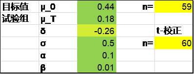
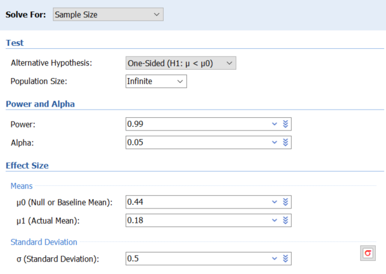
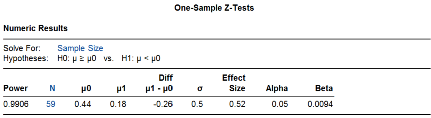
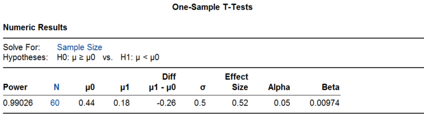

# 2. 单组均数的样本量计算

单组（arm，在医疗器械临床研究中多翻译为"组"，而在药物临床试验中常翻译成"臂"，如单臂研究）均数的研究包括均数的单组目标值法、单样本均数与总体均数比较以及配对设计等。

单组均数的研究设计在本质上都是单样本均数与总体均数的比较，根据预估的样本均值和设定的总体均值或目标值计算样本量。配对设计时样本量计算的结果为对子数。

单样本均数与总体均数比较的样本量计算公式如下^1-4^：

[]{#_Ref187480325 .anchor}公式 1‑1 $n = \frac{\left( Z_{1 - \alpha/2} + Z_{1 - \beta} \right)^{2}}{{(\frac{\delta}{\sigma})}^{2}}$

其中$\delta$为样本均数与总体均数的差值，即预期值与目标值的差异μ~T~-μ~0~；$\sigma$为总体标准差，Z为设定的概率（如I类错误水平α和II类错误水平β）所对应的标准化正态分布的分位数，大家熟知的α为双侧0.05时，Z~(1-0.05/2)~=1.96；β为0.2（即检验的效能或把握度为0.8）时，Z~(1-0..2)~为0.84。从公式可以看出，影响样本量的是样本均数与总体均数的差值以及总体标准差，确切地说样本量与$\frac{\delta}{\sigma}$的平方成反比，而与样本均数或总体均数各自的具体数值并不直接相关，这个$\frac{\delta}{\sigma}$在样本量计算领域里常成为效应量。单组均数的研究设计通常采用单侧检验，因此一些统计学书刊上的公式表达为$Z_{1 - \alpha}$。另外由于对称性，$Z_{1 - \alpha}$=$- Z_{\alpha}$，平方后两者相等，因而也有些统计书刊直接采用了$Z_{\alpha}$或$Z_{\alpha/2}$的表达方式。本书的样本量计算统一默认为双侧α=0.05，因此采用了$Z_{1 - \alpha/2}$的表达方式，读者在实际应用时应稍加留意。常见的Z值见[表 1‑1](#_Ref186359846)。

  --------------------------------
  P              $$Z_{1 - P/2}$$
  -------------- -----------------
  0.005          2.576

  0.01           2.326

  0.025          1.960

  0.05           1.645

  0.1            1.282

  0.2            0.842
  --------------------------------

  : []{#_Ref186359846 .anchor}表 1‑1 常见Z值表

[公式 1‑1](#_Ref187480325)是基于正态分布且总体方差已知情形的推导，亦称Z检验法。对小样本研究或总体方差未知时，宜进行基于t分布的计算，但该法需要进行迭代，无显性公式。好在基于t分布的样本量计算比较稳健，通常在上述公式计算的基础上增加2-3例即可^5^，或者可应用下列校正公式^2^：

公式 1‑2 $n = \frac{\left( Z_{1 - \alpha/2} + Z_{1 - \beta} \right)^{2}}{{(\frac{\delta}{\sigma})}^{2}} + \frac{1}{2}Z_{1 - \alpha/2}^{2}$

利用R语言计算及作图，可清晰地看到样本量随$\frac{\delta}{\sigma}$的增加而迅速减少（[图 1‑1](#_Ref186360017)，[表 1‑2](#_Ref186360036)）。

![[]{#_Ref186360017 .anchor}图 1‑1 样本量随$\frac{\delta}{\sigma}$增加而迅速减少（α=0.025单侧）](media/S1_1Mean/image1.png){width="5.768055555555556in" height="4.326388888888889in"}

+---------------------------+---------------------------+---------------------------+
| $$\frac{\delta}{\sigma}$$ | α=0.025单侧               | α=0.05单侧                |
|                           +-------------+-------------+-------------+-------------+
|                           | β=0.2       | β=0.1       | β=0.2       | β=0.1       |
+==========================:+============:+============:+============:+============:+
| 0.10                      | 787         | 1053        | 620         | 858         |
+---------------------------+-------------+-------------+-------------+-------------+
| 0.11                      | 651         | 871         | 513         | 710         |
+---------------------------+-------------+-------------+-------------+-------------+
| 0.12                      | 547         | 732         | 431         | 597         |
+---------------------------+-------------+-------------+-------------+-------------+
| 0.13                      | 467         | 624         | 368         | 509         |
+---------------------------+-------------+-------------+-------------+-------------+
| 0.14                      | 403         | 539         | 317         | 439         |
+---------------------------+-------------+-------------+-------------+-------------+
| 0.15                      | 351         | 469         | 277         | 382         |
+---------------------------+-------------+-------------+-------------+-------------+
| 0.16                      | 309         | 413         | 243         | 336         |
+---------------------------+-------------+-------------+-------------+-------------+
| 0.17                      | 274         | 366         | 216         | 298         |
+---------------------------+-------------+-------------+-------------+-------------+
| 0.18                      | 245         | 327         | 193         | 266         |
+---------------------------+-------------+-------------+-------------+-------------+
| 0.19                      | 220         | 293         | 173         | 239         |
+---------------------------+-------------+-------------+-------------+-------------+
| 0.20                      | 199         | 265         | 156         | 216         |
+---------------------------+-------------+-------------+-------------+-------------+
| 0.21                      | 180         | 241         | 142         | 196         |
+---------------------------+-------------+-------------+-------------+-------------+
| 0.22                      | 165         | 220         | 130         | 179         |
+---------------------------+-------------+-------------+-------------+-------------+
| 0.23                      | 151         | 201         | 119         | 164         |
+---------------------------+-------------+-------------+-------------+-------------+
| 0.24                      | 139         | 185         | 109         | 151         |
+---------------------------+-------------+-------------+-------------+-------------+
| 0.25                      | 128         | 171         | 101         | 139         |
+---------------------------+-------------+-------------+-------------+-------------+
| 0.26                      | 119         | 158         | 93          | 129         |
+---------------------------+-------------+-------------+-------------+-------------+
| 0.27                      | 110         | 147         | 87          | 119         |
+---------------------------+-------------+-------------+-------------+-------------+
| 0.28                      | 103         | 136         | 81          | 111         |
+---------------------------+-------------+-------------+-------------+-------------+
| 0.29                      | 96          | 127         | 75          | 104         |
+---------------------------+-------------+-------------+-------------+-------------+
| 0.30                      | 90          | 119         | 71          | 97          |
+---------------------------+-------------+-------------+-------------+-------------+
| 0.31                      | 84          | 112         | 66          | 91          |
+---------------------------+-------------+-------------+-------------+-------------+
| 0.32                      | 79          | 105         | 62          | 86          |
+---------------------------+-------------+-------------+-------------+-------------+
| 0.33                      | 75          | 99          | 59          | 81          |
+---------------------------+-------------+-------------+-------------+-------------+
| 0.34                      | 70          | 93          | 55          | 76          |
+---------------------------+-------------+-------------+-------------+-------------+
| 0.35                      | 67          | 88          | 52          | 72          |
+---------------------------+-------------+-------------+-------------+-------------+
| 0.36                      | 63          | 84          | 50          | 68          |
+---------------------------+-------------+-------------+-------------+-------------+
| 0.37                      | 60          | 79          | 47          | 64          |
+---------------------------+-------------+-------------+-------------+-------------+
| 0.38                      | 57          | 75          | 45          | 61          |
+---------------------------+-------------+-------------+-------------+-------------+
| 0.39                      | 54          | 72          | 43          | 58          |
+---------------------------+-------------+-------------+-------------+-------------+
| 0.40                      | 52          | 68          | 41          | 55          |
+---------------------------+-------------+-------------+-------------+-------------+
| 0.41                      | 49          | 65          | 39          | 53          |
+---------------------------+-------------+-------------+-------------+-------------+
| 0.42                      | 47          | 62          | 37          | 50          |
+---------------------------+-------------+-------------+-------------+-------------+
| 0.43                      | 45          | 59          | 35          | 48          |
+---------------------------+-------------+-------------+-------------+-------------+
| 0.44                      | 43          | 57          | 34          | 46          |
+---------------------------+-------------+-------------+-------------+-------------+
| 0.45                      | 41          | 54          | 32          | 44          |
+---------------------------+-------------+-------------+-------------+-------------+
| 0.46                      | 40          | 52          | 31          | 42          |
+---------------------------+-------------+-------------+-------------+-------------+
| 0.47                      | 38          | 50          | 30          | 41          |
+---------------------------+-------------+-------------+-------------+-------------+
| 0.48                      | 37          | 48          | 29          | 39          |
+---------------------------+-------------+-------------+-------------+-------------+
| 0.49                      | 35          | 46          | 28          | 38          |
+---------------------------+-------------+-------------+-------------+-------------+
| 0.50                      | 34          | 44          | 27          | 36          |
+---------------------------+-------------+-------------+-------------+-------------+

: []{#_Ref186360036 .anchor}表 1‑2 不同$\frac{\delta}{\sigma}$、α及β组合下的样本量

## 单组目标值法

[]{#_Ref138313753 .anchor}例 1‑1 PLATINUM QCA研究^6^评价某冠状动脉支架的临床表现，主要有效性终点为随访9个月时的管腔丢失，目标值0.44mm，预期值0.18±0.50 mm，将其单侧95%置信区间上限与目标值比较，则60例样本可提供99%的检验效能。

该例采用了单侧95%置信区间，相当于双侧α=0.1，因此Excel表里的α填写了0.1，正态近似法的结果为59，t-校正后为60。

{width="3.301388888888889in" height="1.25625in"}

PASS软件Z检验法的结果也是59，操作时依次点击Means, One Mean, Z-Test (Inequality), One-Sample Z-Test。

{width="4.062992125984252in" height="2.893700787401575in"}

{width="5.768055555555556in" height="1.5819444444444444in"}

PASS软件t检验的结果同样是60，操作时依次点击Means, One Mean, T-Test (Inequality), One-Sample T-Test。

{width="4.409448818897638in" height="3.0669291338582676in"}

{width="5.768055555555556in" height="1.5944444444444446in"}

R语言pwrss包Z检验法的结果为59，t检验法的结果为60。

Z检验法：

library(pwrss)

pwrss.z.mean(mu = 0.18, sd = 0.5, mu0 = 0.44, alpha = 0.1, power = 0.99)

结果输出：

    ##  A Mean against a Constant (z Test) 
    ##  H0: mu = mu0 
    ##  HA: mu != mu0 
    ##  ------------------------------ 
    ##   Statistical power = 0.99 
    ##   n = 59 
    ##  ------------------------------ 
    ##  Alternative = "not equal" 
    ##  Non-centrality parameter = -3.971 
    ##  Type I error rate = 0.1 
    ##  Type II error rate = 0.01

t检验法：

library(pwrss)

pwrss.t.mean(mu = 0.18, sd = 0.5, mu0 = 0.44, alpha = 0.1, power = 0.99)

结果输出：

    ##  A Mean against a Constant (t Test) 
    ##  H0: mu = mu0 
    ##  HA: mu != mu0 
    ##  ------------------------------ 
    ##   Statistical power = 0.99 
    ##   n = 60 
    ##  ------------------------------ 
    ##  Alternative = "not equal" 
    ##  Non-centrality parameter = -4.028 
    ##  Degrees of freedom = 59 
    ##  Type I error rate = 0.1 
    ##  Type II error rate = 0.01

该研究实际入组了100例患者，支架晚期管腔丢失为0.17±0.25 mm，P\<0.001，研究达成。

## 单样本均数与总体均数的比较

例 1‑2 ^7^为了解高海拔作业工人的心率是否高于一般人群，已知标准差为9.9次/分，心率差异5次/分有临床意义，设α=0.05（单侧），β=0.1，则样本量为36。该例声称采用了正态近似校正法。

Excel表t-校正法计算结果为35，PASS软件t检验法的结果为35，R语言pwrss包t检验法结果也是35。

library(pwrss)

pwrss.t.mean(mu = 5, sd = 9.9, mu0 = 0, alpha = 0.1, power = 0.9)

[]{#_Ref140611292 .anchor}例 1‑3 医学8年制教材《医学统计学》第3版介绍了一个例子^8^，某医师试验某种升白细胞的疗效，预实验用药前后白细胞差值的标准差为2.5X10^9^/L，要求治疗后白细胞上升1 X10^9^/L为有效，取α=0.05（单侧），β=0.1，则t检验法需56例患者。

Excel表t-校正法计算结果为55，PASS软件t检验法的结果为55，R语言pwrss包t检验法的结果也是55。

library(pwrss)

pwrss.t.mean(mu = 1, sd = 2.5, mu0 = 0, alpha = 0.1, power = 0.9)

## 配对设计

（同源配对与异源配对，前后配对）

例 1‑4 医学本科教材《医学统计学》第6版介绍了一个例子^1^，研究维生素E缺乏时对肝中维生素A含量的影响。将大鼠配对后分为两组，分别喂以正常饲料和维生素E缺乏饲料。如果肝中维生素A含量差异为700IU/g时认为有意义，已知标准差为500IU/g，取α=0.05，β=0.05，则需8对大鼠。该例声称采用了正态近似法。

该例按公式1-1计算的实际结果为8.02。Excel表正态近似法计算结果为9，PASS软件Z检验法结果为9，R语言pwrss包Z检验法的结果也是9。

library(pwrss)

pwrss.z.mean(mu = 700, sd = 550, mu0 = 0, alpha = 0.05, power = 0.95)

## 讨论

R语言pwr包可以做一些基本的样本量计算，如本章[例 1‑1](#_Ref138313753)，pwr包的正态近似法与t检验法的结果分别为：

library(pwr)

pwr.norm.test(d = (0.18-0.44)/0.5, sig.level = 0.05, power = 0.99,

alternative = \"less\")

结果输出：

    ## 
    ##      Mean power calculation for normal distribution with known variance 
    ## 
    ##               d = -0.52
    ##               n = 58.32264
    ##       sig.level = 0.05
    ##           power = 0.99
    ##     alternative = less

library(pwr)

pwr.t.test(d = (0.18-0.44)/0.5, sig.level = 0.05, power = 0.99,

type = \"one.sample\", alternative = \"less\")

结果输出：

    ## 
    ##      One-sample t test power calculation 
    ## 
    ##               n = 59.70845
    ##               d = -0.52
    ##       sig.level = 0.05
    ##           power = 0.99
    ##     alternative = less

这里的d是Cohen\'s d，即标准化的效应量，对应的是本章开头部分样本量计算公式里的$\frac{\delta}{\sigma}$。

### 检验效能的计算

本章[例 1‑1](#_Ref138313753) PASS软件计算结果里给出了实际的检验效能，比如t检验法样本量60可提供的实际检验效能为0.99026，R语言也可以提供。

library(pwr)

pwr.t.test(d = (0.18-0.44)/0.5, sig.level = 0.05, n = 60,

type = \"one.sample\", alternative = \"less\")

结果输出：

    ## 
    ##      One-sample t test power calculation 
    ## 
    ##               n = 60
    ##               d = -0.52
    ##       sig.level = 0.05
    ##           power = 0.9902613
    ##     alternative = less

或者，

library(pwrss)

pwrss.t.mean(mu = 0.18, sd = 0.5, mu0 = 0.44, alpha = 0.1, n = 60)

结果输出：

    ##  A Mean against a Constant (t Test) 
    ##  H0: mu = mu0 
    ##  HA: mu != mu0 
    ##  ------------------------------ 
    ##   Statistical power = 0.99 
    ##   n = 60 
    ##  ------------------------------ 
    ##  Alternative = "not equal" 
    ##  Non-centrality parameter = -4.028 
    ##  Degrees of freedom = 59 
    ##  Type I error rate = 0.1 
    ##  Type II error rate = 0.01

### 自身前后对照

本章[例 1‑3](#_Ref140611292)是一个自身前后对照的案例，该例在原书中列于样本均数与已知总体均数比较（或配对设计均数比较）之下，也偶有将其归为前后配对的。但需要注意的是在案例的情形下，前后对照并不是一个良好的研究设计，因为治疗以外的因素，比如患者疾病的恢复或进展也会引起前后测量的差异。通常应当再设立一组对照，将治疗组的前后差值与对照组的前后差值进行比较。其实，许多单组目标值设计的研究都存在这个问题，随机对照试验的论证力度显然更强。

### 目标值的含义

美国食品药品监督管理局（FDA, Food and Drug Administration）2013年发布的《医疗器械关键性临床研究的设计考虑指导原则》^9^提出了客观性能标准（Objective performance criteria，OPC）和性能目标（Performance goal，PG）两个概念，对OPC的定义是：来自临床研究和/或登记研究历史数据的一个数值指标， FDA可据此对安全性或有效性终点进行二分类（通过／失败）的评价与比较。该指导原则指出OPC通常来自监管机构、专业学会或标准组织等，其证据等级高于PG。但这种分类在临床试验的实践中并没有严格的区分，从统计学角度来看这两者用于样本量计算时没有任何差异。另外，该指导原则将单组目标值法限定在了二分类数据。

我国国家药品监督管理局（药监局）2018年发布的《医疗器械临床试验设计指导原则》^10^指出目标值是专业领域内公认的某类医疗器械的有效性/安全性评价指标所应达到的最低标准，在分类上沿用了FDA的观点，包括客观性能标准和性能目标两种。

国内临床研究实践中常将OPC和PG通称为目标值，不再细分。中国临床试验生物统计学组2017年发表的《单组目标值临床试验的统计学考虑》^11^认为目标值是指专业领域内公认的某医疗器械的有效性／安全性／性能评价指标所应达到的标准。

以上这些目标值的定义都值得商榷。FDA的定义描述了目标值的功用，但避开了说明这个数值指标是什么。这个数值指标具体是什么确实不容易说清楚，中国临床试验生物统计学组定义的"应达到的标准"似不够准确，而药监局的定义认为是"最低标准"，实际上当单组研究的结果正好达到该数值时，研究肯定是无法通过假设检验的。我们以高优指标（数值越大越好，比如成功率）为例说明，单组目标值法要求研究结果的双侧95%置信区间的下限（或者单侧97.5%置信区间下限）大于该目标值，所以研究结果正好为目标值时，其置信区间的下限就小于目标值了，研究无法通过，除非样本量为无穷大。因此临床医生有时候会感觉研究设定的目标值太低了，比如2017年美国心律协会等学会发布的《心房颤动导管和外科消融专家共识》^12^建议阵发性房颤导管消融一年成功率的目标值为50%，持续性房颤为40%，其实是要求研究结果的置信区间的下限高于这个值。从单组目标值法样本量计算公式来看，期望值与目标值差异越大，所需样本量越小；如果想以接近目标值的较低的成功率通过检验，需要的样本量是巨大的。

设置一个较低的目标值和一个较高的期望值有助于减少样本量，但前者需要有临床意义，后者应考虑研究达成的可能性。我们将在下一章讨论目标值的制定。

**References:**

1\. 李康, 贺佳. 医学统计学. 6版 ed. 北京: 人民卫生出版社; 2013.

2\. 颜艳, 王彤. 医学统计学. 5版 ed. 北京: 人民卫生出版社; 2020.

3\. 李卫. 医疗器械临床试验统计方法. 2版 ed. 北京: 科学出版社; 2016.

4\. Chow S, Shao J, Wang H, Lokhnygina Y. Sample Size Calculations in Clinical Research. Third Edition ed: CRC Press; 2018.

5\. 陈峰. 医学统计学. 4版 ed. 北京: 人民卫生出版社; 2024.

6\. Meredith IT, Whitbourn R, Scott D, et al. PLATINUM QCA: a prospective, multicentre study assessing clinical, angiographic, and intravascular ultrasound outcomes with the novel platinum chromium thin-strut PROMUS Element everolimus-eluting stent in de novo coronary stenoses. EUROINTERVENTION 2011;7:84-90.

7\. 杨土保. 医学科学研究与设计. 2版 ed. 北京: 人民卫生出版社; 2013.

8\. 颜虹, 徐勇勇. 医学统计学. 3版 ed. 北京: 人民卫生出版社; 2015.

9\. FDA. Design Considerations for Pivotal Clinical Investigations for Medical Devices Guidance for Industry, Clinical Investigators, Institutional Review Boards and Food and Drug Administration Staff; 2013.

10\. 国家药品监督管理局. 医疗器械临床试验设计指导原则; 2018.

11\. 李卫, 赵耐青. 单组目标值临床试验的统计学考虑. 中国卫生统计 2017;34:505-8.

12\. Calkins H, Hindricks G, Cappato R, et al. 2017 HRS/EHRA/ECAS/APHRS/SOLAECE expert consensus statement on catheter and surgical ablation of atrial fibrillation: Executive summary. HEART RHYTHM 2017;14:e445-94.
