# 诊断试验

诊断试验是运用一定的检测手段和方法（如临床资料、实验室检查、X线等）将有病者与无病者鉴别开来的试验。诊断试验在临床上的应用涉及面甚广，包括病因和病原学诊断、疾病病理和功能损害的诊断、疗效的判断、药物毒副作用的监测、疾病预后的判断，以及普查、筛检无症状的患者等。本章介绍的诊断试验主要关注诊断试验准确性研究，即与金标准对比后的结果。诊断试验的准确性是指区分出不同疾病状态的能力，包括灵敏度、特异度、阳性预测值、阴性预测值、阳性似然比、阴性似然比、曲线下面积（AUC）等指标，其中灵敏度和特异度不受待诊断人群目标疾病患病率的影响，便于进行试验的评价即不同诊断试验间的比较，应用较为广泛。

与其他研究设计类型相似，诊断试验开始前也需要对研究所需样本量进行估计，以保证诊断试验的准确性和统计学检验效能。基于诊断准确性研究的以下4种常见设计类型：（1）单样本诊断试验准确性评价；（2）单样本诊断试验（与目标值比较）；（3）两个诊断试验比较（非匹配设计）；（4）两个诊断试验比较（匹配设计）。本章主要介绍4种样本量计算方法。

1.  **单样本诊断试验准确性评价**

这种设计类型为一种新的诊断试验与金标准进行比较，目的是评估新的诊断试验准确性是否达到一定的准确程度（置信区间的宽度一定）。统计方法常使用正态近似法，通过置信度（1-α）%和最大允许误差Δ来计算真实灵敏度和特异度的置信区间。估算这种研究的样本量时，需要预估新的诊断试验灵敏度或特异度或AUC以及它们的允许误差，然后再用率的置信区间法进行样本量估算，最后使用目标人群的疾病患病率进行样本量调整。样本量计算公式如下^\[1\]^：

$n = \frac{Z_{1 - \alpha/2}^{2}P(1 - P)}{\Delta^{2}}$ (公式11-1)

其中，公式中n为阳性组/阴性组样本量，Z~1-α/2~为标准正态分布的分位数，P为灵敏度或特异度的预期值，Δ为P的允许误差大小，一般取P的95%置信区间宽度的一半，常用的取值为0.05-0.10。采用上述公式，可根据灵敏度或特异度的预期值分别估算具有目标疾病的受试者（阳性）或不具有目标疾病的受试者（阴性）的样本数量，最终的样本量为这两类受试者样本数量的总和。

此外，如果已知人群中目标疾病的患病率，也可根据目标疾病患病率和具有/不具有目标疾病的受试者数量来计算最终的样本量。计算公式如下^\[1\]^：

$n_{total} = \frac{n_{case}}{Pre}$ （公式11-2）

$n_{total} = \frac{n_{control}}{1 - Pre}$ （公式11-3）

其中，公式中n~Case~为根据灵敏度预期值估算的具有目标疾病的受试者（阳性）数量，n~Control~为根据特异度预期值估算的不具有目标疾病的受试者（阴性）数量，n~total~为两类受试者样本数量的总和，Pre为人群中目标疾病患病率。

1.  **案例分析1**

例11-1：药监局2021年9月颁布的《体外诊断试剂临床试验技术指导原则》^\[2\]^中给出了如下案例：某项标志物检测试剂用于相关疾病的辅助诊断，通过对已有资料进行分析得知，该检测试剂的灵敏度预期为85%，特异度预期为90%，临床试验采用试验体外诊断试剂与临床参考标准进行比较研究的方法，评价试验体外诊断试剂的临床性能，允许误差取值0.05。

**1.1 公式法计算样本量**

按照公式11-1计算，具有目标疾病的受试者（阳性）最低样本量（n~case~）和不具有目标疾病的受试者（阴性）最低样本量（n~control~）分别为：

$$n_{case} = \frac{{1.96}^{2} \times 0.85 \times (1 - 0.85)}{{0.05}^{2}} = 196$$

$$n_{control} = \frac{{1.96}^{2} \times 0.9 \times (1 - 0.9)}{{0.05}^{2}} = 139$$

Excel表按公式11-1计算结果如下：

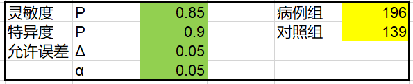{width="4.638939195100613in" height="0.9511340769903762in"}

根据以上估算，总样本例数预计为335例（196例+139例）。按照脱落率10%，则应至少入组373例受试者。实际入组受试人群中，具有目标疾病的受试者（阳性）和不具有目标疾病的受试者（阴性）样本例数应分别满足上述n~case~和n~control~的最低要求。

**1.2 PASS软件操作计算样本量**

PASS 2023软件也提供了相应的模块用于此类诊断试验的样本量计算。具体操作步骤如下：Proportions → One Proportions → Confidence Interval → Confidence Intervals for One Proportion。

需要注意的是，PASS软件中不是直接输入允许误差，而是需要输入双侧置信区间宽度"Confidence Interval Width (two-sided)"，而双侧置信区间宽度为允许误差的2倍。本案例中，允许误差取值0.05，所以双侧置信区间宽度为0.1。

此外，PASS软件在计算单样本率的置信区间时提供了5种不同的方法，每种方法对应不同的样本量计算公式。这5种方法分别为：（1）Exact (Clopper-Pearson)；（2）Score (Wilson); (3) Score with continuity correction; (4) Simple Asymptotic; (5) Simple Asymptotic with continuity correction。其中，Simple Asymptotic法的计算公式采用的是基于二项分布的正态近似法，当样本量足够大时可认为近似服从正态分布，计算公式即公式11-1。所以，在PASS软件参数输入界面中应选择"Simple Asymptotic"法。

根据灵敏度预期值计算具有目标疾病的受试者（阳性）数量时，PASS软件参数输入界面和样本量计算结果界面如下：

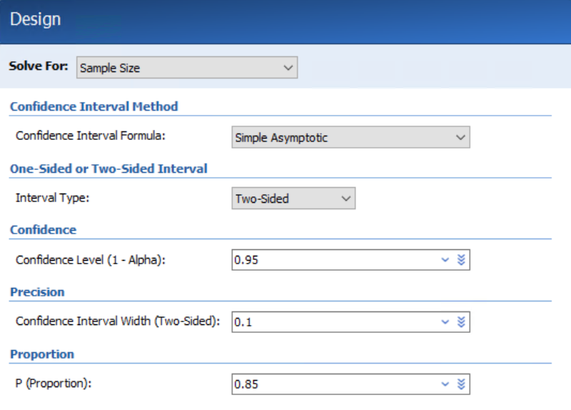{width="4.088077427821522in" height="2.933416447944007in"}

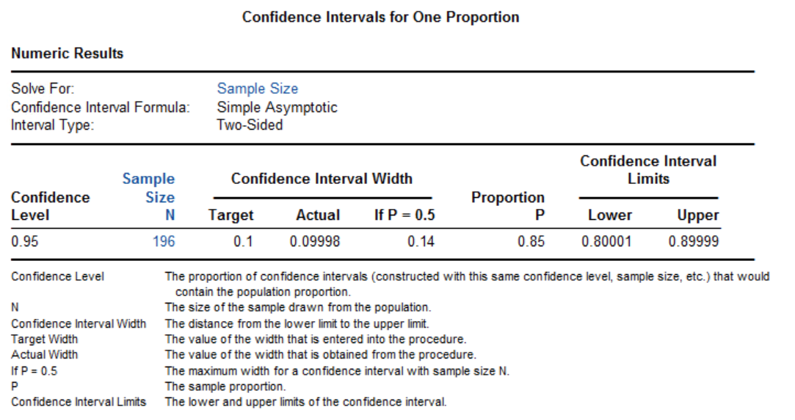{width="4.989067147856518in" height="2.639892825896763in"}

根据特异度预期值计算不具有目标疾病的受试者（阴性）数量时，PASS软件参数输入界面和样本量计算结果界面如下：

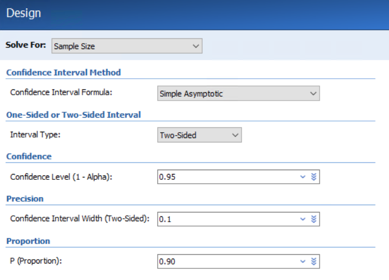{width="4.252600612423447in" height="3.0622200349956255in"}

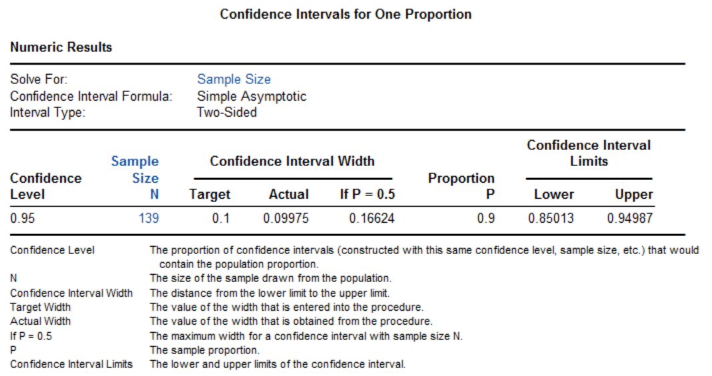{width="5.073285214348206in" height="2.6789577865266843in"}

根据以上估算，总样本例数预计为335例（196例+139例）。按照脱落率10%，则应至少入组373例受试者。根据PASS软件和公式法计算的结果相同。

3.  **R软件操作计算样本量**

> 通过R语言可编写一个较为简单的函数来计算样本量。根据灵敏度预期值计算具有目标

疾病的受试者（阳性）数量时，详细的R语言代码和计算结果如下。通过R语言计算样本量为195.9144例，向上取整为196例。

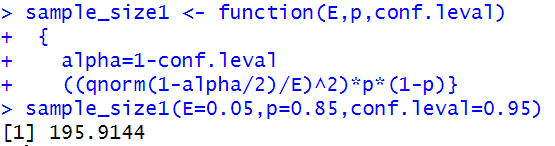{width="3.9973031496062994in" height="1.0515419947506561in"}

> 根据特异度预期值计算不具有目标疾病的受试者（阴性）数量时，详细的R语言代码和

计算结果如下。通过R语言计算样本量为138.2925例，向上取整为139例。

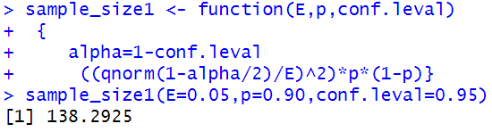{width="4.127741688538933in" height="1.1107381889763779in"}

根据以上估算，总样本例数预计为335例（196例+139例）。按照脱落率10%，则应至少入组373例受试者。R软件计算结果与根据PASS软件和公式法计算的结果相同。

2.  **案例分析2**

> 例11-2：某研究^\[3\]^评估一种改良的社区孕产妇抑郁检测工具（CIDT-MD）用于诊断农村

地区孕产妇抑郁的准确性。根据既往研究结果，预估这种改良的CIDT-MD工具诊断的灵敏度为和特异度分别为92%和66%，在准确度（允许误差）为0.05，置信度为95%，人群中孕产妇抑郁患病率为26%时，根据灵敏度计算至少需要的样本量为435例，根据特异度计算至少需要的样本量为466例。

**2.1 公式法计算样本量**

按照公式11-1，根据灵敏度计算至少需要纳入的具有抑郁症的孕产妇例数（n~case~）为113.09例，向上取整为114例。然后再按照公式11-2，基于人群患病率计算最终的样本量（n~total~）为438.46例，向上取整为439例。

$$n_{case} = \frac{{1.96}^{2} \times 0.92 \times (1 - 0.92)}{{0.05}^{2}} = 113.09$$

$$n_{total} = \frac{114}{0.26} = 438.46$$

根据公式11-1，根据特异度计算至少需要纳入的不具有抑郁症的正常孕产妇例数（n~control~）为344.82例，向上取整为345例。然后再按照公式11-3，基于人群无患病率（1-患病率）计算最终的样本量（ntotal）为466.22例，向上取整为463例。

$$n_{control} = \frac{{1.96}^{2} \times 0.66 \times (1 - 0.66)}{{0.05}^{2}} = 344.82$$

$$n_{total} = \frac{345}{1 - 0.26} = 466.22$$

Excel表按公式11-1计算至少需要纳入的具有抑郁症和不具有抑郁症的孕产妇例数分别为114例和345例。与上述计算结果相符。

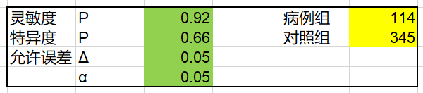{width="5.349681758530184in" height="1.1767246281714785in"}

**2.2 PASS软件操作计算样本量**

PASS 2023软件也提供了相应的模块用于此类诊断试验的样本量计算。具体操作步骤如下：Proportions → One Proportions → Confidence Interval → Confidence Intervals for One Proportion。

需要注意的是，PASS软件中不是直接输入允许误差，而是需要输入双侧置信区间宽度"Confidence Interval Width (two-sided)"，而双侧置信区间宽度为允许误差的2倍。本案例中，允许误差取值0.05，所以双侧置信区间宽度为0.1。

此外，PASS软件在计算单样本率的置信区间时提供了5种不同的方法，每种方法对应不同的样本量计算公式。这5种方法分别为：（1）Exact (Clopper-Pearson)；（2）Score (Wilson); (3) Score with continuity correction; (4) Simple Asymptotic; (5) Simple Asymptotic with continuity correction。其中，Simple Asymptotic法的计算公式采用的是基于二项分布的正态近似法，当样本量足够大时可认为近似服从正态分布，计算公式即公式11-1。所以，在PASS软件参数输入界面中应选择"Simple Asymptotic"法。

根据灵敏度预期值计算具有抑郁症的孕产妇例数时，PASS软件参数输入界面和样本量计算结果界面如下：

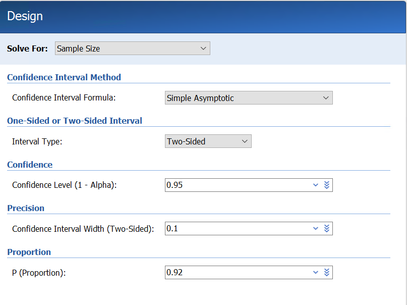{width="4.055810367454068in" height="3.0357556867891513in"}

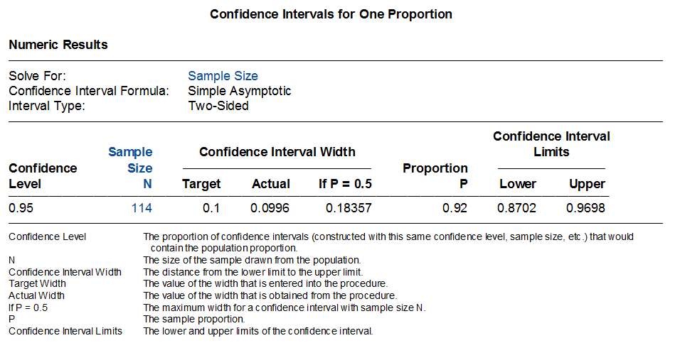{width="4.801851487314086in" height="2.42578302712161in"}

根据特异度预期值计算不具有抑郁症的正常孕产妇例数时，PASS软件参数输入界面和样本量计算结果界面如下：

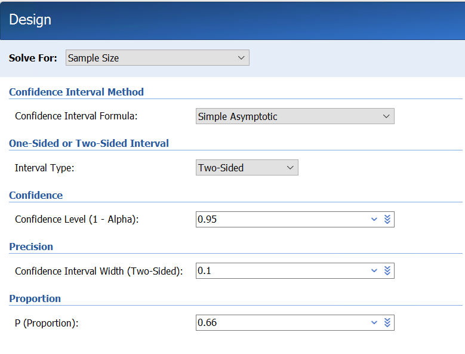{width="3.9542705599300088in" height="3.0102154418197724in"}

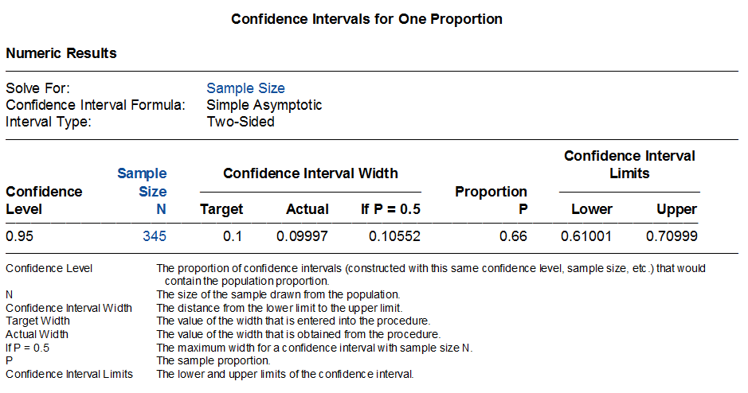{width="5.272285651793526in" height="2.773883420822397in"}

**需要注意的是：**该模块的PASS输入界面中未设置人群患病率选项，所以根据此模块计算出的样本量实际为患病人群的数量和未患病人群的数量。如果需要根据人群患病率或未患病率计算最终的样本量，则需要手动利用公式11-2或11-3进行计算。

根据以上估算，根据灵敏度和特异度计算的需要纳入的具有抑郁症和不具有抑郁症的孕产妇例数分别为114例和345例，根据PASS软件的计算结果与公式法计算结果一致。

3.  **R软件操作计算样本量**

通过R语言可编写一个较为简单的函数来计算样本量。根据灵敏度计算具有抑郁症的的孕产妇例数时，R语言计算的样本量为113.0925例，向上取整为114例。根据特异度计算不具有郁郁症的孕产妇例数时，R语言计算的样本量为344.8093例，向上取整为345例。计算结果与根据PASS软件和公式法计算的结果一致。

详细的R语言代码和计算结果如下：

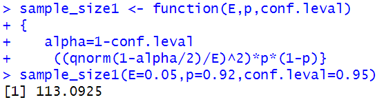{width="4.329837051618548in" height="1.1463167104111986in"}

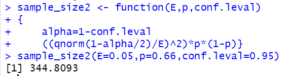{width="4.486692913385827in" height="1.1683989501312335in"}

**第二节 单样本诊断试验（与目标值比较）**

> 这类研究又被称为验证性诊断准确性研究，待评价诊断试验与预先指定的灵敏度、特异

度或AUC的参考值（目标值）进行比较。由于灵敏度和特异度本质上属于率，所以样本量估算的过程为单组率与目标值比较的检验，或单组AUC与目标值比较的检验。估算这种研究的样本量时，需要预估待评价诊断试验的敏感度或特异度以及临床上能接受的灵敏度或特异度的最低标准，基于预先例11-2：

设定的检验水准和检验效能进行样本量估算，最后使用目标人群的疾病患病率进行样本量调整。样本量计算公式如下^\[1\]^：

$n = \frac{{(Z_{1 - \alpha/2} \times \sqrt{P_{0}\left( 1 - P_{0} \right)} + Z_{1 - \beta} \times \sqrt{P_{1}\left( 1 - P_{1} \right)})}^{2}}{{{(P}_{1} - P_{0})}^{2}}$ （公式11-4）

公式中，n为阳性组/阴性组样本量；Z~1-α/2~、Z~1-β~为显著性水平和把握度的标准正态分布的分位数，P~0~为灵敏度或特异度的临床可接受标准，P~1~为待评价诊断试验灵敏度或特异度的预期值。采用上述公式，可根据灵敏度或特异度的预期值分别估算具有目标疾病的受试者（阳性）或不具有目标疾病的受试者（阴性）的样本数量。

当灵敏度或特异度的预期值过大（接近于1）或过小（接近于0）时，可考虑进行Yates连续性校正，校正公式如下^\[1\]^：

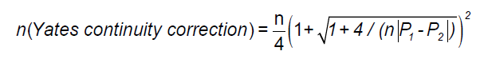{width="3.7242924321959756in" height="0.45376531058617675in"} （公式11-5）

此外，如果已知人群中目标疾病的患病率，也可根据目标疾病患病率和具有/不具有目标疾病的受试者数量来计算最终的样本量。计算公式同第一节中的公式11-2和公式11-3。

1.  **案例分析1**

> 例11-3：FAVOR II China研究^\[4\]^以基于压力导丝的FFR为金标准，评估在导管室中通过

实时测量定量血流分数（QFR）诊断冠脉狭窄病变的准确性。研究的主要终点为QFR相比FFR诊断冠脉狭窄病变的诊断准确性。基于既往FAVOR Pilot研究报道的结果，保守地预估QFR诊断冠脉狭窄病变的敏感度为83%，可接受的目标值设定为75%，在90%的检验效能和双侧0.05的显著性水平下进行样本量估算。因FAVOR II China研究入选的均为冠脉狭窄病变患者，所以该研究仅对具有目标疾病的受试者（阳性）数量进行估算。

1.  **公式法计算样本量**

> 按照公式11-4计算，需要纳入的具有冠脉狭窄病变的患者例数（n~case~）为：
>
> $$n_{case} = \frac{{(1.96 \times \sqrt{0.75(1 - 0.75)} + 1.28 \times \sqrt{0.83(1 - 0.83)})}^{2}}{{（0.83 - 0.75）}^{2}} = 277$$
>
> 根据以上估算，至少需要纳入277例冠脉狭窄病变患者。考虑FFR/QFA脱落率10%，则

应至少纳入308例患者。该结果与FAVOR II China研究公开发表的文献^\[2\]^中报告的结果一致。

2.  **PASS软件操作计算样本量**

> PASS 2023软件也提供了相应的模块用于此类诊断试验的样本量计算。具体操作步骤如

下：Proportions → Sensitivity and Specificity → Test for One-Sample Sensitivity and Specificity。

需要注意的是：PASS软件在参数输入界面中需要患病率P（Prevalence），这里的患病率是指人群中目标疾病的患病率，即公式11-2和公式11-3中的Pre。因FAVOR II China研究仅入选冠脉狭窄病变患者，所以该研究无需根据患病率对样本量进行调整。

PASS软件参数输入界面和样本量计算结果界面如下：

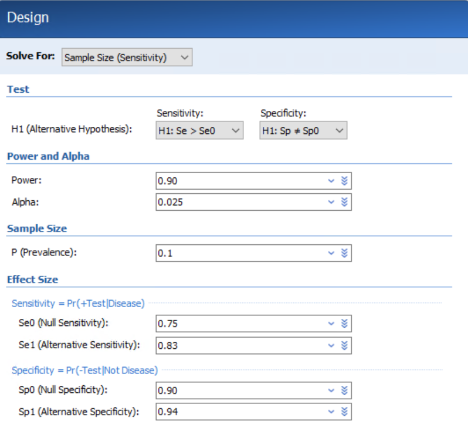{width="4.957100831146107in" height="4.559627077865267in"}

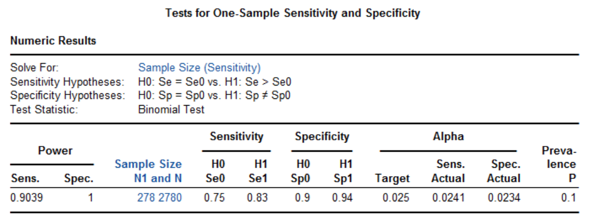{width="5.436797900262468in" height="2.0474726596675414in"}

根据以上估算，在不考虑脱落率的情况下，至少需要纳入278例具有冠脉狭窄病变的患者。PASS软件计算结果与根据公式11-4计算结果略有差异，这是因为PASS软件使用的计算公式与公式11-4略有不同，公式11-4基于的是正态近似法，而PASS软件中的计算公式基于的是二项式模型。当预期的灵敏度或特异度越接近于0或1，两种方法计算结果的差异越大。

3.  **R软件操作计算样本量**

R语言rpact程序包也提供了此类诊断试验的样本量计算方法，计算结果为276.4，向上取整为277，与基于公式11-4的计算结果相同。具体的R语言代码及计算结果如下：

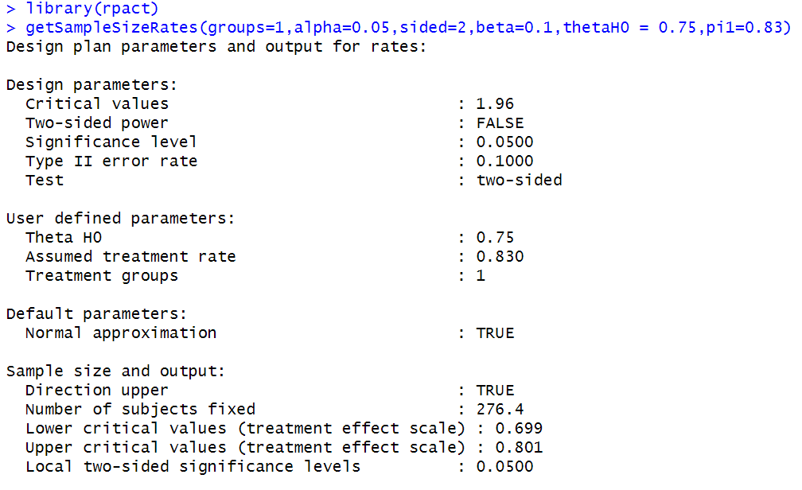{width="5.768055555555556in" height="3.525in"}

**2案例分析2**

例11-4：某研究^\[5\]^以活检为金标准，评估应用尿液质谱分析方法诊断肾移植患者中出现急性排斥反应的准确性。该研究为一项3期诊断准确性研究，主要目的是验证尿液质谱分析方法检测的准确性不劣于金标准。肾移植患者中出现急性排斥反应的概率为25%，研究预设的尿液质谱分析方法的灵敏度和特异度应分别不低于83%和70%，预估实际的灵敏度和特异度分别为91%和76%，则在单侧0.025的检验水准和80%的检验效能下，应至少需要150例阳性患者（出现急性排斥反应）和440例阴性患者（未出现急性排斥反应）。

**2.1 公式法计算样本量**

本研究类型为单样本诊断性试验，将尿液质谱分析法诊断急性排斥反应的灵敏度和特异度与预设的目标值进行比较。故此处应用公式11-4进行样本计算。将预期的灵敏度和灵敏度目标值代入公式11-4，计算需要的阳性样本例数为149.03例，向上取整为150例。将预期的特异度和特异度目标值代入公式11-4，计算需要的阴性样本例数为438.85例，向上取整为439例，总的样本量为150+439=589例。

$$n_{case} = \frac{{(1.96 \times \sqrt{0.83 \times (1 - 0.83)} + 0.84 \times \sqrt{0.91 \times (1 - 0.91)})}^{2}}{{（0.91 - 0.83）}^{2}} = 149.03$$

$$n_{control} = \frac{{(1.96 \times \sqrt{0.70 \times (1 - 0.70)} + 0.84 \times \sqrt{0.76 \times (1 - 0.76)})}^{2}}{{（0.76 - 0.70）}^{2}} = 438.85$$

本案例中，研究者还提供了肾移植患者中急性排斥反应出现的概率25%，在根据灵敏度计算出需要的阳性样本量（即出现急性排斥反应的患者例数）150后，还可根据公式11-2计算总的样本量n~total~=150/0.25=600例。最终研究者在该研究案例中选择600例作为最终的样本量。

**2.2 PASS软件计算样本量**

PASS 2023软件也提供了相应的模块用于此类诊断试验的样本量计算。具体操作步骤

如下：Proportions → Sensitivity and Specificity → Test for One-Sample Sensitivity and Specificity。

详细的样本量计算参数输入界面和样本量计算结果界面如下：

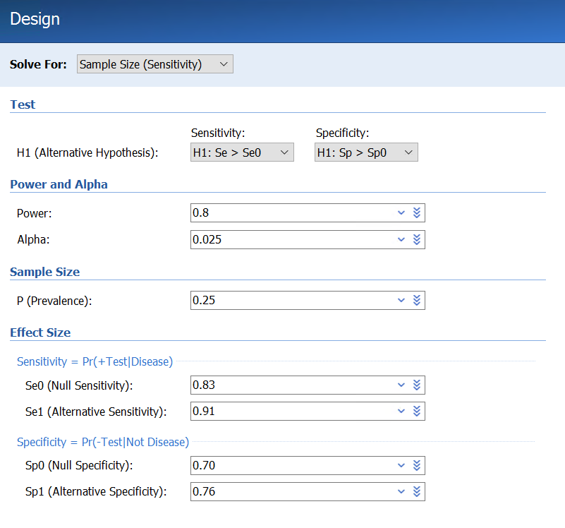{width="3.9188385826771652in" height="3.6593438320209972in"}

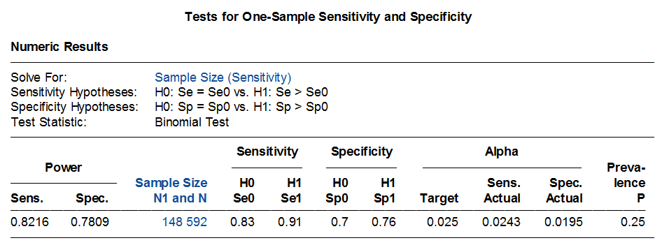{width="4.971237970253719in" height="1.8769324146981627in"}

根据以上估算，在不考虑脱落率的情况下，至少需要纳入148例阳性（出现急性排斥反应）患者，至少需要纳入444例阴性（未出现急性排斥反应）患者，总的样本量至少需要592例。该结果与根据公式法直接计算的结果差异不大。

**2.3 R软件计算样本量**

R语言rpact程序包也提供了此类诊断试验的样本量计算方法。根据预期的灵敏度及灵敏度目标值，计算阳性（出现急性排斥反应）样本量为149.2例，向上取整为150例。根据预期的特异度和特异度目标值，计算阴性（未出现急性排斥反应）样本量为439.3例，向上取整为440例。该结果与基于公式11-4的计算结果基本相同。

详细的R语言代码及计算结果如下：

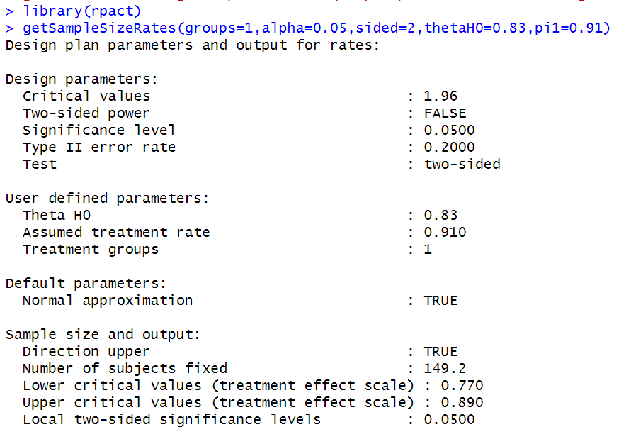{width="5.295285433070866in" height="3.7205971128608923in"}

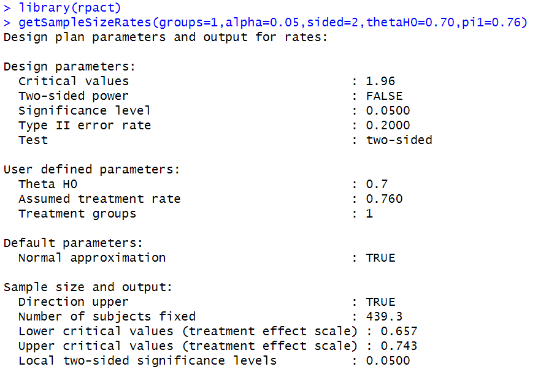{width="4.9243777340332455in" height="3.408408792650919in"}

**第三节 两个诊断试验比较（非匹配设计）**

采用非匹配设计对两个诊断试验进行比较时，将研究对象随机分到2组，分别接受不同诊断试验的诊断，分别计算两组的灵敏度、特异度或AUC并进行比较。此类研究样本量估算采用两组独立样本率或者两组AUC进行比较。基于二项分布的正态近似法，样本量计算公式如下^\[1\]^：

$n = \frac{{\lbrack Z_{\alpha}\sqrt{2 \times \overline{P}(1 - \overline{P}}) + Z_{\beta}\sqrt{P_{1}\left( 1 - P_{1} \right) + P_{2}(1 - P_{2})}\rbrack}^{2}}{{(P_{1} - P_{2})}^{2}}$ (公式11-6)

公式中，P~1~和P~2~为两个诊断试验预期的灵敏度或特异度，$\overline{P}$为P~1~和P~2~的平均值，Z~α~、Z~β~为显著性水平和把握度的标准正态分布的分位数。显著性水平α多取单侧0.025。通过该公式计算的样本量为每组患者的样本量。

当灵敏度或特异度的预期值过大（接近于1）或过小（接近于0）时，可考虑使用公式11-5进行Yates连续性校正。

**1 案例分析1**

例11-5：假设使用现有诊断方法诊断某病的灵敏度为71%，现开发出一个更便宜的无创伤诊断方法，研究者拟采用前瞻性研究设计的两组平行独立样本双侧Z检验比较两个诊断试验的灵敏度有无差别，期望新方法的灵敏度增加10%，即78.1%。研究疾病的的患病率为20%。取α=0.05、β=0.20，试估计该研究所需的样本含量。

1.  **公式法计算样本量**

> 根据公式11-6，计算每组需要纳入的患者数量(n~case~)为588.97例，向上取整为589

例，两组需要的患者数量为589\*2=1178例。研究所需的样本含量为1178/0.2=5890例。

> $$\overline{p} = \frac{0.71 + 0.781}{2} = 0.7455$$
>
> $$n_{case} = \frac{{(1.96 \times \sqrt{2 \times 0.7455(1 - 0.7455)} + 0.84 \times \sqrt{0.781(1 - 0.781) + 0.71(1 - 0.71)})}^{2}}{{(0.781 - 0.71)}^{2}} = 588.97$$

2.  **PASS软件计算样本量**

PASS 2023软件也提供了相应的模块用于此类诊断试验的样本量计算。具体操作步骤如下：Proportions → Sensitivity and Specificity → Tests for Two Independent Sensitivities

PASS软件参数输入界面和样本量计算结果界面如下：

根据以上估算，在不考虑脱落率的情况下，至少需要纳入5900例受试者，每组2950例。PASS软件计算结果与根据公式11-4计算结果大致相同。

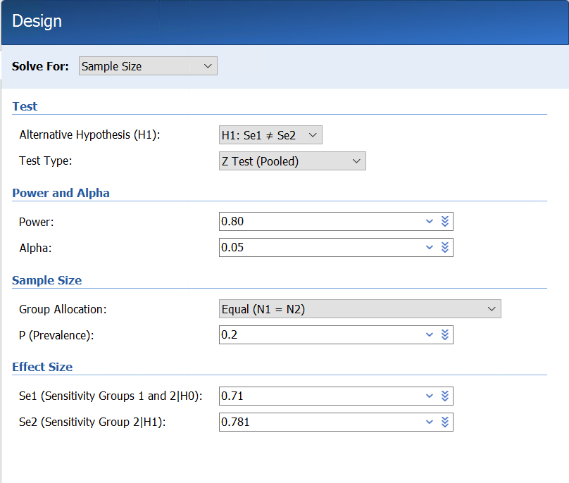{width="5.744732064741907in" height="4.87742125984252in"}

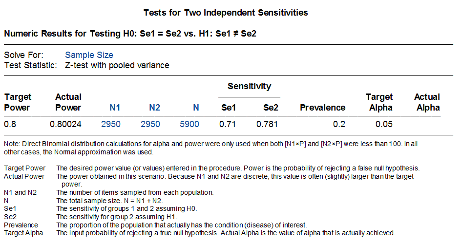{width="5.947657480314961in" height="3.1378094925634294in"}

3.  **R软件计算样本量**

R语言rpact程序包也提供了此类诊断试验的样本量计算方法，计算结果为每组需要患者589.6例，向上取整为590例，与基于公式11-6的计算结果大致相同。具体的R语言代码及计算结果如下：

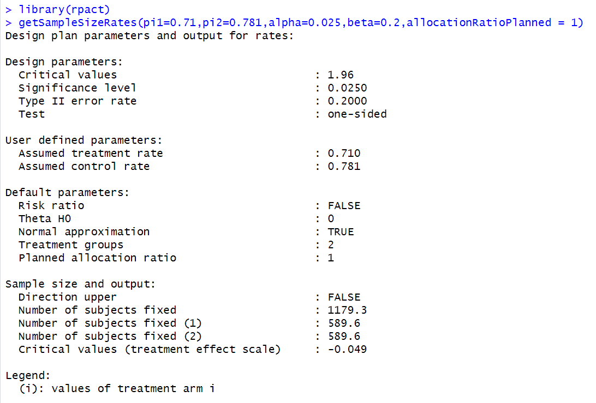{width="5.448300524934383in" height="3.6916732283464566in"}

1.  **案例分析2**

> 例11-6：某研究^\[6\]^拟对一种新型的用于谵妄评估的工具---4AT量表的诊断性能进行评

估，该研究将4AT量表与另一常用的谵妄评估量表（CAM）进行了比较。研究采用随机对照研究设计，计划入组900例受试者，按照1:1比例将随机分配至使用4AT量表或CAM量表进行评估。在每组450例受试者中，预计15%的受试者有谵妄，85%的受试者没有谵妄。基于连续校正的卡方检验，假定零假设为两种方法检测的特异度和灵敏度均为0.70，在双侧0.05的检验水准下，有83%的效能可检测到两种方法的特异度差异为0.1，有80%的效能可检测到两种方法的灵敏度差异为0.224。

1.  **公式法计算样本量**

本研究对用于谵妄评估的两种不同量表进行了比较，采用非配对设计，故采用公式

11-6进行样本量计算，因研究中提到应用连续校正的卡方检验，所以此处用公式法计算后再利用公式11-5对样本量进行校正。

根据灵敏度计算需要的阳性（谵妄）样本量时，参数如下：P~1~=0.924，P~2~=0.70，$\overline{p}$=(0.924+0.70)/2=0.812，将这些参数代入公式11-6，计算每组需要的阳性（谵妄）样本量为46.5例，向上取整为47例。

$$n = \frac{{\lbrack 1.96\sqrt{2 \times 0.812 \times (1 - 0.812}) + 0.84\sqrt{0.924 \times (1 - 0.924) + 0.70 \times (1 - 0.70)}\rbrack}^{2}}{{(0.924 - 0.70)}^{2}} = 46.5$$

应用公式11-5对样本量进行校正，校正后的阳性（谵妄）样本量为55.07例，向上取整为56例。

$$n_{c} = \frac{46.5}{4}{(1 + \sqrt{1 + 4/(46.5 \times |0.924 - 0.70|)})}^{2} = 55.07$$

根据特异度计算需要的阴性（非谵妄）样本量时，参数如下：P~1~=0.80，P~2~=0.70，$\overline{p} =$（0.80+0.70）/2=0.75，将这些参数代入公式11-6，计算每组需要的阴性样本量（非谵妄）为314.99例，向上取整为315例。

$$n = \frac{{\lbrack 1.96\sqrt{2 \times 0.75 \times (1 - 0.75}) + 0.945\sqrt{0.80 \times (1 - 0.80) + 0.70 \times (1 - 0.70)}\rbrack}^{2}}{{(0.80 - 0.70)}^{2}} = 314.99$$

应用公式11-5对样本量进行校正，校正后的阳性（谵妄）样本量为334.69例，向上取整为335例。

$$n_{c} = \frac{314.99}{4}{(1 + \sqrt{1 + 4/(314.99 \times |0.80 - 0.70|)})}^{2} = 334.69$$

最终，每组需要的总的样本量为阳性（谵妄）样本量和阴性（非谵妄）样本量之和，为56+335=391例。当然，因研究中还报告了人群中谵妄的患病率为15%，在计算总的样本量时还可利用公式11-2计算（即56/0.15=373例）或公式11-3计算（即335/0.85=395例）。最终样本量取较大者即可。

2.  **PASS软件计算样本量**

> PASS软件也提供了相应的模块用于此类诊断试验的样本量计算。具体的操作步骤如

下：Proportions → Sensitivity and Specificity → Tests for Two Independent Sensitivities。

PASS样本量计算参数输入界面和样本量计算结果如下图所示。

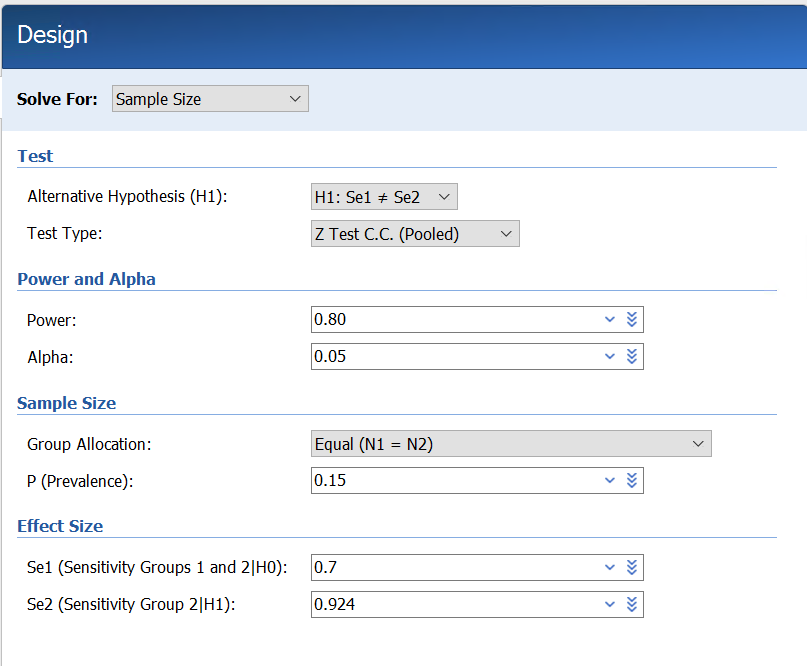{width="5.445325896762904in" height="4.494068241469816in"}

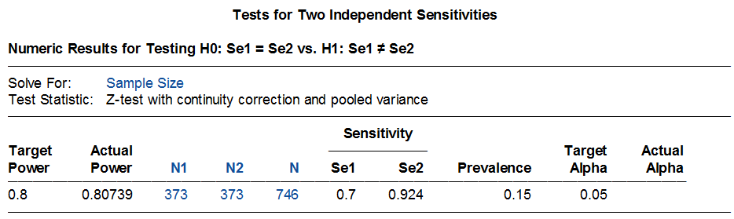{width="5.819207130358705in" height="1.7381955380577427in"}

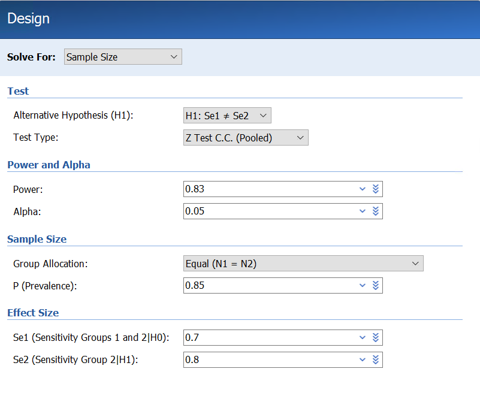{width="5.102279090113735in" height="4.242275809273841in"}

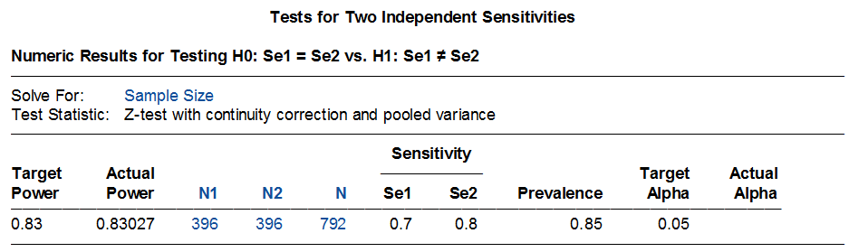{width="5.498238188976378in" height="1.6370264654418198in"}

根据灵敏度和特异度计算的每组样本量分别为373例和396例，与公式法计算的样本量大致相同。

此外，需要注意的是，PASS软件模块中可输入目标疾病患病率，以灵敏度计算样本量时，直接输入目标疾病患病率，计算的样本量即为总样本量。以特异度计算样本量时，需要输入1-目标疾病患病率，计算出的样本量为总样本量。所以无需再将两部分样本量相加。

3.  **R软件计算样本量**

> R语言的clinfun程序包也提供了此类诊断试验的样本量计算方法，此方法分别给出了

CPS和Fisher确切概率法的计算结果。

根据灵敏度计算的阳性（谵妄）样本量时，样本量为每组56例或52例。根据特异度计算阴性（非谵妄）样本量时，样本量为每组337例或336例。每组最终的样本量需要将阳性样本量和阴性样本量相加，即为每组56+337=393例或388例。此结果与公式法和PASS软件计算结果大致相同。详细的R语言代码及计算结果如下：

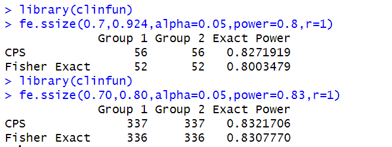{width="4.926427165354331in" height="1.8511165791776028in"}

**第四节 两个诊断试验比较（匹配设计）**

采用匹配设计对两个诊断试验进行比较时，对同一个研究对象使用2种诊断试验，比较两组的灵敏度、特异度或AUC。此类研究样本量估算采用两组配对样本率比较的方法，即McNemar检验。样本量计算公式如下^\[1\]^：

$n = \frac{{\lbrack Z_{\alpha}\sqrt{\psi} + Z_{\beta}\sqrt{\psi - {(P_{2} - P_{1})}^{2}}\rbrack}^{2}}{{(P_{2} - P_{1})}^{2}}$ （公式11-7）

公式中，ψ为两个诊断试验检测结果不一致的概率，ψ的最小值$\psi_{\min} = P_{2} - P_{1}$，ψ的最大值$\psi_{\max} = P_{1} \times \left( 1 - P_{2} \right) + P_{2} \times (1 - P_{1})$；Zα、Zβ为显著性水平和把握度的标准正态分布的分位数。显著性水平α多取单侧0.025。

当灵敏度或特异度的预期值过大（接近于1）或过小（接近于0）时，可考虑使用公式11-5进行Yates连续性校正。

**1 案例分析1**

例11-7：FAVOR II China研究^\[4\]^以基于压力导丝的FFR为金标准，评估在导管室中通过实时测量定量血流分数（QFR）诊断冠脉狭窄病变的准确性。除主要终点外，研究还设置了一个关键次要终点，即比较QFR和QCA诊断冠脉狭窄病病变的准确性。以FFR为金标准，对QFR和QCA诊断的灵敏度和特异度进行比较。研究者预期QFR的灵敏度和特异度分别为0.74和0.91，QCA的灵敏度和特异度分别为0.48和0.76，在双侧0.05的检验水准下，入组308例患者可提供\>80%的检验效能以评估QFR优于QCA。

根据灵敏度的参数，可以构建下面的四格表：

+----------------------+---------------------------------------+
|                      | QCA                                   |
|                      +-------------------+-------------------+
|                      | 阳性              | 阴性              |
+:========:+:=========:+:=================:+:=================:+
| QFR      | 阳性      | 0.355 (1,1)       | 0.385 (1,0)       |
|          +-----------+-------------------+-------------------+
|          | 阴性      | 0.125 (0,1)       | 0.135 (0,0)       |
+----------+-----------+-------------------+-------------------+

根据特异度的参数，可以构建下面的四格表：

+----------------------+---------------------------------------+
|                      | QCA                                   |
|                      +-------------------+-------------------+
|                      | 阳性              | 阴性              |
+:========:+:=========:+:=================:+:=================:+
| QFR      | 阳性      | 0.0216 (1,1)      | 0.0684 (1,0)      |
|          +-----------+-------------------+-------------------+
|          | 阴性      | 0.2184 (0,1)      | 0.6916 (0,0)      |
+----------+-----------+-------------------+-------------------+

1.  **公式法计算样本量**

> 按照公式11-7计算，根据QFR和QCA两种诊断方法预期的灵敏度0.74和0.48，在双

侧0.05（即单侧0.025）的检验水准和80%的检验效能下，计算样本量至少需要56.69例（对），向上取整为57例（对）。

$$\psi = 0.74 \times (1 - 0.48) + 0.48 \times (1 - 0.74) = 0.5096$$

$$n = \frac{{(1.96 \times \sqrt{0.5096} + 0.84 \times \sqrt{0.5096 - (0.48 - 0.74)^{2}})}^{2}}{{(0.48 - 0.74)}^{2}} = 56.69$$

按照公式11-7计算，根据QFR和QCA两种诊断方法预期的特异度0.91和0.76，在双侧0.05（即单侧0.025）的检验水准和80%的检验效能下，计算样本量至少需要97.55例（对），向上取整为98例（对）。

$$\psi = 0.91 \times (1 - 0.76) + 0.76 \times (1 - 0.91) = 0.2868$$

$$n = \frac{{(1.96 \times \sqrt{0.2868} + 0.84 \times \sqrt{0.2868 - (0.76 - 0.91)^{2}})}^{2}}{{(0.76 - 0.91)}^{2}} = 97.55$$

2.  **PASS软件操作计算样本量**

PASS 2023软件也提供了相应的模块用于此类诊断试验的样本量计算。具体操作步骤如下：Proportions → Two Correlated (Paired) Proportions → Tests for Two Correlated Proportions (McNemar Test)

通过灵敏度计算样本量时，PASS软件参数输入界面和样本量计算结果界面如下。需要注意的是，在通过灵敏度计算样本量时，在效应大小的输入类型上建议选择"Marginal"，其下方出现的P~11~代表的是两种检验方法结果均为阳性的概率，这个概率通过P1、P2和ψ可计算。本案例中，通过计算，P11=0.3552。通过PASS计算，需要的样本量为57例（对），与公式法计算结果相同。

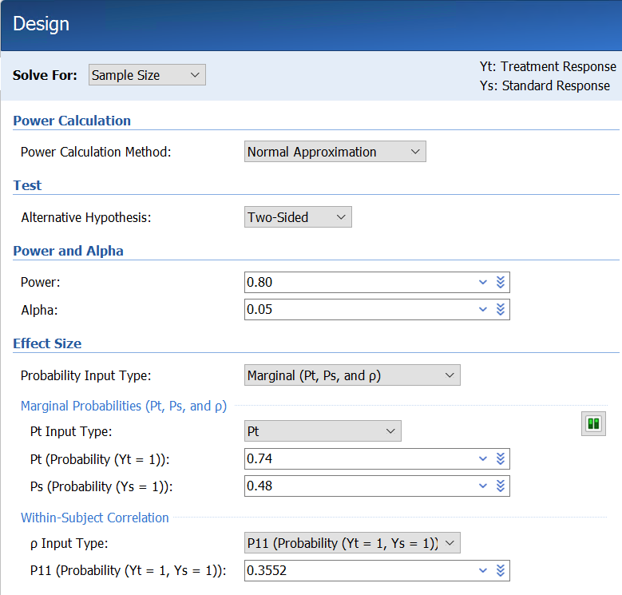{width="4.750910979877515in" height="4.543852799650044in"}

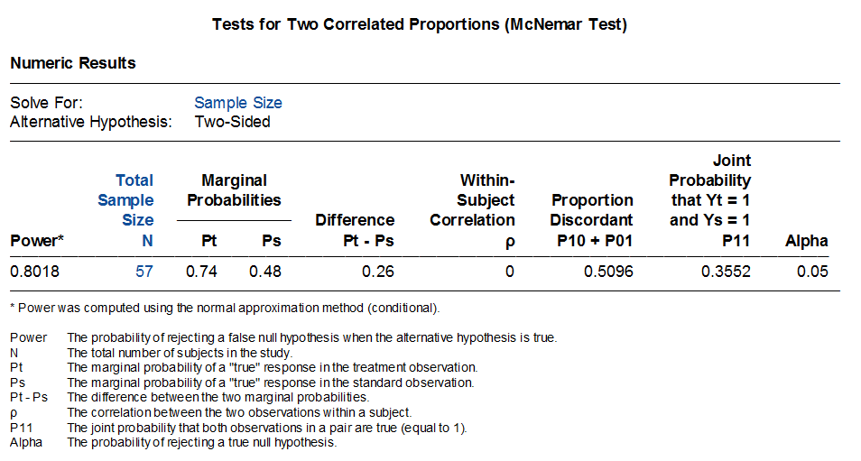{width="4.92976924759405in" height="2.6405653980752404in"}

通过特异度计算样本量时，PASS软件参数输入界面和样本量计算结果界面如下。需要注意的是，在通过特异度计算样本量时，在效应大小的输入类型上建议选择"Off Diagonal"，这时其下方出现"Difference"和"Proportion Discordant"两个参数。"Difference"的数值通过P1-P2可以计算，本案例通过计算为0.15。"Proportion Discordant"为两种检测方法结果不一致的概率，即ψ，本案例中ψ=0.2868。通过PASS计算，需要的样本量为98例（对），与公式法计算的结果相同。

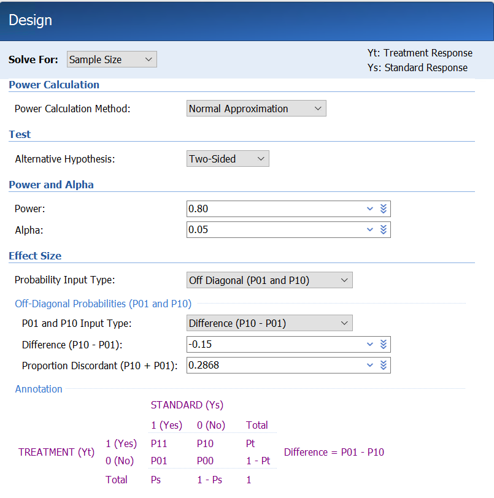{width="4.596044400699912in" height="4.635884733158355in"}

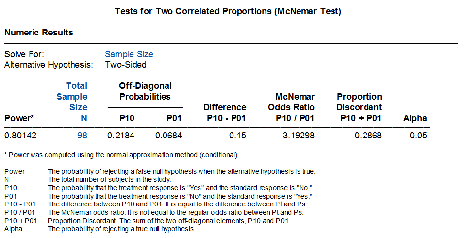{width="4.940811461067367in" height="2.5227515310586175in"}

3.  **R软件计算样本量**

R软件的TrialSize包也提供了此类诊断性试验的样本量计算方法，实际上也是使用的

公式11-7。根据灵敏度和特异度，通过R软件计算样本量分别为56.84496例（对）和97.65549例（对），向上取整分别为57例（对）和98例（对）。R软件的计算结果与公式法和PASS软件计算结果相同。

详细的R语言代码及运行结果如下：

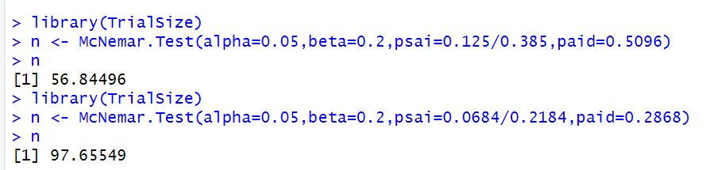{width="5.768055555555556in" height="1.3583333333333334in"}

1.  **案例分析2**

> 例11-8：某研究^\[7\]^拟比较粪便免疫化学实验（FIT）和基于抗体的多靶点粪便免疫化学实

验（mtFIT）两种方法用于诊断进展期肿瘤（AN）的准确性。该研究采用配对设计，样本量计算基于McNemar检验。研究者预估FIT对于AN的检出率为1.2%，预计使用mtFIT可使AN的检出率增加20%（检出率1.44%），两种检测方法在AN检出上有80%的重叠，那么在检验水准取双侧0.05，检验效能90%的水平下，该研究至少应需要样本量13131例。

根据以上参数，构建如下四格表

+----------------------+---------------------------------------+
|                      | FIT                                   |
|                      +-------------------+-------------------+
|                      | 检出              | 未检出            |
+:========:+:=========:+:=================:+:=================:+
| mtFIT    | 检出      | 0.0096 (1,1)      | 0.0048 (1,0)      |
|          +-----------+-------------------+-------------------+
|          | 未检出    | 0.0024 (0,1)      | 0.9832 (0,0)      |
+----------+-----------+-------------------+-------------------+

1.  **公式法计算样本量**

按照公式11-7计算，在双侧0.05的检验水准和90%的检验效能下，计算样本量至少需要13117.85例（对），向上取整为13118例（对）。

> ψ=0.0048+0.0024=0.0072
>
> $$n = \frac{{(1.96 \times \sqrt{0.0072} + 1.28 \times \sqrt{0.0072 - (0.0144 - 0.012)^{2}})}^{2}}{{(0.0144 - 0.012)}^{2}} = 13117.85$$

2.  **PASS软件计算样本量**

> PASS 2023软件也提供了相应的模块用于此类诊断试验的样本量计算。具体操作步骤如

下：Proportions → Two Correlated (Paired) Proportions → Tests for Two Correlated Proportions (McNemar Test)。

通过PASS软件计算所需样本量为13131例，与根据公式法计算的结果大致相同。详细的样本量参数输入界面和样本量计算结果如下：

需要注意的是，在配对设计的两个诊断试验比较的研究中，样本量计算方法都是采用的McNemar检验。在计算样本量前，建议先根据已知的参数绘制配对设计的四格表，并把四格表内各个格子数补充完整。这样后续在PASS样本量计算参数界面就会容易一些。

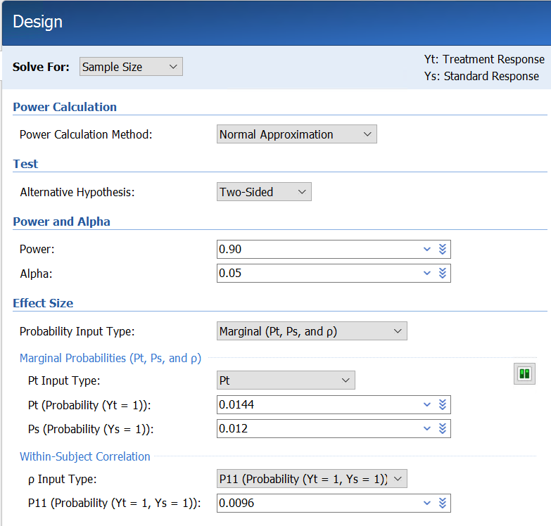{width="4.4905260279965in" height="4.289950787401575in"}

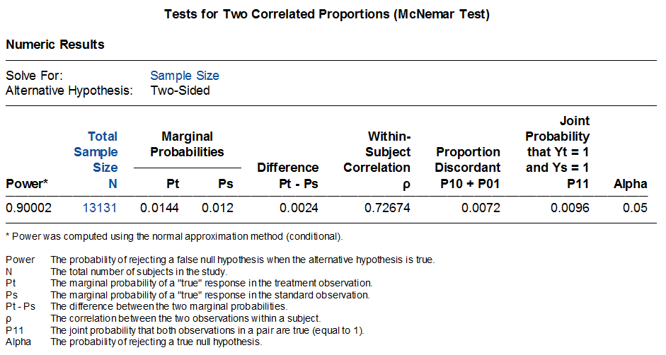{width="4.271096894138233in" height="2.2785017497812774in"}

3.  **R软件计算样本量**

R软件的TrialSize包也提供了此类诊断性试验的样本量计算方法，实际上也是使用的是

公式11-7。通过R软件计算样本量为13130.12例（对），向上取整为13131例（对）。与PASS软件计算结果相同。

详细的R语言代码及运行结果如下：

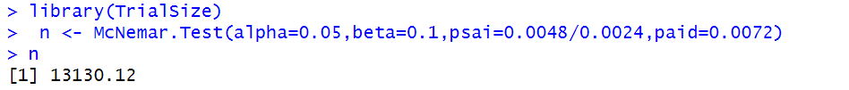{width="5.768055555555556in" height="0.6145833333333334in"}

参考文献：

\[1\] Obuchowski NA. Sample size calculations in studies of test accuracy. Stat Methods Med Res 1998, 7: 371-392.

\[2\] NMPA.《体外诊断试剂临床试验技术指导原则》. 2021.09.

\[3\] Shamaila M, et al. Accuracy of community informant led detection of maternal depression in Rural Pakistan. International Journal of Environmental Research and Public Health 2021, 18, 1075.

\[4\] Bo Xu, et al. Diagnostic accuracy of angiography-based quantitative flow ratio measurements for online assessment of coronary stenosis. JACC 2017, 70(25):3077-3087.

\[5\] Antonia Z, et al. Non-invasive diagnosis of acute rejection in renal transplant patients using mass spectrometry of urine samples -- a multicenter phase 3 diagnostic accuracy study. BMC Nephrology 2015, 16: 153.

\[6\] Susan DS, et al. Protocol for validation of the 4AT, a rapid screening tool for delirium: a multicenter prospective diagnostic test accuracy study. BMJ Open 2018, 8: e015572.

\[7\] Wisse PHA, et al. The multitarget fecal immunochemical test versus the fecal immunochemical test for programmatic colorectal cancer screening: a cross-sectional intervention study with paired design. BMC Cancer 2022, 22: 1299.
