# 12. 观察性研究

观察性研究是非随机化的研究，在自然状态下对研究对象的特征进行观察、记录，并对结果进行描述和对比分析。该研究的研究者不能人为设置处理因素，同时受试对象接受何种处理因素或同一处理因素的不同水平也不是由随机化决定的。该研究可进一步细分为描述性研究和分析性研究。在观察性研究中，一般只有研究对象和研究因素两个基本因素。在描述性研究中，研究因素是影响因素；在分析性研究中，研究因素被称为危险因素或暴露因素。在医学研究中，观察性研究主要用于评估潜在有害暴露对健康的影响及环境暴露对公共卫生的影响，描述疾病或治疗模式的流行病学，研究罕见转归或确定病因，以及为随后的随机对照试验提供研究假设。

与其他设计类型相似，观察性研究在设计阶段也需要对研究所需样本量进行估计。横断面研究、病例-对照研究、队列研究是最常见的观察性研究类型，本章主要介绍这3种类型研究的样本量计算方法。

**第一节 横断面研究的样本含量估算**

横断面研究是指在某一时点或短时期内，按照研究设计的要求，在一定的人群中应用普查或抽样调查的方法，收集有关疾病或健康状况的资料，以描述疾病或健康状况及其影响因素的关系。研究的目的主要是通过抽样调查获得的样本资料来推断总体特征。为了更好地根据样本统计指标来推断总体水平，提高对总体特征的估计精度，在进行横断面研究前，一般应估算研究所需的样本含量。

横断面研究的主要研究方法是抽样调查。常见的抽样方法有简单随机抽样、系统抽样、分层随机抽样、整群抽样和多级抽样。本章节主要介绍应用单纯随机抽样获取样本的样本量计算方法。在估算样本量时，需要预估总体中个体的变异程度、要求的估计精度（允许误差），然后再用均数或率的置信区间法进行样本量估算。

总体均数估计的样本含量计算公式如下^\[1\]^：

$n = {(\frac{\mu_{\alpha/2}\sigma}{\delta})}^{2}$ (公式5-1)

公式中n为所需要的样本量；μ~α/2~为标准正态分布的分位数，α置通常取0.05；σ为总体标准差；δ为允许误差，一般为置信区间宽度的一半，常用的取值为0.05-0.10。

总体率估计的样本含量计算公式如下^\[1\]^：

$n = \frac{\mu_{\alpha/2}^{2}}{\delta^{2}}\pi(1 - \pi)$ (公式5-2)

公式中n为所需要的样本量；μ~α/2~为标准正态分布的分位数，α置通常取0.05；π为总体概率的预期值；δ为允许误差，一般为置信区间宽度的一半，常用的取值为0.05-0.10。

1.  **案例分析1**

> 例5-1：某研究^\[2\]^拟调查30所养老机构老年人的认知功能现状并分析其影响因素，为制

定改善老年人认知功能的干预方案提供参考。该研究使用多阶段抽样法进行横断面调查，既往研究显示，养老机构老年人认知障碍发生率为29%，在允许误差为2%，0.05的检验水准下，至少需要调查的样本量为1977例。

1.  **公式法计算样本量**

> 此研究案例中估计的是养老机构老年人认知功能障碍的发生率，为定性指标，所以采用

公式5-2进行计算，样本量为1977.46例，向上取整为1978例。

$$n = \frac{{1.96}^{2}}{{0.02}^{2}} \times 0.29 \times (1 - 0.29) = 1977.46$$

Excel表按公式5-2计算至少需要的样本量为1978例，与上述计算结果相符。

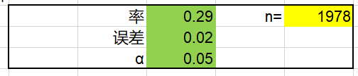{width="4.225211067366579in" height="0.9054024496937882in"}

2.  **PASS软件计算样本量**

> PASS 2023软件也提供了相应的模块用于此类研究的样本量计算。具体操作步骤如下：

Proportions → One Proportions → Confidence Intervals → Confidence Intervals for One Proportion。

通过PASS软件计算样本含量为1978例，与基于公式法计算的结果相同。详细的PASS软件参数输入界面和样本量计算结果如下：

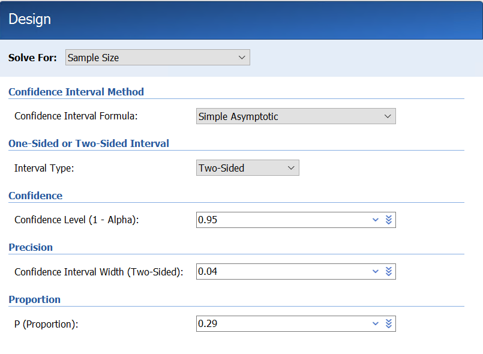{width="5.336070647419072in" height="3.911150481189851in"}

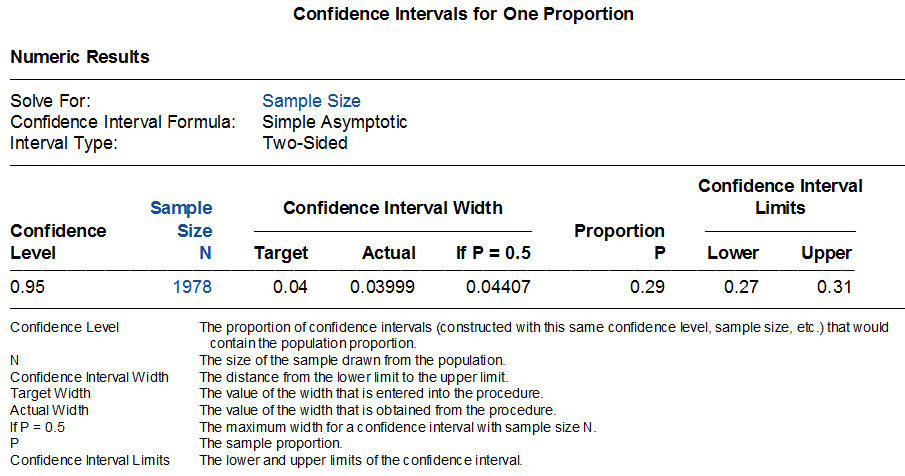{width="5.207175196850394in" height="2.7383748906386702in"}

3.  **R软件计算样本量**

> 通过R语言可编写一个较为简单的函数来计算样本量。通过R语言计算样本量为1977.39

例，向上取整为1978例。详细的R语言代码和计算结果如下：

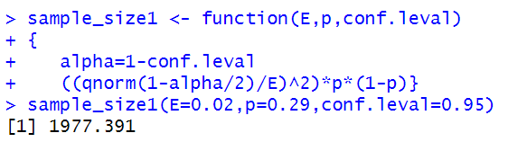{width="3.984860017497813in" height="1.1202318460192475in"}

2.  **案例分析2**

> 例5-2：某研究^\[3\]^拟对医院内出现骨科疾病的患者的临床和人口学特征进行调查。该研

究采用横断面调查方法，预估院内骨科疾病患病率为50%，在允许误差5%，检验水准α=0.05的情况下，通过计算至少需要样本量384例。

1.  **公式法计算样本量**

> 此研究案例中估计的是医院内骨科疾病的患病率，为定性指标，所以采用公式5-2进行

计算，样本量为384.16例，向上取整为385例。

$$n = \frac{{1.96}^{2}}{{0.05}^{2}} \times 0.50 \times (1 - 0.50) = 384.16$$

Excel表按公式5-2计算至少需要的样本量为385例，与上述计算结果相符。

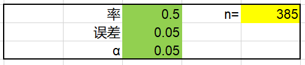{width="3.6369958442694665in" height="0.7798764216972879in"}

2.  **PASS软件计算样本量**

> PASS 2023软件也提供了相应的模块用于此类研究的样本量计算。具体操作步骤如下：

Proportions → One Proportions → Confidence Intervals → Confidence Intervals for One Proportion。通过PASS软件计算样本含量为385例，与基于公式法计算的结果相同。详细的PASS软件参数输入界面和样本量计算结果如下：

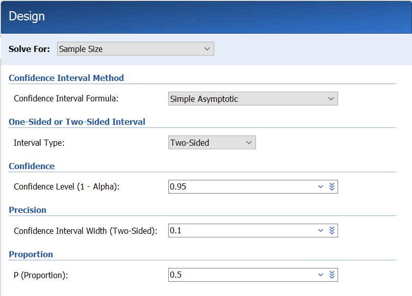{width="5.56917760279965in" height="4.004901574803149in"}

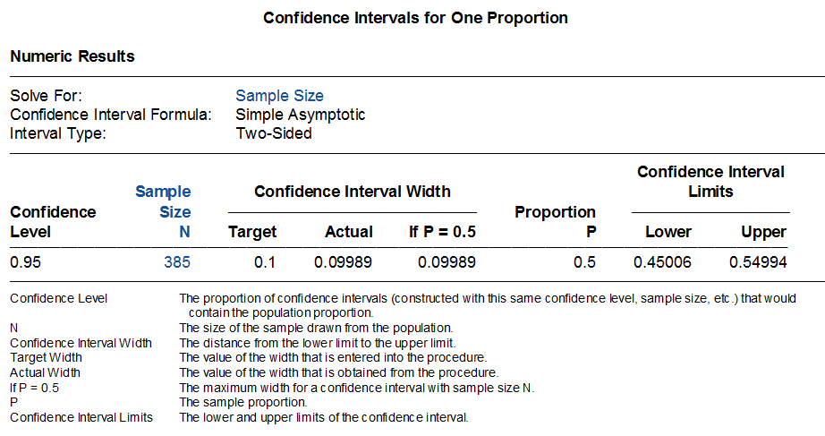{width="5.557822615923009in" height="2.9361570428696413in"}

3.  **R软件计算样本量**

> 通过R语言可编写一个较为简单的函数来计算样本量。通过R语言计算的样本量为

384.1459例，向上取整为385例。与根据公式法和PASS软件计算的结果相同。

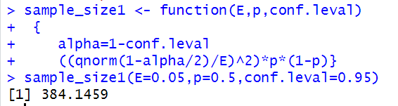{width="3.247567804024497in" height="0.8664359142607174in"}

**第二节 病例-对照研究的样本含量计算**

病例-对照研究相对于横断面研究来说比较复杂，它通过选择一组患某病的患者（病例组），再选择一组不患该病的患者（对照组），比较两组人群之间在疾病发生之前有关可疑因素（危险因素）的暴露情况，如果两组的暴露率确有差别，则可认为所研究疾病与因素之间存在着关联。虽然病例-对照研究多适用于罕见疾病，选取的病例往往是一个人群中某时期内的全部病例，但也需要估计其样本含量是否可足以计算预期的优势比（OR）。决定病例-对照研究样本含量的参数主要有：（1）对照人群的暴露率P0；（2）暴露因素与疾病的联系程度，以OR或RR为指标（当人群疾病患病率小于5%时，RR与OR近似相等）；（3）假阳性率，即I类错误α；（4）假阴性率，即II类错误β。根据病例组与对照组配比方式的不同，样本量计算公式不同。

- 对于成组设计的病例-对照研究，Kelsey等提供的样本量计算公式^\[4\]^如下：

$n_{1} = \frac{\left( Z_{\alpha/2} + Z_{1 - \beta} \right)^{2}\overline{p}\overline{q}(r + 1)}{r{(p_{1} - p_{0})}^{2}}$ (公式5-3)

公式中，n~1~为病例组的样本量，n~2~为对照组的样本量（n~2~=rn~1~），r为对照组与病例组的样本量之比，Z~α/2~、Z~1-β~为显著性水平和把握度的标准正态分布的分位数，P~0~为估计的对照组某因素暴露史的比例，P~1~为估计的病例组某因素暴露史的比例。

$\overline{p} = \frac{p_{1} + rp_{0}}{r + 1}$ $\overline{q} = 1 - \overline{p}$

此外，针对成组设计的病例对照研究，Fleiss等亦提供了如下样本量计算公式^\[5\]^：

$n_{1} = \frac{{(Z_{\alpha/2}\sqrt{(r + 1)\overline{p}\overline{q}} + Z_{1 - \beta}\sqrt{p_{0}\left( 1 - p_{0} \right) + rp_{1}\left( 1 - p_{1} \right)})}^{2}}{r{(p_{1} - p_{0})}^{2}}$ (公式5-4)

公式中，n~1~为病例组的样本量，n~2~为对照组的样本量（n~2~=rn~1~），r为对照组与病例组的样本量之比，Z~α/2~、Z~1-β~为显著性水平和把握度的标准正态分布的分位数，P~0~为估计的对照组某因素暴露史的比例，P~1~为估计的病例组某因素暴露史的比例。

$\overline{p} = \frac{p_{1} + rp_{0}}{r + 1}$ $\overline{q} = 1 - \overline{p}$

当事件率P1或P0极大或极小（比如接近于0或1时），样本量不服从正态分布，此时需要对计算出的样本量进行连续性校正以使其近似服从正态分布。样本量校正公式如下^\[5\]^：

$n_{1,cc} = \frac{n_{1}}{4}{\lbrack 1 + \sqrt{1 + \frac{2(r + 1)}{rn_{1}\left| p_{1} - p_{0} \right|}}\rbrack}^{2}$ (公式5-5)

- 1:1配对设计的病例-对照研究样本量计算公式如下^\[6\]^：

$M = \frac{\left\lbrack Z_{\frac{\alpha}{2}} + Z_{\beta}\sqrt{\pi_{c}\left( 1 - \pi_{c} \right)} \right\rbrack^{2}}{\left( \pi_{c} - 0.5 \right)^{2}}/\lbrack\pi_{1}\left( 1 - \pi_{2} \right) + \pi_{2}\left( 1 - \pi_{1} \right)\rbrack$ (公式5-6)

公式中，M为研究需要的总对子数，$\pi_{1}$和$\pi_{2}$分别是对照组人群中估计的暴露率和病例组人群中估计的暴露率，$\pi_{c} = OR/(1 + OR)$，$OR = \pi_{2}(1 - \pi_{1})/\pi_{1}(1 - \pi_{2})$。*\*

- 1:C配对设计的病例-对照研究样本量计算公式如下^\[6\]^：

$n = \frac{{\lbrack Z_{\alpha/2}\sqrt{(1 + \frac{1}{C})\pi_{c}(1 - \pi_{c})} + Z_{\beta}\sqrt{\pi_{2}\left( 1 - \pi_{2} \right)/C + \pi_{1}(1 - \pi_{1})}\rbrack}^{2}}{{(\pi_{2} - \pi_{1})}^{2}}$ (公式5-7)

公式中，n为病例组的样本量，C为对照组与病例组的样本量之比，对照组的样本量为C\*n，Z~α/2~、Z~β~为显著性水平和把握度的标准正态分布的分位数，$\pi_{1}$和$\pi_{2}$分别是对照组人群中估计的暴露率和病例组人群中估计的暴露率。

$\pi_{c} = \frac{\pi_{2} + c\pi_{1}}{1 + C}$

某些情况下，我们可能无法准确的预估π~2~，但可以预估与某因素有关的暴露的优势比OR，可根据公式5-4通过OR计算π~2~。

$\pi_{2} = \frac{OR \times \pi_{1}}{(1 - \pi_{1} + OR \times \pi_{1})}$ （公式5-8）

**1 案例分析1**

例5-3：某研究^\[7\]^欲评估吸食鸦片或鸦片成瘾与颅内动脉瘤破裂之间的相关性。该研究采用病例-对照研究设计，入选颅内动脉瘤破裂患者作为病例组，入选虽有颅内动脉瘤但未破裂患者作为对照组，对两组患者吸食鸦片或鸦片成瘾的情况进行比较和分析。样本量计算采用基于两个率比较的公式，预估病例组鸦片吸食或成瘾的概率为20%，对照组鸦片吸食或成瘾的概率为3.2%，在检验水准0.05，检验效能80%的情况下，每组至少需要纳入样本量各50例。

1.  **公式法计算样本量**

> 此研究采用成组（非配对）设计的病例-对照研究设计，病例组和对照组的例数相等。

故可采用公式5-3、公式5-4或公式5-5进行计算。本案例中，P~1~=0.2，P~0~=0.032，$\overline{p}$=(P~1~+P~0~)/2=0.116，$\overline{q}$=1-$\overline{p}$=0.884。代入公式5-3中，计算所需要的病例组样本量（n~1~）为56.97例，向上取整为57例，对照组的样本量亦为57例，两组样本量共计114例。

$$n_{1} = \frac{(1.96 + 0.84)^{2} \times 0.116 \times 0.884 \times 2}{{(0.2 - 0.032)}^{2}} = 56.97$$

将上述参数代入公式5-4，计算所需要的病例组样本量为55.78例，向上取整为56例，对照组的样本量亦为56例，两组样本量共计112例。

$$n_{1} = \frac{{(1.96\sqrt{2 \times 0.116 \times 0.884} + 0.84\sqrt{0.032 \times (1 - 0.032) + 0.2 \times (1 - 0.2)})}^{2}}{{(0.2 - 0.032)}^{2}} = 55.78$$

Excel表计算至少需要的样本量为112例（病例组和对照组各56例），与上述计算结果相符。

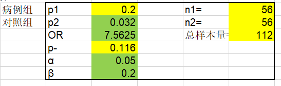{width="3.838721566054243in" height="1.186003937007874in"}

**1.2 PASS软件计算样本量**

PASS 2023软件也提供了相应的模块用于此类研究样本量的计算。具体操作步骤如下：Proportions → Two Independent Proportions → Test (Inequality) → Tests for Two Proportions。详细的样本量计算参数输入界面和样本量计算结果如下图所示：

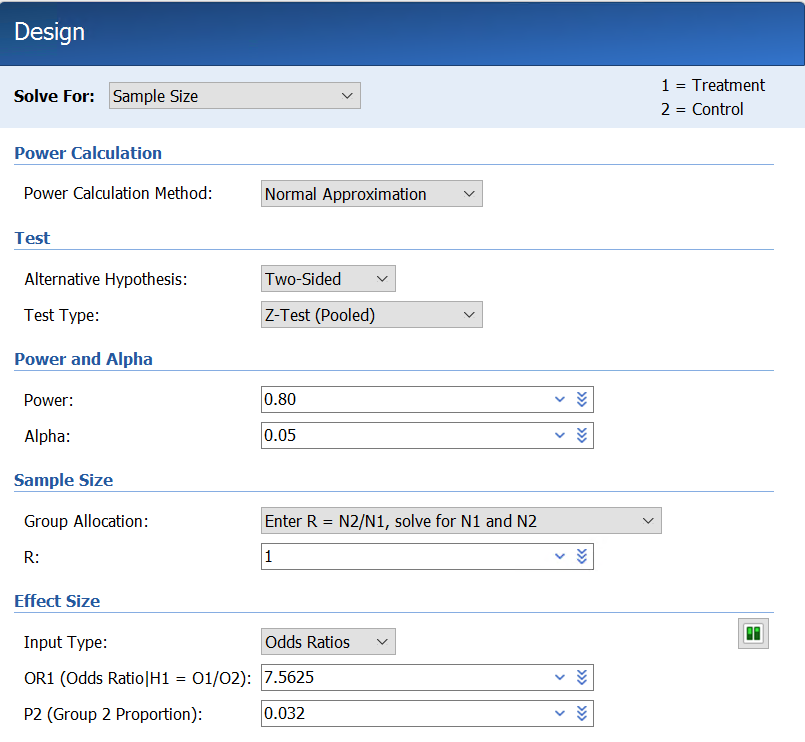{width="4.552373140857393in" height="4.196119860017498in"}

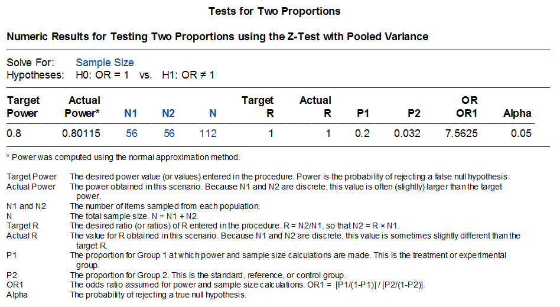{width="4.42995406824147in" height="2.4299146981627295in"}

通过PASS软件计算病例组和对照组需要的样本量均为56例，总样本量共计为112例。计算结果与根据公式法计算的结果相同。

3.  **R软件计算样本量**

> R语言rpact程序包提供了此类研究的样本量计算方法，计算结果为病例组和对照组各

需要患者55.8例，向上取整为56例，总样本量共计112例。与根据公式5-4计算结果相同，与根据公式5-3和PASS软件计算结果相似。

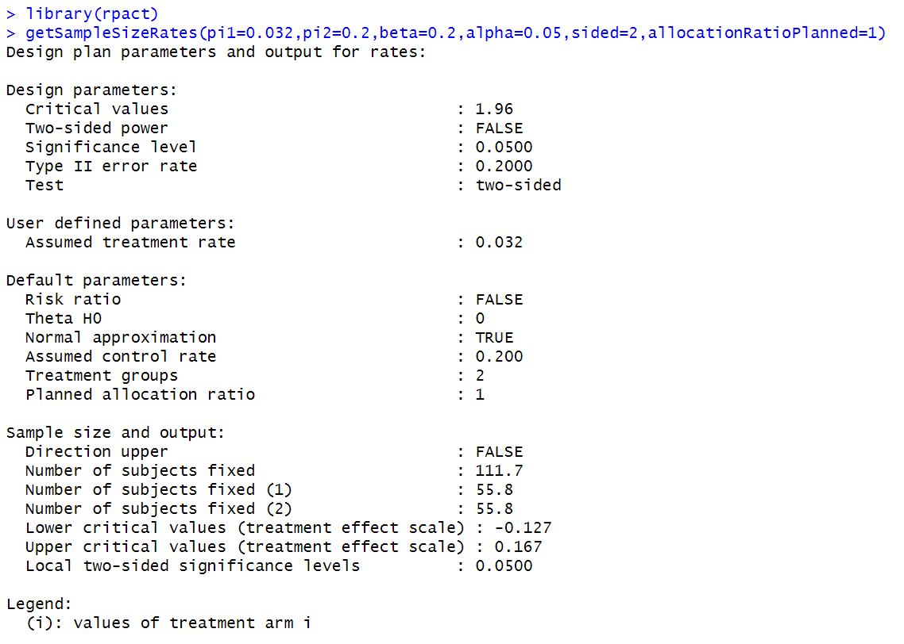{width="5.768055555555556in" height="4.115277777777778in"}

1.  **案例分析2**

> 例5-4：某研究^\[8\]^拟评估埃塞俄比亚东北部谢瓦罗比特地区艾滋病毒阳性人群中与艾滋

病毒-疟疾合并感染相关的因素。该研究采用非配对病例-对照研究设计，选择正接受抗逆转录病毒治疗且既往6个月内出现过疟疾感染的艾滋病患者作为病例组，选择正接受抗逆转录病毒治疗且既往6个月内未感染过疟疾的艾滋病患者作为对照组，对照组与病例组的患者比例为3：1。基于既往研究结果，研究者预估对照组患者感染疟疾的比例为22.7%，优势比OR为2.73，在检验水准α=0.05，检验效能85%，脱落率10%的情况下，计算样本量至少需要262例，病例组66例，对照组196例。

**2.1 公式法计算样本量**

此研究采用非配对设计的病例-对照研究设计，对照组与病例组样本量之比为3:1。故可采用公式5-3、公式5-4或公式5-5进行计算。本案例中，P~0~=0.227，OR=2.73，将OR值和P~0~代入公式5-8，计算P~1~=0.445，$\overline{p}$=(P~1~+3P~0~)/4=0.2815，$\overline{q}$=0.7185。

将上述参数代入公式5-3中，计算所需要的病例组样本量（n~1~）为51.07例，向上取整为52例，对照组样本量为52\*3=156例。考虑10%脱落率，病例组和对照组样本量分别为58例和174例。

$$n_{1} = \frac{(1.96 + 1.04)^{2} \times 0.2815 \times 0.7185 \times 4}{3 \times {(0.445 - 0.227)}^{2}} = 51.07$$

将上述参数代入公式5-4中，计算所需要的病例组样本量为53.37例，向上取整为54例，对照组样本量为54\*3=162例。考虑10%脱落率，病例组和对照组样本量分别为60例和180例。

$$n_{1} = \frac{{(1.96\sqrt{4 \times 0.2815 \times 0.7185} + 1.04\sqrt{0.227 \times (1 - 0.227) + 3 \times 0.445 \times (1 - 0.445)})}^{2}}{3 \times {(0.445 - 0.227)}^{2}} = 53.37$$

若根据公式5-5对样本量进行校正，校正后计算所需要的病例组样本量为59.6例，向上取整为60例，对照组样本量为60\*3=180例。考虑10%脱落率，病例组和对照组样本量分别为67例和200例。由此可见，根据公式5-4并利用公式5-5校正后计算的样本量与原文中报告的样本量最为接近。

**2.2 PASS软件计算样本量**

PASS 2023软件也提供了相应的模块用于此类研究的样本量计算。具体操作步骤如下：

Proportions → Two Independent Proportions → Test (Inequality) → Tests for Two Proportions。

PASS软件在计算样本量时提供了几种不同的检验方法。若选择合并方差的Z检验方法（Z-test (Pooled)），计算病例组和对照组需要的样本量分别为54例和162例，此结果与根据公式5-4计算的结果相同。详细的样本量计算参数输入界面和样本量计算结果如下图所示：

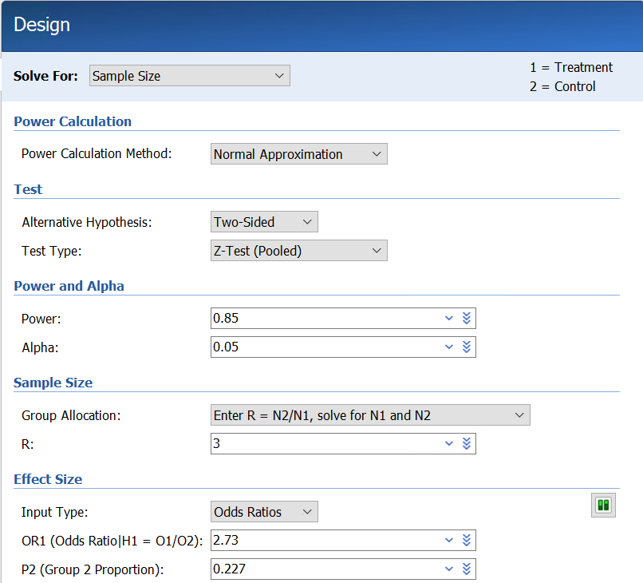{width="4.743300524934384in" height="4.296153762029746in"}

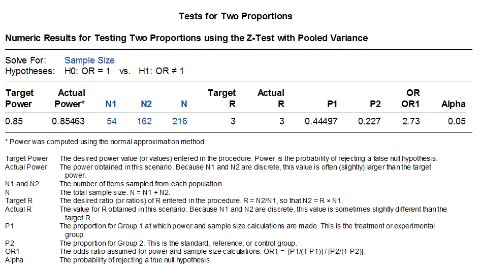{width="4.538027121609799in" height="2.5400054680664916in"}

若选择Fisher确切概率检验方法（Fisher's Exact Test），计算病例组和对照组需要的样本量分别为60例和180例，此结果与根据公式5-4计算并根据公式5-5校正后的结果相同，亦与原文中报告的样本量相同。详细的样本量计算参数输入界面和样本量计算结果如下图所示：

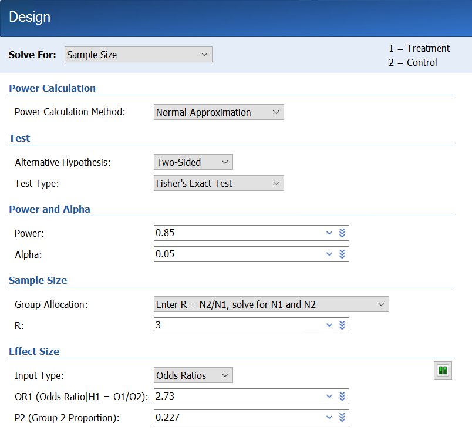{width="4.235009842519685in" height="3.882176290463692in"}

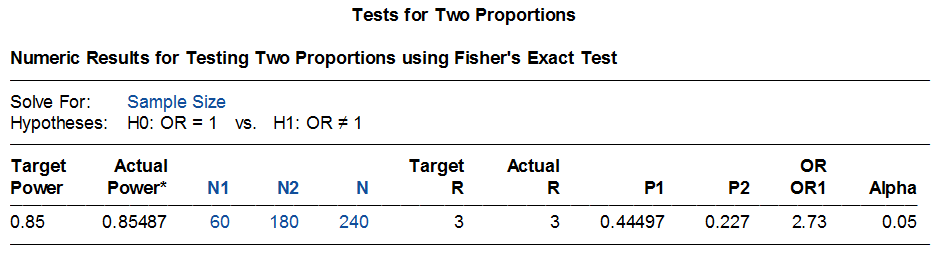{width="5.4211843832021in" height="1.4652734033245844in"}

**2.3 R软件计算样本量**

R语言rpact程序包提供了此类研究的样本量计算方法，应用的是近似正态分布法。详细的R语言代码和计算结果如下图所示。病例组和对照组所需要的样本量分别为55.6例（向上取整为56例）和166.9例（向上取整为167例），样本量共计223例，比根据公式5-4计算结果略多一些。

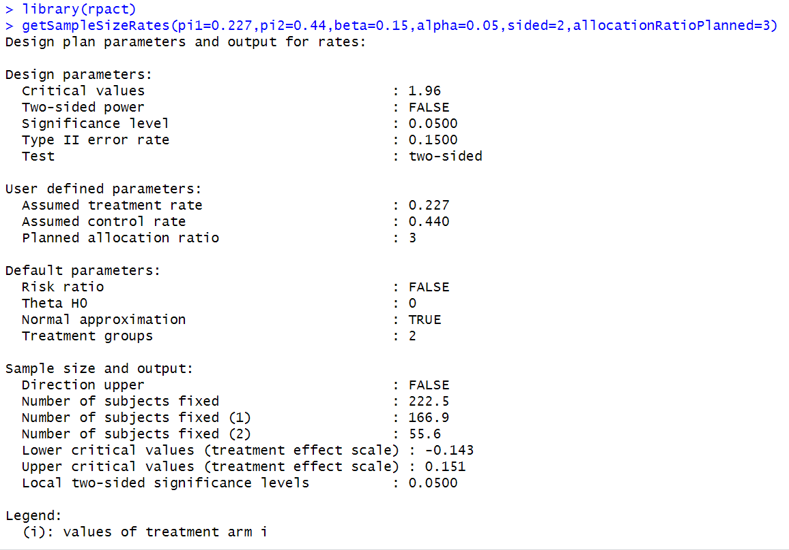{width="6.342250656167979in" height="4.432551399825022in"}

此外，R语言clinfun程序包亦可用于计算此类研究的样本量，应用的是Fisher确切概率法。详细的R语言代码和计算结果如下图所示。病例组和对照组所需要的样本量分别为64例和191例，比根据公式5-4和5-5计算结果略多一些。

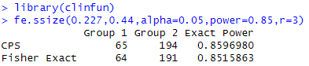{width="3.790426509186352in" height="0.8101673228346457in"}

2.  **案例分析3**

> 例5-5：某研究^\[9\]^拟评估临床和实验室检查结果用于诊断急性主动脉夹层的准确性。该

研究采用1:4配对病例-对照研究设计，病例组纳入经CT或超声心动图证实患有非外伤性急性主动脉夹层的患者，对照组纳入14天内出现胸、后背、腹部或腰部疼痛，但未明确诊断的患者。研究者预估对照组的暴露率为10%，在检验水准α=0.05，检验效能80%的水平下，要检测到\>2的OR值，至少需要样本量825例（病例组165例，对照组660例）。

**3.1 公式法计算样本量**

此研究采用1:4配对的病例-对照研究设计，故采用公式5-7进行样本量计算。本案例中，$\pi_{1}$=0.10，当OR=2时，利用公式5-8计算$\pi_{2}$=0.1818，$\pi_{c}$=(0.1818+4\*0.10)/(1+4)=0.145。将上述参数代入公式5-7，计算病例组样本量至少为171.47例，向上取整为172例，对照组样本量为4\*172=688例，此结果高于研究中报告的样本量数值。

$$n = \frac{{（1.96\sqrt{\left( 1 + \frac{1}{4} \right) \times 0.145 \times (1 - 0.145)} + 0.84\sqrt{0.1818 \times (1 - 0.1818)/4 + 0.10 \times (1 - 0.10)})}^{2}}{{(0.1818 - 0.10)}^{2}} = 171.47$$

因研究中报告OR\>2，众所周知，OR值越大，需要的样本量越小。所以研究中报道，如果病例组样本量为165例时，可检测到\>2的OR值。

**3.2 PASS软件计算样本量**

PASS 2023软件也提供了相应的模块用于此类研究样本含量的计算。具体操作步骤如下：

Proportions → Two Correlated (Paired) Proportions → Test (Inequality) → Test for Two Correlated Proportions in a Matched Case-Control Design。

若取OR为2，应用PASS软件计算病例组样本量为198例，此结果高于公式法计算的样本量。若取OR为2.12，应用PASS软件计算样本量为165例，与研究中报告的样本量结果一致。详细的样本量计算参数输入界面和样本量计算结果如下：

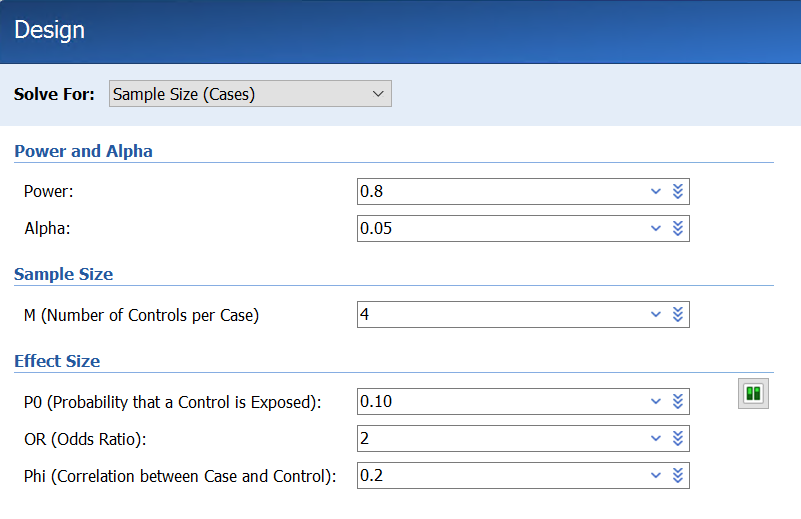{width="4.31580271216098in" height="2.7964905949256345in"}

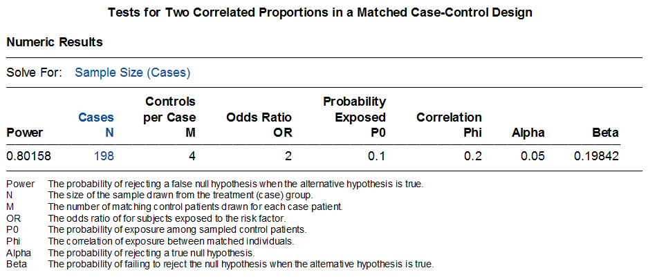{width="4.5848042432195975in" height="1.9617618110236221in"}

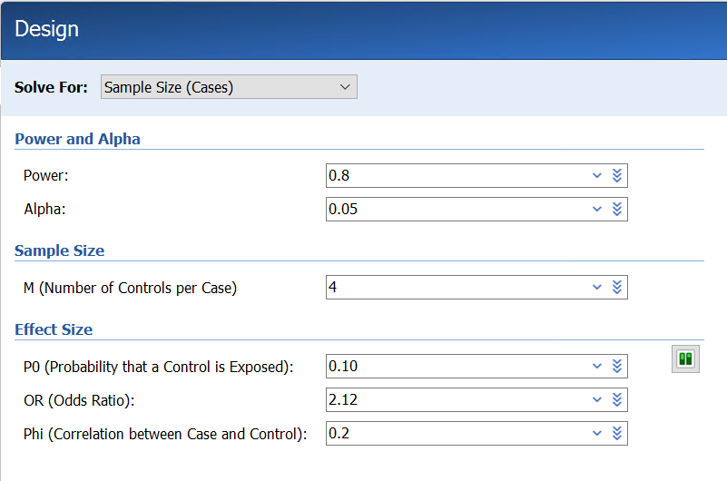{width="5.102634514435696in" height="3.3763648293963255in"}

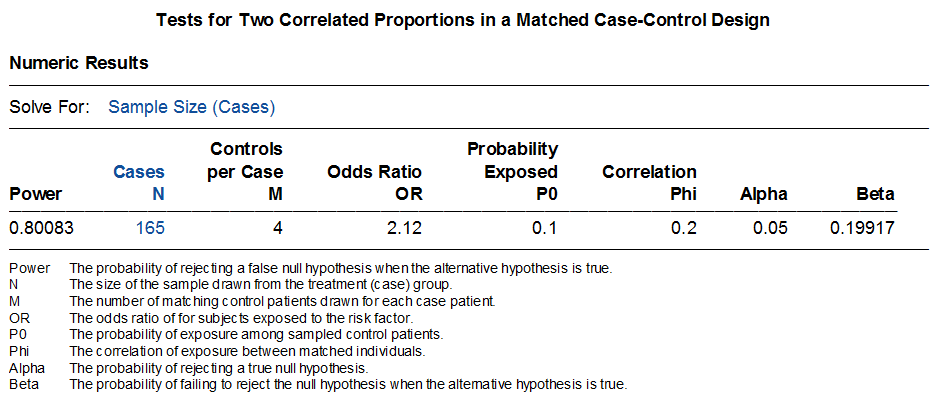{width="5.653885608048994in" height="2.4614074803149606in"}

3.  **R软件计算样本量：**

> [未找到可用于1：C配对病例对照研究样本量计算的程序包，需要曾博的帮助，谢谢！]{.mark}

**第三节 队列研究的样本含量估算**

队列研究是一种常用于确证病因的观察性研究方法。基本的研究过程是将研究人群按是否暴露于某个待研究的因素（或其不同的暴露水平）而将研究对象分成不同的组，如暴露组和非暴露组，随访观察一定时间并追踪各组观察对象的发病和死亡的结局，比较各组间结局的差异，以验证暴露因素与疾病之间有无因果关联及关联大小。

在估算队列研究的样本含量时需要考虑：一般来说，暴露与非暴露人群的比例取决于自然人群中暴露的频率，如果暴露因素是非常罕见的，则不适宜做队列研究。如果暴露人群远少于非暴露人群，非暴露队列可以是人群的随机样本，但非暴露队列样本含量不应少于暴露队列，两组人群数量相等时统计效率最高。

队列研究所需样本含量仍可按照公式5-3、公式5-4和公式5-5计算。但这里P~1~为暴露组的发病率，P~0~为非暴露组的发病率，其余均同病例对照研究。

**1 案例分析1**

例11-7：某研究^\[10\]^采用前瞻性队列研究设计调查马来西亚地区登革热病毒的感染情况并分析相关的影响因素。该研究使用Fleiss等提出的样本计算计算和校正公式进行计算，基于以下信息，计算每组样本量至少为333例。

- 昔加末高风险区登革热病毒的患病率（暴露组）=5%

- 昔加末低风险区登革热病毒的患病率（非暴露组）=1%

- 非暴露组与暴露组样本量之比=1:1

- 检验水准α=0.05，双侧

- 检验效能1-β=80%

  1.  **公式法计算样本量**

> 本案例采用前瞻性队列研究设计，暴露组与非暴露组样本量之比为1:1，因暴露组和非

暴露组登革热病毒患病率分别为5%或1%，接近于0%，故采用公式5-4和5-5公式进行样本量计算及校正。本研究案例中，P0=0.01，P1=0.05，$\overline{p}$=(P0+P1)/2=0.03，$\overline{q}$=1-$\overline{p}$=0.97，r=1。代入公式5-4中计算病例组样本量（n1）为275.75例，利用公式5-5校正后计算样本量为332.12例，向上取整为333例。最终病例组和对照组样本量分别为333例。

$$n_{1} = \frac{{(1.96\sqrt{(1 + 1) \times 0.03 \times 0.97} + 0.84\sqrt{0.01 \times (1 - 0.01) + 0.05(1 - 0.05)})}^{2}}{{(0.05 - 0.01)}^{2}} = 284$$

$$n_{1,cc} = \frac{284}{4}{\lbrack 1 + \sqrt{1 + \frac{2(1 + 1)}{284|0.05 - 0.01|}}\rbrack}^{2} = 332.12$$

2.  **PASS软件计算样本量**

> PASS软件也提供了相应的模块用于此类研究的样本量计算。具体操作步骤为：

Proportions → Two Independent Proportions → Test (Inequality) → Test for Two Proportions。

需要注意的是，PASS软件在此模块中共提供了七种差异性检验方法，分别为：Fisher's Exact Test, Z-Test (Pooled), Z-Test (Unpooled), Z-Test C.C. (Pooled), Z-Test C.C. (Unpooled), Mantel-Haenszel Test, Likelihood Ratio Test, T-Test. 其中，Z-Test (Pooled)为合并标准差的卡方检验，公式5-3和公式5-4采用的就是这种检验方法。但是当事件率过大或过小（接近于0或1）时，变量因不服从正态分布不宜直接使用Z-Test (Pooled)这种方法直接计算，此时就需要利用公式5-5进行校正。校正后的样本量与利用Fisher's Exact Test方法计算的样本量一致。

在本案例中，因暴露组和非暴露组的登革热病毒患病率较低，接近于1%，不符合正态分布，所以在PASS模块中应选择Fisher's Exact Test方法。详细的样本量计算参数输入界面和样本量计算结果如下图所示：

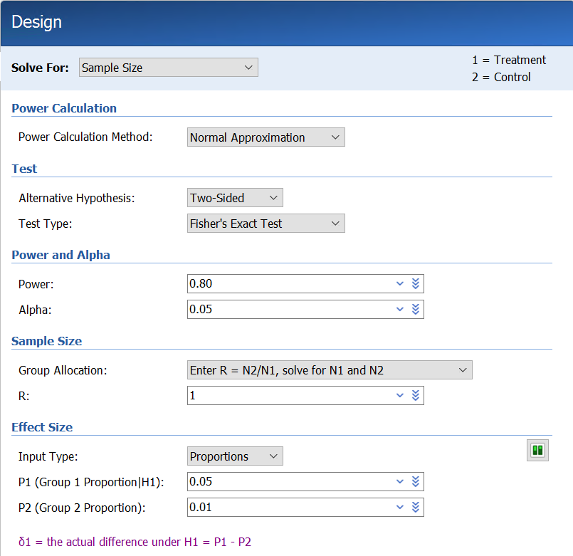{width="4.127718722659668in" height="4.004472878390201in"}

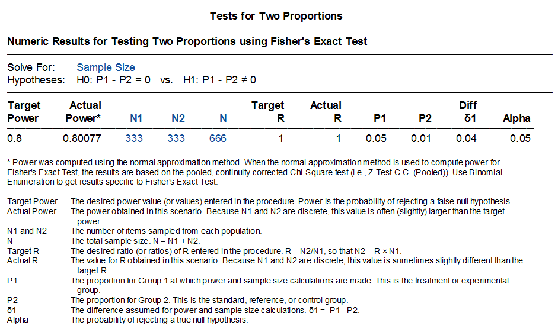{width="4.330207786526684in" height="2.58165135608049in"}

通过PASS软件计算暴露组和非暴露组的样本量分别333例，与公式法计算结果及该研究公开发表的研究方案提及的样本量一致。

3.  **R软件计算样本量**

> R语言exact2X2程序包提供了应用Fisher's Exact Test方法对此类研究样本量进行计算

的方法，计算结果为病例组和对照组样本量均为332.4412例，向上取整为333例。与通过公式法、PASS软件以及研究公开发表的研究方案中提及的样本量一致。

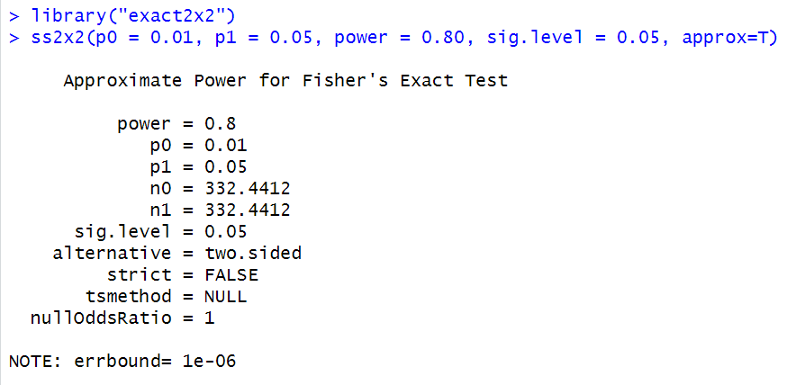{width="5.512680446194226in" height="2.638865923009624in"}

参考文献

\[1\] 颜艳等.《医学统计学》（第5版）. 人民卫生出版社，2020.

\[2\] 李欣等. 养老机构老年人认知功能现状及影响因素分析. 中华护理杂志，2023, 58(4): 446-451.

\[3\] Badri R, et al. Study on clinic-Demographic characteristics of orthopaedic cases in a tertiary care center: a descriptive cross-sectional study. J Nepal Med Assoc 2020; 58(232): 1069-71.

\[4\] Kelsey JL, et al. Methods in Observational Epidemiology. Oxford University Press 1996.

\[5\] Fleiss JL, et al. Statistical Methods for Rates and Proportions. John Wiley & Sons, 1981.

\[6\] 方积乾等.《卫生统计学》（第6版）. 人民卫生出版社，2007.

\[7\] Mojtaba D, et al. Association of opium addiction with rupture of intracranial aneurysms: a case-control study. World Neurosurg, 2019, 02.077.

\[8\] Tenaw Y, et al. Determinants of HIV-malaria co-infection among people living with HIV on anti-retroviral therapy in Northeast Ethiopia: unmatched case control study. Tropical Medicine and Health, 2020, 48:94.

\[9\] Robert O, et al. High risk clinical features for acute aortic dissection: a case=control study. Academic Emergency Medicine, 2018, 25: 378-387.

\[10\] Nowrozy KJ, et al. A community-based prospective cohort study of dengue viral infection in Malaysia: the study protocol. Infectious Diseases of Poverty, 2016, 5: 76.
