# S12. 成组序贯设计

## 成组序贯设计

适应性设计是指按照预先设定的计划，在期中分析时使用试验期间累积的数据对试验做出相应修改的临床试验设计1-3。常见的适应性设计包括：成组序贯设计，样本量重新估计，适应性无缝剂量选择的设计，适应性富集设计，两阶段适应性设计，适应性主方案试验设计，多重适应性设计等。本章重点关注成组序贯设计。

成组序贯设计是最早应用于临床试验的适应性设计，指方案中预先计划在试验过程中进行一次或多次期中分析，依据每一次期中分析的结果做出后续试验的决策，决策通常有四种可能：（1）依据优效性终止试验；（2）依据无效性终止试验；（3）依据安全性终止试验；（4）继续试验1。

在研究开展的过程中预设若干个节点进行假设检验，有望因结果有效或无效而提前终止研究，提高研究的效率。这增加的期中分析，是一种特殊类型的多重检验，因此研究设计时总的样本量需适当扩增以控制I类错误，尽管成组序贯设计的期望样本量仍然是减少的。

调整I类错误率的常见方法有O’Brien-Fleming法，Pocock法及各种α消耗函数法。经典的O’Brien-Fleming方法不考虑无效边界，样本量扩增系数见表 12-1。非绑定（non-binding，期中分析显示无效后仍继续研究）类O’Brien-Fleming法样本量扩增系数见表 12-2，绑定性类O’Brien-Fleming法（期中分析显示无效后终止研究）样本量扩增系数见表 12-3。

表 12-1 经典O’Brien-Fleming法样本量扩增系数（k为总检验次数）

表 12-2 非绑定类O’Brien-Fleming法样本量扩增系数（k为总检验次数）

表 12-3 绑定性类O’Brien-Fleming法样本量扩增系数（k为总检验次数）

α消耗函数法不受等间距进行期中分析的束缚，更为灵活。常用的有Lan-Demets及Hwang-Shih函数，也都可以模拟出类似O’Brien-Fleming的情形。

Lan-DeMets α消耗函数，当ρ=1时类似O’Brien-Fleming。

Hwang-Shih-DeCani α消耗函数，当γ=-4时类似O’Brien-Fleming。

### 单组研究的成组序贯设计

#### 例 12-4 某单臂研究评价某心脏康复干预对运动耐量（以6分钟步行距离，6MWD，单位米计）的改善，采用自身前后配对设计（以基线值为对照）。假设干预前均值为290 m，预期干预后提高5 m，差值的个体内标准差（within-subject SD）约为15 m。取单侧α=0.025，检验效能80%，按配对t检验计算固定设计样本量：

n = (z_{0.975}+z_{0.8})^2 σ_d^2 / δ^2 = (1.96+0.84)^2 × 15^2 / 5^2 ≈ 71

即需71例患者。研究计划在入组约一半（36例）时进行一次期中分析，采用Lan-DeMets O'Brien-Fleming边界（ρ=1，近似O'Brien-Fleming）。R语言gsDesign包计算如下：

library(gsDesign)

x <- gsDesign(

k = 2,

alpha = 0.025,

beta = 0.2,

test.type = 1,

timing = c(0.5),

sfu = sfLDOF,

sfl = sfLDOF,

n.fix = 71

)

x

结果输出：

One-sided group sequential design with

80 % power and 2.5 % Type I Error.

Analysis N   Z   Nominal p  Spend

1 36 2.96    0.0015 0.0015

2 72 1.97    0.0245 0.0235

Total                   0.0250

++ alpha spending:

Lan-DeMets O'Brien-Fleming approximation spending function (no parameters).

Boundary crossing probabilities and expected sample size

assume any cross stops the trial

Upper boundary (power or Type I Error)

Analysis

Theta      1      2 Total E{N}

0.0000 0.0015 0.0235 0.025 71.2

0.3325 0.1641 0.6359 0.800 65.4

第1次分析（约36例）的疗效界值为Z=2.96（对应单侧P=0.0015），第2次分析（72例）为Z=1.97（对应单侧P=0.0245）。在真实效应δ=5 m时，预期需要的样本量E{N}=65.4，小于固定设计的71例，体现了成组序贯设计在有效时提前终止的优势；若期中分析未达到疗效界值，则继续入组至72例进行最终分析。单组/配对设计常用于单臂器械或自身前后对照研究，此时以单侧检验考察“是否改善”较为常见。

### 两组均数比较的成组序贯设计

#### 例 12-5 某研究比较某降压干预与常规治疗对24小时动态收缩压（mmHg）降低值的影响。假设常规治疗组降低5 mmHg，试验组降低12 mmHg，两组个体内标准差均为12 mmHg。取双侧α=0.05，检验效能80%，按两独立样本均数比较的固定设计，每组需：

n = 2(z_{0.975}+z_{0.8})^2 σ^2 / δ^2 = 2×(1.96+0.84)^2×12^2/7^2 ≈ 47

即每组47例，共94例。研究计划在入组约一半时进行一次期中分析，采用Lan-DeMets O'Brien-Fleming边界。R语言可先按公式求得固定设计样本量，再用gsDesign包进行成组序贯设计：

delta <- 7; sigma <- 12

n_per_group <- 2 * (qnorm(0.975) + qnorm(0.8))^2 * sigma^2 / delta^2

ceiling(n_per_group)

library(gsDesign)

x <- gsDesign(

k = 2,

alpha = 0.025,

beta = 0.2,

test.type = 2,

timing = c(0.5),

sfu = sfLDOF,

sfl = sfLDOF,

n.fix = 94

)

x

结果输出：

Symmetric two-sided group sequential design with

80 % power and 2.5 % Type I Error.

Spending computations assume trial stops

if a bound is crossed.

Analysis N   Z   Nominal p  Spend

1 48 2.96    0.0015 0.0015

2 95 1.97    0.0245 0.0235

Total                   0.0250

++ alpha spending:

Lan-DeMets O'Brien-Fleming approximation spending function (no parameters).

Boundary crossing probabilities and expected sample size

assume any cross stops the trial

Upper boundary (power or Type I Error)

Analysis

Theta      1      2 Total E{N}

0.000 0.0015 0.0235 0.025 94.2

0.289 0.1641 0.6359 0.800 86.6

Lower boundary (futility or Type II Error)

Analysis

Theta      1      2 Total

0.000 0.0015 0.0235 0.025

0.289 0.0000 0.0000 0.000

第1次分析（48例）的疗效界值为Z=2.96（双侧P=0.003），第2次分析（95例）为Z=1.97（双侧P=0.049）。在真实效应δ=7 mmHg时，预期样本量E{N}=86.6，小于固定设计的94例。当两组标准差不等或需考虑脱落时，可改用test.type=3（不等方差），或在n.fix中除以（1-脱落率），处理方式与本章“两组率比较”及“生存数据”部分相同。

### 两组率比较的成组序贯设计

#### 例 12-1 BAOCHE研究4考察血管内血栓切除对基底动脉急性闭塞引起的卒中的疗效。与药物治疗比较，主要终点为90天功能良好率（Rankin评分0~3），假设对照组为0.4，试验组为0.6，双侧α=0.05，β=0.1，固定设计需样本量254。采用Lan-Demets法O’Brien–Fleming成组序贯设计，入组2/3患者时进行一次期中分析，样本量增加至286，考虑10%脱落，样本量定为318，拟在入组212例患者时作一次期中分析。期中分析和最终分析的α水平分别为0.012和0.046。采用PASS 13软件进行样本量计算。

Legacy

Excel表显示独立方差法的固定样本量为254。

利用R语言pwrss包计算固定设计的样本量为254，再利用R语言gsDesign包计算脱落前的样本量为269，rpact包结果与之相同。

x <- gsDesign(

k = 2,

alpha = 0.025,

timing = c(2/3),

sfu = sfLDOF,

sfl = sfLDOF,

n.fix = 254

)

X

结果输出：

Asymmetric two-sided group sequential design with

90 % power and 2.5 % Type I Error.

Upper bound spending computations assume

trial continues if lower bound is crossed.

----Lower bounds----  ----Upper bounds-----

Analysis  N   Z   Nominal p Spend+  Z   Nominal p Spend++

1 180 1.02    0.8451  0.044 2.51    0.0060   0.006

2 269 1.99    0.9769  0.056 1.99    0.0231   0.019

Total                    0.1000                 0.0250

+ lower bound beta spending (under H1):

Lan-DeMets O'Brien-Fleming approximation spending function (no parameters).

++ alpha spending:

Lan-DeMets O'Brien-Fleming approximation spending function (no parameters).

Boundary crossing probabilities and expected sample size

assume any cross stops the trial

Upper boundary (power or Type I Error)

Analysis

Theta      1      2  Total  E{N}

0.0000 0.0060 0.0173 0.0233 192.5

0.2034 0.5843 0.3157 0.9000 212.4

Lower boundary (futility or Type II Error)

Analysis

Theta      1      2  Total

0.0000 0.8451 0.1316 0.9767

0.2034 0.0440 0.0560 0.1000

依次点击Group-Sequential, Two Proportions, Test(Inequality), Group-Sequential Tests for Two Proportions (Legacy)

选择Legacy的方法，依次点击Group-Sequential, Two Proportions, Test(Inequality), Group-Sequential Tests for Two Proportions (Legacy)，结果脱落前样本量为266。

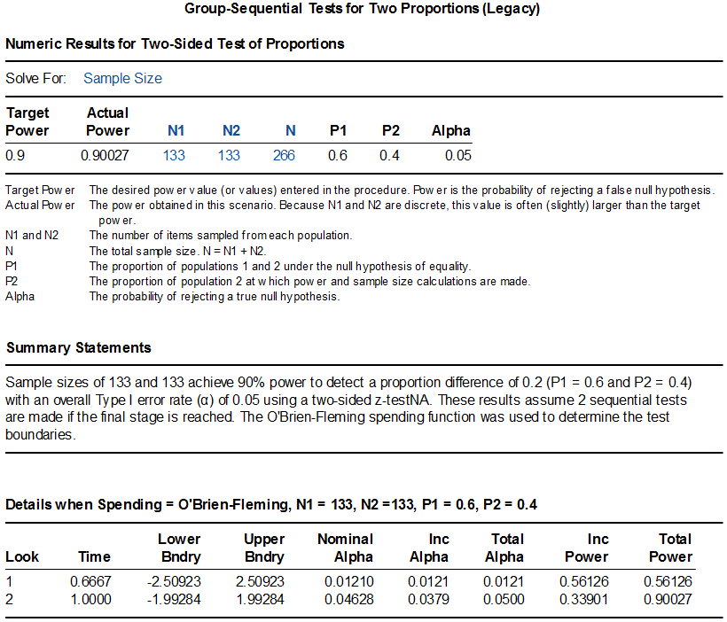{width="6.0in"}
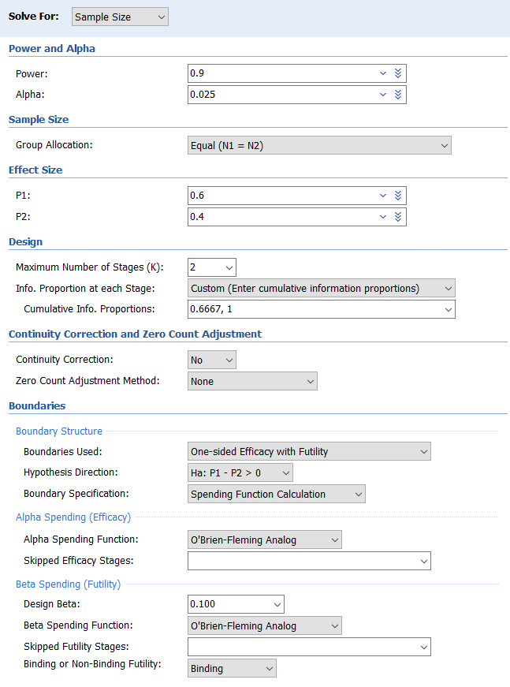{width="6.0in"}
{width="6.0in"}
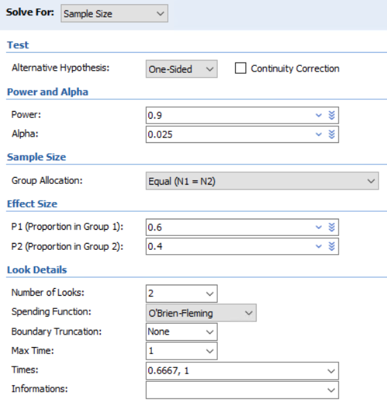{width="6.0in"}
Simulation

依次点击Group-Sequential, Two Proportions, Test(Inequality), Group-Sequential Tests for Two Proportions (Simulation)，因系模拟计算，结果难以完全重复，同样的设置下，差异可超过10例。

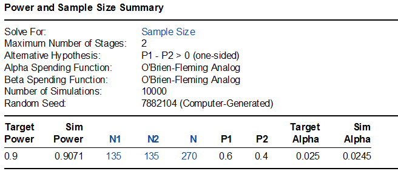{width="6.0in"}
{width="6.0in"}
{width="6.0in"}
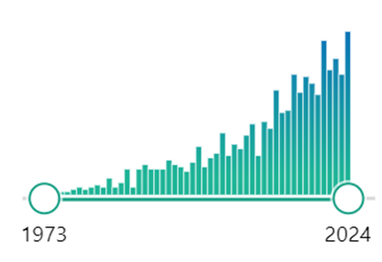{width="6.0in"}
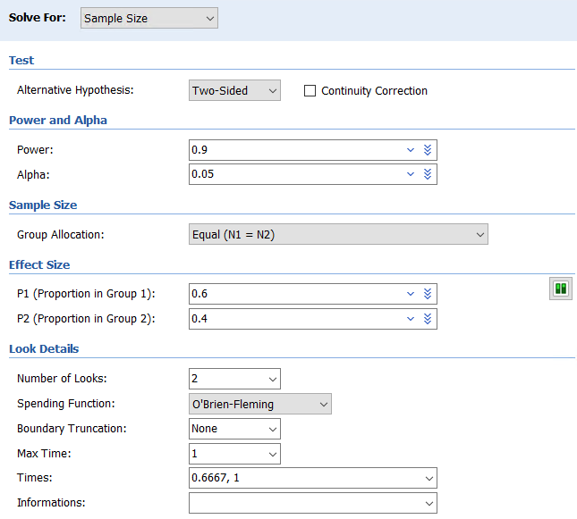{width="6.0in"}
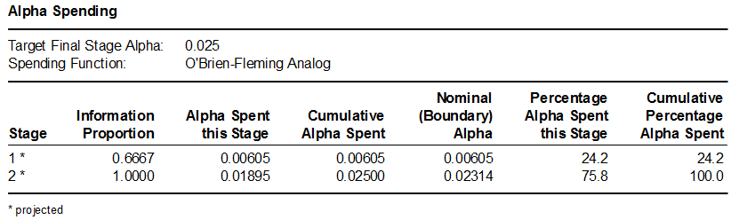{width="6.0in"}
该研究对入组的217例患者结果进行了一次期中分析，功能良好率在对照组和试验组分别为24%与46%，P<0.001，研究达成，提前终止。

#### 例 12- TOTAL研究考察了某种胎儿手术的疗效，手术组与对照组比较，主要终点为新生儿出院存活率。假设对照组存活率25%，手术组50%，成组序贯设计，在入组40%，60%，70%，80%及90%时设置了5次期中分析，采用O’Brien–Fleming终止规则，取双侧α=0.05，检验效能80%，需入组116例受试者。

首先计算固定设计时所需样本量为110：

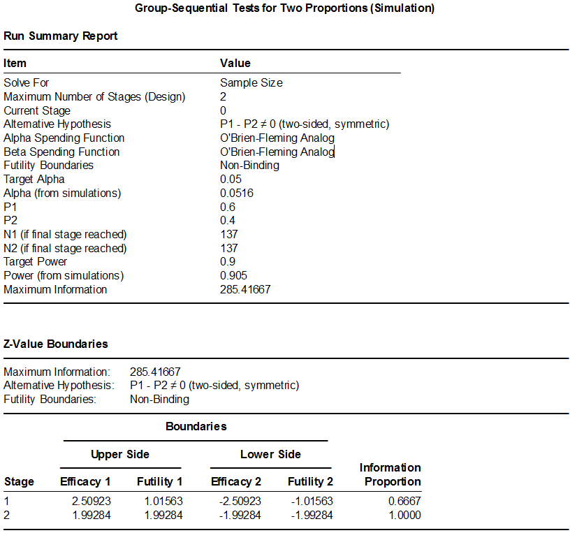{width="6.0in"}
利用R语言pwrss包计算固定设计的样本量为110，再利用gsDesign包进行成组序贯设计：

library(pwrss)

pwrss.z.2props(0.25, 0.5, power = 0.8)

library(gsDesign)

x <- gsDesign(

alpha = 0.025,

beta = 0.2,

k = 6,

sfu = "OF",

sfl = "OF",

timing = c(0.4, 0.6, 0.7, 0.8, 0.9, 1),

test.type = 2,

n.fix = 110

)

x

plot(x)

结果输出：

Symmetric two-sided group sequential design with

80 % power and 2.5 % Type I Error.

Spending computations assume trial stops

if a bound is crossed.

Analysis  N   Z   Nominal p  Spend

1  46 3.29    0.0005 0.0005

2  69 2.69    0.0036 0.0033

3  80 2.49    0.0064 0.0037

4  92 2.33    0.0099 0.0049

5 103 2.20    0.0140 0.0059

6 115 2.08    0.0186 0.0067

Total                    0.0250

++ alpha spending:

O'Brien-Fleming boundary.

Boundary crossing probabilities and expected sample size

assume any cross stops the trial

Upper boundary (power or Type I Error)

Analysis

Theta      1      2      3      4      5      6 Total  E{N}

0.0000 0.0005 0.0033 0.0037 0.0049 0.0059 0.0067 0.025 113.2

0.2671 0.0683 0.2509 0.1544 0.1343 0.1088 0.0833 0.800  88.5

Lower boundary (futility or Type II Error)

Analysis

Theta     1      2      3      4      5      6 Total

0.0000 5e-04 0.0033 0.0037 0.0049 0.0059 0.0067 0.025

0.2671 0e+00 0.0000 0.0000 0.0000 0.0000 0.0000 0.000

PASS Group-Sequential Tests for Two Proportions (Legacy)的界面较为简单，计算结果为124，并且其给出的期中分析的P值的界值也与原文不符。可尝试模拟计算Group-Sequential Tests for Two Proportions (Simulation)，此处不做介绍。

研究在入组了80例产妇时进行了第3次期中分析，手术组存活率40%，对照组16%，P=0.009，研究方案里给出的第3次期中分析的P的界值为单侧0.0064，相当于双侧0.0128，因此宣告手术有效而提前终止了研究。从R语言的结果来看，第3次期中分析的P的界值为也是单侧0.0064，与该研究一致。

### 生存数据的成组序贯设计

#### 例 12- 某研究比较了鼻咽癌的两种化疗方案，主要终点为无复发生存率。假设HR=0.52（预期对照组3年无复发生存率为78%，试验组为88%），取双侧α=0.05，检验效能80%，则需要77个事件，452例患者。假设脱落率为5%，样本量扩增至476例。研究计划在记录到一半的事件数时进行一次期中分析，采用Lan-DeMets O’Brien-Fleming边界，期中分析的P要求<0.003，最终分析时的P值为0.049，总的I类错误率控制在0.05。

研究在累积了38个主要终点事件后进行了期中分析，建议研究继续。最终入组了480例患者，主要终点在试验组和对照组分别为85.3%和76.5%（HR=0.51，95%置信区间0.34~0.77，P=0.001），研究达成。

先将生存率0.78和0.88转化为事件率0.22和0.12，Excel表显示此例HR=0.5145（注意不是简单的(1-0.88)/(1-0.78）)，据此再计算出事件数。如果HR取0.52，则Schoenfeld法和Freedman法的事件数分别为74和79。此例未给出入组和随访时间，我们假设患者同时入组，Excel表中Ta给了一个极小值0.001；随访3年，即1个时间单位，Tf填入1。Shoenfeld法事件数为72，根据表 12-2，乘以样本量扩增系数1.056，得76.03，取整为77；样本量相应扩增为442。

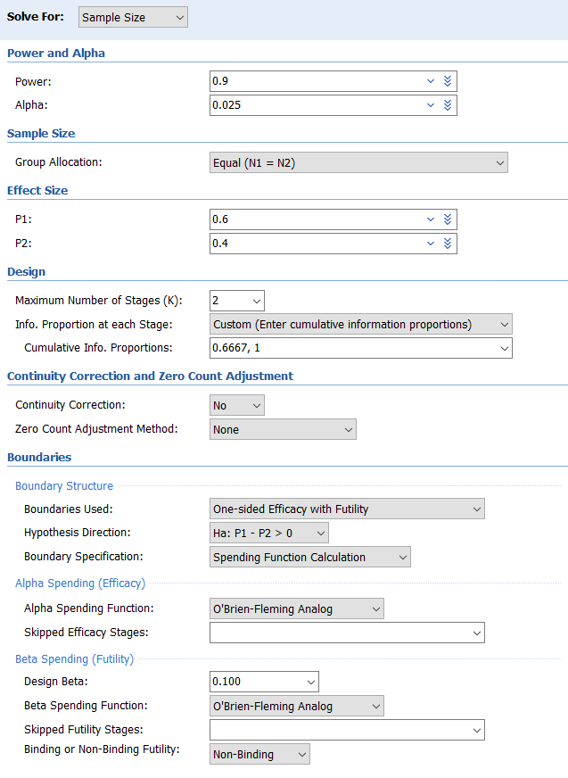{width="6.0in"}
R语言gsDesign包计算如下，数值稍有不同，需要77个事件，451例患者：

gsSurv(

k = 2,

alpha = 0.025,

beta = 0.2,

sfu = sfLDOF,

sfl = sfLDOF,

lambdaC = -log(0.78),

hr = log(0.88)/log(0.78),

T = 1.001,

minfup = 1

)

结果输出：

Time to event group sequential design with HR= 0.5145

Equal randomization:          ratio=1

Asymmetric two-sided group sequential design with

80 % power and 2.5 % Type I Error.

Upper bound spending computations assume

trial continues if lower bound is crossed.

----Lower bounds----  ----Upper bounds-----

Analysis N   Z   Nominal p Spend+  Z   Nominal p Spend++

1 39 0.56    0.7121 0.0699 2.96    0.0015  0.0015

2 77 1.97    0.9755 0.1301 1.97    0.0245  0.0235

Total                   0.2000                 0.0250

+ lower bound beta spending (under H1):

Lan-DeMets O'Brien-Fleming approximation spending function (no parameters).

++ alpha spending:

Lan-DeMets O'Brien-Fleming approximation spending function (no parameters).

Boundary crossing probabilities and expected sample size

assume any cross stops the trial

Upper boundary (power or Type I Error)

Analysis

Theta      1      2  Total E{N}

0.0000 0.0015 0.0218 0.0233 49.3

0.3287 0.1770 0.6230 0.8000 67.2

Lower boundary (futility or Type II Error)

Analysis

Theta      1      2  Total

0.0000 0.7121 0.2646 0.9767

0.3287 0.0699 0.1301 0.2000

T   n Events HR futility HR efficacy

IA 1  0.475 451  38.35       0.835       0.384

Final 1.001 451  76.70       0.638       0.638

Accrual rates:

Stratum 1

0-0    450988

Control event rates (H1):

Stratum 1

0-Inf      0.25

Censoring rates:

Stratum 1

0-Inf         0

结果中的One-sided local significance level为0.0015和0.00245，转换为双侧分别为0.003和0.0049，与原例的要求完全一致。

R语言rpact包计算需76个事件，442例患者。

PASS软件操作时一次点击Group-Sequential, Survival, Test(Inequality), Group-Sequential Logrank Tests (Legacy)，参数界面较为简陋，计算需事件数71.4，样本量420，可考虑使用模拟法。

#### 例12- 3 BERLIN VT研究探索预防性室速消融能否降低全因死亡及室速或心衰恶化住院的复合终点。入选缺血性心肌病合并室速拟接受ICD植入的患者，随机分为预防消融组（ICD植入前进行室速消融）和延迟消融组（在3次ICD治疗室速后再进行消融）。O’Brien-Fleming成组序贯设计，预设3次期中分析。假设HR=0.525（预防消融组风险率0.168，延迟消融组为0.320），在检验效能80%，单侧显著性水平0.025时需85个事件。假设入组1.5年，随访1.5年，脱落率8%/年，共需样本量208例。

研究在累积了43个主要终点事件后进行了第二次期中分析，P=0.297，大于既定的0.253，故因无效而终止，研究此时已入组163例患者。

Excel表计算固定设计的事件数为76，样本量为202，乘以表 12-3中的样本量扩增系数1.078，得81.9与217.8，向上取整后分别为82与218。

{width="6.0in"}
R语言gsDesign计算需要82个事件，216.8例患者（向上取整并保持两组例数相等后为218，与Excel表一致）。

library(gsDesign)

nEvents(hr = 0.525, alpha = 0.025, beta = 0.2)

x<-gsSurv(

k = 4,

test.type = 3,

alpha = 0.025,

beta = 0.2,

sfu = sfLDOF,

sfl = sfLDOF,

lambdaC = 0.32,

hr = 0.525,

T = 3,

minfup = 1.5,

eta = -log(1-0.08)

)

x

plot(x)

结果输出：

Time to event group sequential design with HR= 0.525

Equal randomization:          ratio=1

Asymmetric two-sided group sequential design with

80 % power and 2.5 % Type I Error.

Spending computations assume trial stops

if a bound is crossed.

----Lower bounds----  ----Upper bounds-----

Analysis N    Z   Nominal p Spend+  Z   Nominal p Spend++

1 21 -0.86    0.1953 0.0104 4.33    0.0000  0.0000

2 41  0.56    0.7108 0.0596 2.96    0.0015  0.0015

3 62  1.34    0.9091 0.0690 2.36    0.0092  0.0081

4 82  1.93    0.9731 0.0611 1.93    0.0269  0.0154

Total                    0.2000                 0.0250

+ lower bound beta spending (under H1):

Lan-DeMets O'Brien-Fleming approximation spending function (no parameters).

++ alpha spending:

Lan-DeMets O'Brien-Fleming approximation spending function (no parameters).

Boundary crossing probabilities and expected sample size

assume any cross stops the trial

Upper boundary (power or Type I Error)

Analysis

Theta     1      2      3      4 Total E{N}

0.0000 0.000 0.0015 0.0081 0.0154 0.025 44.2

0.3215 0.002 0.1803 0.3841 0.2336 0.800 62.0

Lower boundary (futility or Type II Error)

Analysis

Theta      1      2      3      4 Total

0.0000 0.1953 0.5195 0.2021 0.0581 0.975

0.3215 0.0104 0.0596 0.0690 0.0611 0.200

T     n Events HR futility HR efficacy

IA 1  1.149 166.1  20.46       1.462       0.147

IA 2  1.684 216.8  40.91       0.841       0.396

IA 3  2.268 216.8  61.37       0.711       0.548

Final 3.000 216.8  81.82       0.653       0.653

Accrual rates:

Stratum 1

0-1.5     144.6

Control event rates (H1):

Stratum 1

0-Inf      0.32

Censoring rates:

Stratum 1

0-Inf      0.08

R语言rpact包计算结果与之相同。

结果该研究在第2次期中分析（累积发生43个事件，上文R语言计算结果为42.9）时，单侧P=0.297，大于既定的0.253，研究因无效终止，此时已入组了163例患者。

ARISTOTLE研究比较了新型口服抗凝药Apixaban与华法林预防非瓣膜病房颤血栓栓塞的效果，主要终点为卒中或全身栓塞，假设事件率为每年1.2%，非劣效界值1.44，要求试验组相对风险99%置信区间上限小于该界值，则448个事件可以提供90%的检验效能。平均随访约2.1年，需要约18000例患者。

（根据不同地区的监管要求，样本量计算满足两种情形：1）I类错误单侧0.025，非劣效界值1.38；2）I类错误单侧0.005，非劣效界值1.44。选择了要求样本量更大的情形2。）

（protocol Amendment 07，原先假设事件率为1.67%，样本量为15000，盲态分析显示实际的事件率为1.2%，样本量增加至18000）

50%终点事件时进行一次期中分析，如Apixaban优于华法林，P<0.0001则终止研究，不进行非劣效检验。

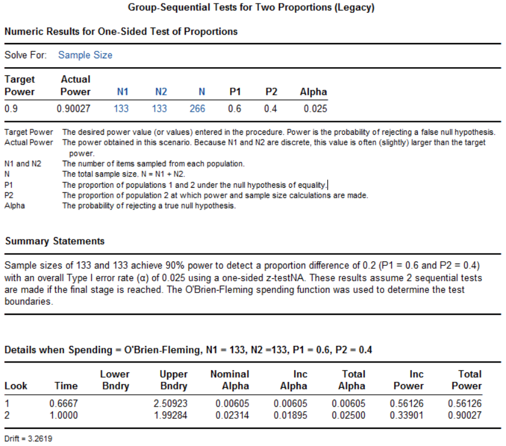{width="6.0in"}
中位随访时间1.8年，主要终点事件率在试验组为1.27%，对照组1.60%，HR为0.79（95%置信区间0.66~0.95，非劣效P<0.001，优效P=0.01）

（中国数据质量问题）

### 讨论

成组序贯设计，研究有望提前终止，不论是有效还是无效，可节约不少时间与成本，近年来使用逐渐增多，特别是在一些大型的临床试验中。在PubMed以”group sequential“进行检索，结果见图 12-1，其中2024年达71条记录。

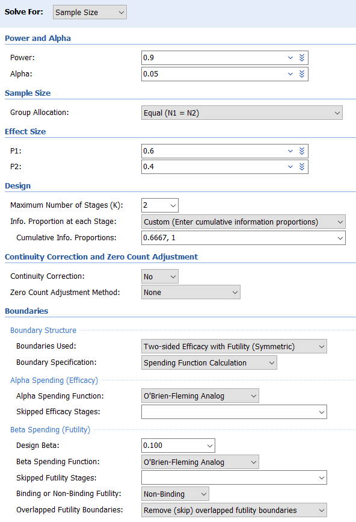{width="6.0in"}
图 12-1 在PubMed以”group sequential“进行检索的结果

出于对I类错误膨胀的担心，监管机构倾向于类似O’Brien-Fleming的边界，对于早期的期中分析设定严格的界值，而反对Pocock的边界，特别是在临床关键性研究中。Pocock边界在产品研发的早期有一定的价值。

期中分析的次数，以1~2次较为常见，尽管也有5次甚至更多的情况，极端情况是每获得一列患者的结果即进行分析，即使所需样本量增加有限（在单侧α=0.025，β=0.1的情况下，经典的O’Brien-Fleming边界，总计10次分析的样本膨胀系数仅为1.037；考虑无效终止，也仅为1.086），但需兼顾可行性。

#### 成组序贯设计的适用情况

一般来说，对预期结果比较有把握时，可直接采用传统的固定设计；对预期结果没有任何把握时，可开展小样本的预试验；而对预期结果的把握度介于这两者之间时，可考虑成组序贯设计。另外，成组序贯设计增加了研究操作层面的复杂性，也是需要考量的因素。药监局指导原则建议：在确证性试验中，适应性设计的期中分析一般应该由独立的数据监查委员会（Data Monitoring Committee, DMC）及其申办者以外的独立统计支持团队完成，并保证期中分析的结果不被申办者、研究者和受试者所知悉，以免影响后续试验的执行和引入操作偏倚1。

成组序贯设计适用于入组相对较慢，而获得结果相对较快的情形，比如主要研究终点为急性期终点时，很快可以获得期中分析的结果，决策是否要继续研究。如果获得结果相对较慢，比如需随访1年，而入组相对较快，则在等待先期患者1年的结果时，研究很可能继续入组完了所有的患者，除非事先约定暂停入组，但这两种情况都不能充分体现成组序贯设计的优势。

References:

1.	国家药品监督管理局. 药物临床试验适应性设计指导原则（试行）; 2021.

2.	FDA. Adaptive Designs for Clinical Trials of Drugs and Biologics Guidance for Industry; 2019.

3.	FDA. Adaptive Designs for Medical Device Clinical Studies; 2016.

4.	Jovin TG, Li C, Wu L, et al. Trial of Thrombectomy 6 to 24 Hours after Stroke Due to Basilar-Artery Occlusion. NEW ENGL J MED 2022;387:1373-84.
