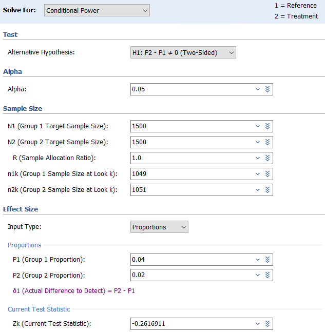
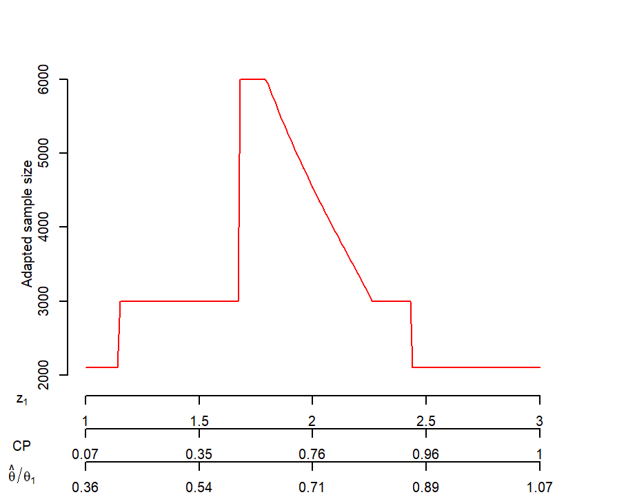
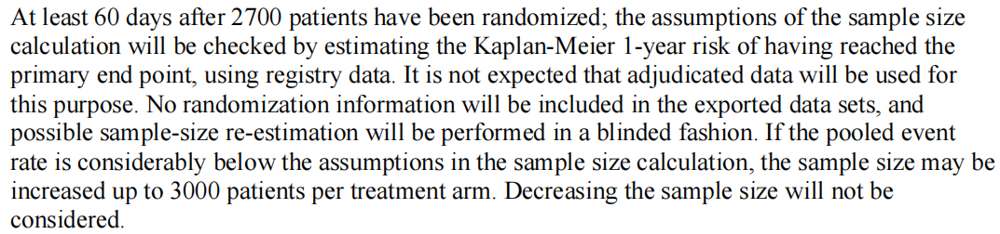
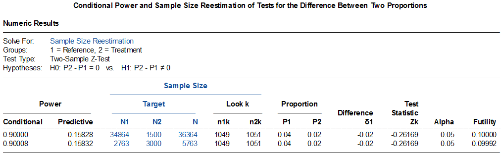
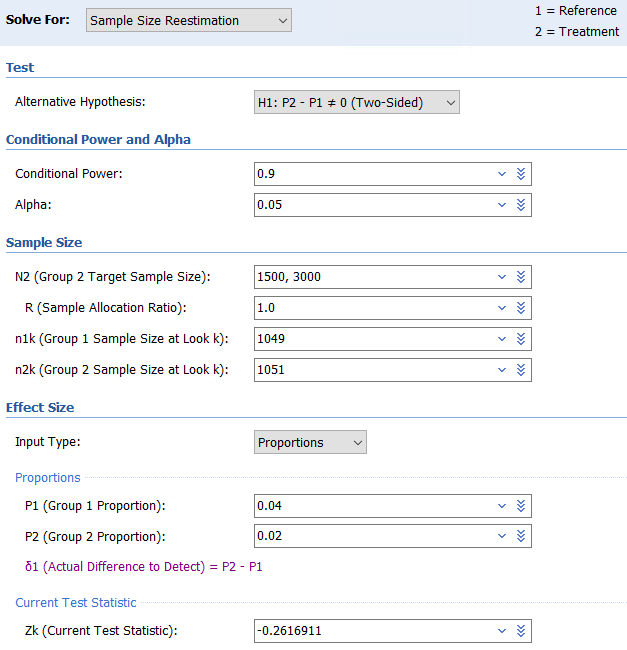
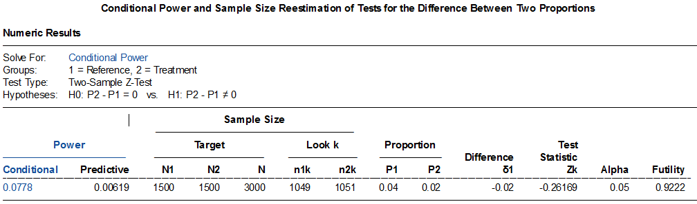
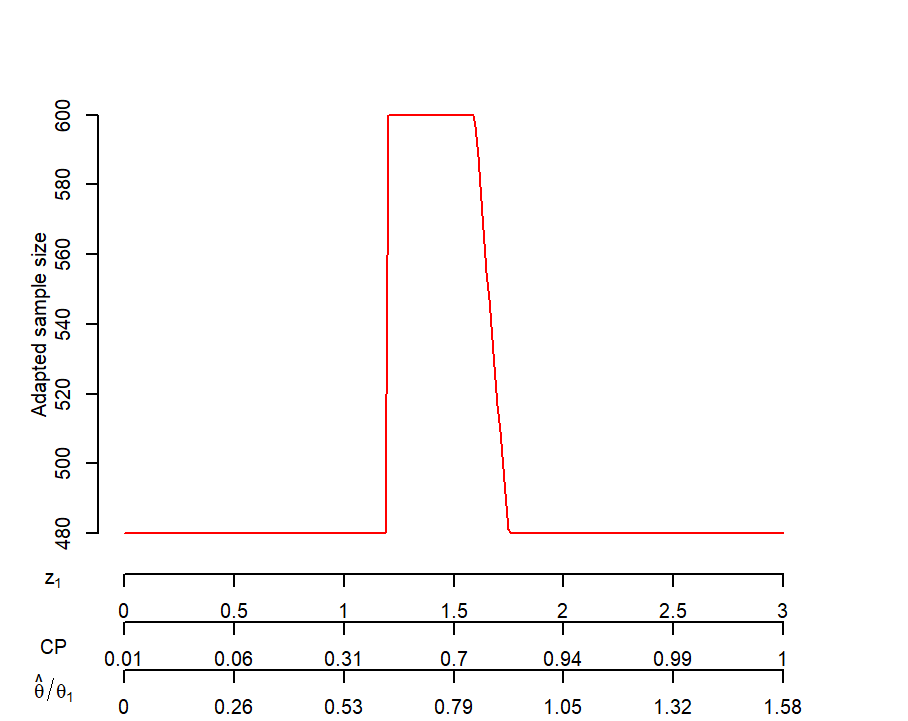

# 13. 样本量重新估计

## 样本量再计算

样本量再计算，亦称样本量重新估计，是指依据预先设定的期中分析计划，利用累积的试验数据重新计算样本量，以保证最终的统计检验能达到预先设定的目标或修改后的目标，并同时能够控制 I类错误率1。

样本量再计算可分为盲态法和非盲态法。盲态下的样本量重新估算，不揭盲分组信息，样本量根据一些重要的参数（如合并方差或合并事件发生率）进行调整，因不涉及假设检验，一般不需要调整I类错误率1, 2。非盲态法，根据分组信息计算了试验的效应量，通常需要对I类错误率进行相应的调整。近年来较为流行的是promising zone（有望区）法，事先设定最大样本量及期中分析条件效能的有望区，当期中分析的条件效能落入有望区时，可适当增加样本量直至最大样本量以期最终研究达成；低于该区为不利区（unfavorable zone）,即使样本量增加至最大样本量，也无法达到预期的检验效能，因此不增加样本量，继续按原计划完成入组；高于该区为有利区（favorable zone），无需增加样本量，按原计划完成入组即可3。

仅基于外部数据的修改。对于产品注册类临床试验，药监局要求必须有充分的依据，并需提前与监管机构进行沟通确认后方可通过试验方案的修正案来体现1。

各种原因造成的非预先计划的样本量再计算，临床研究中并不少见，应给予足够的重视。

### 盲态法样本量再计算

#### 例 13-1 VPS II随机对照双盲试验4评价了起搏器在血管迷走性晕厥中的疗效，所有患者均植入带有频率骤降反应功能的双腔起搏器，对照组程控为仅感知，不进行起搏。假设起搏器治疗可以将6个月晕厥事件由60%降为30%，检验效能80%，则共需80例患者。

研究在入组60例患者后发现实际的总事件率低于预期，样本量增加至100例。结果6个月累积晕厥率在对照组为40%，试验组为31%，降低了30%（95%置信区间-33%~63%，log-rank P=0.14），研究未达成。

#### 例 13-2 ARISTOTLE研究5为新型口服抗凝药与华法林在房颤卒中高危患者中的非劣效比较，假设主要终点事件率为1.67/100患者年，研究进展过程中盲态数据显示主要终点事件率为1.2/100患者年，样本量从15000增加至18000。

FAME36

During recruitment and without knowledge of event rates, the

trial steering committee decided to increase the

noninferiority margin to an upper boundary of

less than 1.65 for the 95% confidence interval

of the hazard ratio because it was thought to be

more appropriate on the basis of newly published clinical trials comparing CABG with PCI,

which reported major adverse cardiac or cerebrovascular events occurring in no more than 10%

of the patients randomly assigned to undergo

CABG and used noninferiority margins similar

to a hazard ratio of 1.65.

With this change, a

sample of 645 patients per group (1290 for the

entire trial) was required to achieve 90% power

to claim noninferiority; however, the steering

committee elected to complete the scheduled

enrollment of 1500 patients

It is important to note that the decision to change the noninferiority margin was made by the steering committee

without knowledge of the event rates in either of the

randomized arms

FULL REVASC7

{width="6.0in"}

### 非盲态法样本量再计算

#### 例 13-3 PROTECTED TAVR研究8旨在评价脑栓塞保护器械Sentinel在经导管主动脉瓣置换术（TAVR，transcatheter aortic-valve replacement）中的应用。患者随机分配入Sentinel组（试验组）或对照组，主要终点为术后72小时内的卒中。假设试验组和对照组的卒中率分别为2%和4%，取双侧α=0.05，则3000例患者的检验效能可超过90%。拟入组70%（2100）患者时进行一次期中分析，采用Lan-Demets消耗函数O’Brien-Fleming边界，期中分析和最终分析的α水平分别为0.0148和0.0455。根据期中分析的结果决定是否宣布有效而提前终止或者调整样本量继续入组，样本量最大为6000。

期中分析时，试验组与对照组的卒中率分别为2.2%（23/1051）和2.4%（25/1049），根据既定方案建议研究按原计划入组至3000例患者。入组完成后，主要终点在试验组和对照组分别为2.3%和2.9%（差值-0.6%，95%置信区间-1.7%~0.5%，P=0.3），致残性卒中在两组分别为0.5%和1.3%（差值-0.8%，95%置信区间-1.5%~-0.1%）。

此例Excel表、PASS及R计算的固定设计样本量均略高于3000。

{width="6.0in"}
该研究设计使用了promising zone法，但PASS软件尚无此方法。看一下PASS软件的计算，依次点击：Sample Size Reestimation, Proportions, Conditional Power and Sample Size Reestimation of Test for the Difference Between Two Proportions. 输入界面稍复杂，需先计期中分析的Z1值，此例为-0.262（注意PASS软件使用初始假设的效应值计算），条件效能为0.078，非常低。PASS软件可以据此计算最终需要的样本量，但过低的期中分析条件效能会引起I类错误膨胀3。

计算条件效能：

{width="6.0in"}
{width="6.0in"}
样本量再计算：

{width="6.0in"}
{width="6.0in"}
R语言gsDesign包样本量再计算部分如下：

library(gsDesign)

test <- gsDesign(

k = 2,

n.fix = 1,

timing = c(0.7, 1),

sfu = sfLDOF,

sfl = sfLDOF

)

x <- gsDesign(

k = 2,

n.fix = 3000/test$n.I[2],

timing = c(0.7, 1),

sfu = sfLDOF,

sfl = sfLDOF

)

z <- seq(1, 3, 0.01)

cpadj <- c(0.5, 0.9)

xx <- ssrCP(x = x, z1 = z, beta = 0.1, cpadj = cpadj,

maxinc = 2, z2 = z2Z)

plot(xx,col="red",lwd=2)

结果输出：

{width="6.0in"}
原文未给出promising zone的范围，我们暂假设为0.5-0.9。根据期中分析时数据计算z1为0.2987071（利用期中分析当前的效应值计算，不同于PASS软件的结果，并且PASS软件使用的是双侧检验），条件检验效能0.001，远小于promising zone的低限，故不增加样本量，按原计划的3000完成入组。

#### 例 13-4 Agent IDE研究欲比较某药物球囊与非药物球囊在支架内再狭窄病变中的疗效，主要终点为12个月靶病变失败（TLF，target lesion failure）。试验组与对照组按2:1随机分配，预计试验组和对照组主要终点发生率分别为10.6%和21.2%，取单侧=0.025，检验效能85%，则需要465例患者。假设脱落率为3%，则样本量增加至480。研究拟在入组90%（n=432）患者时进行一次期中分析（预期此时有40%的患者完成了1年期的随访），设有望区的条件检验效能为0.46~0.85，低于0.46为不利区，高于0.85为有利区。如果期中分析的结果落入有望区，可增加样本量，最大至600。采用Haybittle-Peto α消耗函数。

Excel计算合并方差法需样本量465，考虑脱落后为：465/(1-3%)=479.4。

{width="6.0in"}
PASS软件因无promising zone方法，不再介绍，具体可参看例 13-3。

R语言gsDesign包样本量再计算部分如下：

library(gsDesign)

test <- gsDesign(

alpha = 0.025,

beta = 0.15,

k=2,

timing = c(0.4, 1),

sfu = sfPoints,

sfupar = c(0.001, 0.025)/0.025,

sfl = sfPoints,

sflpar = c(0.001, 0.025)/0.025

)

x <- gsDesign(

alpha = 0.025,

beta = 0.15,

k=2,

timing = c(0.4, 1),

n.fix = round(480/test$n.I[2]),

sfu = sfPoints,

sfupar = c(0.001, 0.025)/0.025,

sfl = sfPoints,

sflpar = c(0.001, 0.025)/0.025,

delta1 = 0.106/0.212

)

结果输出：

{width="6.0in"}
研究入组过快，在入组完600例患者时尚无人完成1年的随访。FDA仍然建议按原计划在40%的患者有1年结果时进行一次期中分析，结果支持按原计划入组至480例，但此时入组早已完成600例。于是在前480例患者随访满1年时做了主要终点的分析，结果显示试验组优于对照组（18.2% vs 29.3%，P=0.005）。最终600例患者随访1年的结果与之一致（17.9% vs 28.6%，P=0.003），研究达成。

### 其他情况的样本量再计算

研究开展过程中对样本量计算进行修改的情形并不少见，原因也是多样的。本章例 4-1 VPS II研究就在入组60例患者后发现实际的总事件率低于预期，样本量由80例增加至100例。这个研究的结果显示试验组比对照组降低晕厥率30%，但没有统计学意义，事后分析可以看出研究设计时预计降低50%其实是过于乐观了。如果此研究中主要终点事件降低30%也具有临床意义的话（当前很多研究试验组比对照组的改善也就在30%左右），样本量需要增加至236例，可见处理效应对样本量的影响是明显的。另外，在80例样本量的设计下，欲发现晕厥率下降30%的差异，检验效能只有37.4%；即使100例时，检验效能也只有44.8%，尽管这种事后评价检验效能的做法争议较大。

library(pwrss)

pwrss.z.2props(p1 = 0.6*0.7, p2 = 0.6, alpha = 0.05, power = 0.8)

pwrss.z.2props(p1 = 0.6*0.7, p2 = 0.6, alpha = 0.05, n2 = 40)

pwrss.z.2props(p1 = 0.6*0.7, p2 = 0.6, alpha = 0.05, n2 = 50)

临床研究中实际事件率比预估事件率低的情况并不少见。RESCUE BT2研究9试验组和对照组的实际预后良好率比样本量计算时的预期值都明显降低，好在是同时降低，研究仍然能够达成，如果采用了单组目标值法（仅试验组），研究就很可能会失败了。

PROMPT-AF研究，初始假设的试验组和对照组的消融后房颤复发率分别为35%和55%，考虑10%的脱落后样本量为27610。后试验组和对照组的复发率分别假设为40%和55%时，双侧α=0.05，检验效能90%，则样本量计算为448例，考虑脱落后为498例11。研究结果为试验组和对照组的成功率分别为70.7%和61.5%（即复发率分别为29.3%与38.5%），P=0.045，研究达成12。

某超声消融治疗帕金森病的研究13，样本量计算的修改过程较为复杂。根据论文网页附件里的方案，第六版原版（2017年）提到：试验组评分改善24.0分, SD=12.0；对照组改善3.5分，SD=12.0，按3:1随机，t检验双侧α=0.05，则总计116例患者可提供至少95%的检验效能（根据这些参数无法重复该样本量计算结果）。方案第六版增补5（2020年）提到：假设治疗组反应率为70%，对照组20%，当样本量为试验组为36例，对照组12例，总计48例时可提供至少90%的检验效能。同时假设试验组不良事件率5%，希望发现1例不良事件的概率为95%，需样本量59，取60，这样总样本量为80，考虑15%的脱落率，最终样本量为92。而实际发表的论文中的样本量计算的描述为：将患者按3:1随机分组进入试验组或假手术对照组，主要终点为3个月时治疗反应率。假设对照组治疗反应率为20%，试验组为70%，双侧α=0.05，基于Fisher确切概率检验，92例（试验组69例，对照组23例）患者可提供98%的检验效能。实在是大相径庭！如果该研究不是发表在了《新英格兰医学杂志》上，并按要求附上了研究方案，我们可能根本无从知晓其样本量计算发生了如此大的变化。

我们将在适应性设计章节中讨论正规的样本量再计算。（CABANA研究）

其余如BAOCHE、PROMPT-AF、SOLVE-CRT等研究在方案中也涉及样本量的调整或调整计划，可参见相应文献14。

讨论

当再计算的样本量少于最初设计的样本量时，通常不接受样本量减少的调整1。

样本量再计算还可能因“测不准”问题引入偏倚：期中分析的结果本身受到研究行为的影响（例如继续或停止入组会改变最终的效应估计），因此成组序贯或样本量再计算的设计须在方案中预先严格规定分析计划，以尽量减少操作偏倚。

样本量再计算与成组序贯设计都借助期中分析调整研究，但目标不同：成组序贯设计通常依据期中分析的检验统计量做出继续/终止的决策（不改变样本量），而盲态样本量再计算仅依据参数估计的更新调整样本量、不改变检验边界；非盲态样本量再计算则可能同时涉及效应估计与边界调整，对I类错误率的控制要求更高。

此外，若因期中分析达到主要终点而提前终止研究，可能损失次要终点的检验效能（例如PROTECTED TAVR研究如果提前终止，则无法得到次要终点的阳性结果），这也是设计中需要权衡的因素。

References:

1.	国家药品监督管理局. 药物临床试验适应性设计指导原则（试行）; 2021.

2.	陈峰. 医学统计学. 4版 ed. 北京: 人民卫生出版社; 2024.

3.	Mehta CR, Pocock SJ. Adaptive increase in sample size when interim results are promising: a practical  guide with examples. STAT MED 2011;30:3267-84.

4.	Connolly SJ, Sheldon R, Thorpe KE, et al. Pacemaker therapy for prevention of syncope in patients with recurrent severe  vasovagal syncope: Second Vasovagal Pacemaker Study (VPS II): a randomized trial. JAMA-J AM MED ASSOC 2003;289:2224-9.

5.	Granger CB, Alexander JH, McMurray JJ, et al. Apixaban versus warfarin in patients with atrial fibrillation. NEW ENGL J MED 2011;365:981-92.

6.	Fearon WF, Zimmermann FM, De Bruyne B, et al. Fractional Flow Reserve-Guided PCI as Compared with Coronary Bypass Surgery. NEW ENGL J MED 2022;386:128-37.

7.	Bohm F, Mogensen B, Engstrom T, et al. FFR-Guided Complete or Culprit-Only PCI in Patients with Myocardial Infarction. NEW ENGL J MED 2024;390:1481-92.

8.	Kapadia SR, Makkar R, Leon M, et al. Cerebral Embolic Protection during Transcatheter Aortic-Valve Replacement. NEW ENGL J MED 2022;387:1253-63.

9.	Zi W, Song J, Kong W, et al. Tirofiban for Stroke without Large or Medium-Sized Vessel Occlusion. NEW ENGL J MED 2023;388:2025-36.

10.	Liu XX, Sang CH, Long DY, et al. Withdrawal: Prospective randomized comparison between upgraded "2C3L" versus PVI  approach for catheter ablation of persistent atrial fibrillation: PROMPT-AF trial  design. PACE 2021;44:1651.

11.	Liu XX, Liu Q, Lai YW, et al. Prospective randomized comparison between upgraded '2C3L' vs. PVI approach for  catheter ablation of persistent atrial fibrillation: PROMPT-AF trial design. AM HEART J 2023;260:34-43.

12.	Sang C, Liu Q, Lai Y, et al. Pulmonary Vein Isolation With Optimized Linear Ablation vs Pulmonary Vein  Isolation Alone for Persistent AF: The PROMPT-AF Randomized Clinical Trial. JAMA-J AM MED ASSOC 2024.

13.	Krishna V, Fishman PS, Eisenberg HM, et al. Trial of Globus Pallidus Focused Ultrasound Ablation in Parkinson's Disease. NEW ENGL J MED 2023;388:683-93.

14.	Jovin TG, Li C, Wu L, et al. Trial of Thrombectomy 6 to 24 Hours after Stroke Due to Basilar-Artery Occlusion. NEW ENGL J MED 2022;387:1373-84.
