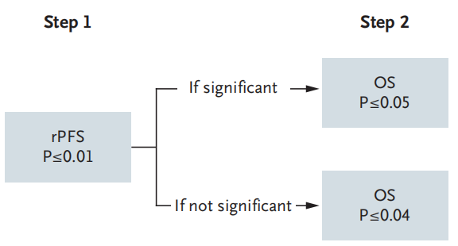
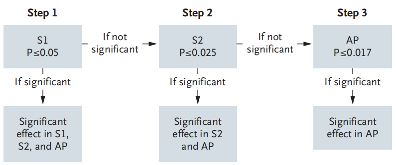
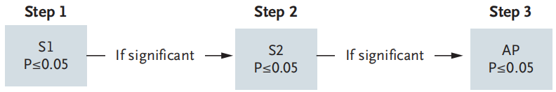
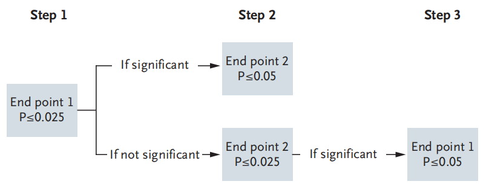

# 14. 多重性与析因设计

## 临床研究多重性

临床试验多重性是指在一项完整的研究中，需要经过不止一次统计推断（多重检验）对研究结论做出决策的相关问题1。常见的多重性包括多个终点、多组间比较、纵向数据不同时间点的分析、亚组分析、期中分析及复杂设计等；包括适应性设计可能同时涉及多个目标人群、多个假设、多个终点或多重检验2。临床研究的多重性普遍存在，复杂并且重要，因此美国、欧盟及我国的监管机构都制定了相关的指导原则1, 3, 4，学术界也有广泛的讨论5。

临床研究多重性调整的基本原则是将总的I 类错误率（FWER）控制在合理水平。多重性分析方法本章不予介绍。

多个终点

FDA指导原则6。

通常一个研究只有一个主要终点，如果设计了多个主要终点，当这多个终点都需要满足时才视为研究达成，即共同主要终点（coprimary endpoint），则无需进行多重性调整，可按各自常规的α水平计算样本量。比如医疗器械注册类临床试验，通常需要设置一个主要有效性终点和一个主要安全性终点，两者必需同时满足。注意不要和复合终点（composite endpoint）混淆，复合终点涵盖了多个指标，比如心血管领域常见的MACE（major adverse cardiovascular events），通常包括了心血管死亡、非致死性心梗及卒中等，但这些事件合起来作为一个终点指标，不存在多重性问题。如果多个主要终点中只需一个满足即视为研究达成，则需要考虑多重性。

#### 例 14-1 ILUMIEN IV研究7比较光学相干断层成像（OCT）引导与造影引导的经皮冠状动脉介入治疗（PCI），设有多个主要终点。为控制I类错误率，研究按预先设定的固定顺序进行序贯检验：先检验主要影像学终点（由独立核心实验室评估），再检验手术相关终点；当多个主要终点按固定顺序检验、且前序假设通过后才检验后续假设时，各次检验的名义α水平与总α相同，无需对α进行分割。对于多个主要终点，除固定顺序法外，还可采用并行策略（如Bonferroni法将总α分割到各终点），或将α分配到若干模块后再在模块内分配（modular alpha allocation），也可保留部分α不预先分配（untouched alpha）；具体策略可参阅FDA与EMA的相关指导原则3,4,6。

多组比较

多组比较时无效假设只有一种，但备择假设较为复杂，可有多种。比如A，B，C三组比较，无效假设是三组均无差异，但备择假设可以是两两比较，也可以是以C组为对照，检验A组及B组与之相比是否有差异，或者其他一些情况。

在实验设计中常见的多组比较，常规的样本量计算（比如多个均数的比较，多个率的比较）可参考相应的统计学专著8-10（临床试验统计学？贺佳？）。如果各组相互独立，可考虑选择两两比较计算所得的最大样本量，然后每组都基于这个最大样本量，也可以采用保守的Bonferroni法校正α11。

临床研究中的多组比较常见于一些特殊情况。

非劣效三臂设计，可见于一些药物临床试验。该设计需要检验（1）试验组优于安慰剂，（2）阳性对照组优于安慰剂，（3）试验组非劣效与阳性对照组。如果3个假设研究均需满足才视为研究达成，则不存在多重性问题，否则需根据具体情况与监管机构事先沟通1。

联合用药。以两个单药的联合用药为例，试验设计至少包括单药A组，单药B组和联合用药组，如果再增加一个安慰剂组就形成2x2析因设计，如果研究的目的是检测联合用药的疗效，则需要满足所有的假设检验，因而无需进行多重性调整。

析因设计，以2X2析因设计为例，首先需考虑两个干预因素A与B之间是否有交互作用以及是否要考察这个交互作用。如果不打算分析交互作用，析因设计可视为两个独立的研究，取较大的一个研究的样本量即可；否则需增加样本量去评估交互作用。根据干预因素A或B计算的样本量不宜相差过大。

剂量反应设计可参考相关专著。

多重性调整

定量资料多样本均数比较可采用SNK-q检验、Dunnett-t检验、LSD-t检验等方法，但在临床研究设计中并不常见。

成组序贯设计的统计检验多重性问题通过设定期中分析的边界值或利用α消耗函数解决，之前章节已经讨论。

平行策略最常见的为Bonferroni法。该方法要求多个检验的独立名义α水平之和等于研究总体的α水平。比如一个研究的总体α水平为0.05，需要进行两次独立检验，则每次独立检验的名义α水平为0.025，也可以不均衡划分，比如0.04和0.01。Bonferroni法通常过于保守，但其增加样本量的程度似乎没有想象的大，比如在检验效能为90%时，作两次比较，α=0.025，样本量扩增1.19倍；作10次比较，α=0.005，样本量扩增1.58倍；而作100次比较，α=0.0005，样本量扩增2.15倍。

平行策略还有前瞻性α分配法等，可参阅相关文献1, 3。

序贯策略包括Holm法、Hochberg法、固定顺序法和回退法。固定顺序法是指按预先定义的顺序进行假设检验，各名义检验水平αi与α相同，当前假设检验通过后才进行下一个假设检验，直到假设检验失败为止，最终的结论为该失败的假设检验之前的结论均被接受。非劣效假设检验通过后再进行差异性比较以确立试验组的有效性可视为固定顺序法的特例。

MADIT-RIT研究12评价ICD治疗中高频与延迟两种新的程控方式的临床表现，分别与传统的程控方式比较。主要终点为首次不适当电击事件。研究者认为这可以视为两个平行的研究，各自有独立的假设检验，因此无需进行多重比较的调整。预期HR为0.5（即高频组或延迟组可降低不适当电击50%），双侧显著性水平5%，检验效能90%，需要88个事件。假设对照组事件率为10%/年，即0.88%/患者月，如果入组12月，随访9月，需样本量每组约500例，3组总计约1500例。

{width="6.0in"}
研究实际入组了1500例患者，平均随访1.4年，高频组与对照组比较，HR为0.21（95%置信区间0.13~0.34，P<0.001）；延迟组与对照组比较HR为0.24（95%置信区间0.15~0.40，P<0.001）。试验组甚至降低了死亡率，高频组与对照组比较HR为0.45（ 95%置信区间0.24~0.85，P=0.01）；延迟组与对照组比较，HR为0.56（95%置信区间0.30~1.02，P=0.06）。

多组比较中若各干预组均须与同一对照组比较、且要求各自成立，通常不视为多重性问题。例如SCD-HeFT研究（N Engl J Med 2005;352:225-37）以90%检验效能检验植入式心律转复除颤器（ICD）或胺碘酮较安慰剂降低全因死亡25%的假设，各比较独立进行；COMPANION研究以相似方式比较心脏再同步治疗（CRT-D或CRT）与药物治疗的疗效。若研究要求多个比较中至少一个成立即视为有效，或比较涉及多个主要终点，则须事先确定多重性调整策略并与监管机构沟通。PALLAS研究（评价决奈达隆在永久性心房颤动患者中的疗效，N Engl J Med 2011;365:2268-2276）设有复合的多个主要终点，并预先计划采用Holm逐步下降法控制多重比较的I类错误率；结果显示决奈达隆组较安慰剂组的心血管事件风险升高（如HR 2.29，P=0.002）。EPOCH研究设有两个主要终点（无进展生存PFS与研究者评估的无进展生存hPFS），预先规定只要其中一个主要终点达到显著即视为研究阳性；结果显示两个终点均显著优于对照（HR 0.69，P=0.0013；HR 0.59，P<0.001）。

研究过程中还可能出现主要终点的修改（如BAOCHE研究13在方案修订中调整了主要终点），此类变更须事先与监管机构沟通并在方案中明确规定。此外，析因设计（factorial design）下对交互作用的检验也会产生多重性问题（如RE-LY研究即涉及多组与多终点的复杂设计），其样本量与多重性安排应提前规划。

多个终点的多重性调整策略

Dmitrienko与D’Agostino5将多重性（multiplicity）操作性定义为：在同一治疗措施的疗效特征中同时检验多个假设的情形（即“多个终点”）。按来源可分为单源多重性（仅多个终点）与多源多重性（多个终点叠加多个剂量或多个受试者人群）。针对多个主要终点的调整策略主要取决于对“研究达成”的定义：若为共同主要终点（coprimary endpoint），要求各终点均成功，标准更严格，通常无需调整（区别于复合终点）；若只要一个主要终点成功即视为有效，则必须进行多重性调整。常用方法包括：①固定顺序法——按临床重要性预先排序依次检验，前序通过后方可检验后序，各次检验名义α与总α相同；②数据驱动法——从最大或最小P值开始检验；③非参数方法——Bonferroni法（可将总α均分或任意分配）、Holm逐步下降法、回退法（fallback）；④半参数方法——Hochberg法、Hommel法；⑤参数方法——常规Dunnett法与下降Dunnett法。此外还有闸门法（gatekeeping）等复合策略，实践中常将固定顺序与家族错误率控制（如回退法）结合使用。

{width="6.0in"}
{width="6.0in"}
{width="6.0in"}
{width="6.0in"}
复合终点没有考虑各指标的权重，在事件驱动的分析中也只计数第一个出现的指标14，需仔细考量，因此FDA要求事先提前沟通15。

References:

1.	国家药品监督管理局. 药物临床试验多重性问题指导原则（试行）; 2020.

2.	国家药品监督管理局. 药物临床试验适应性设计指导原则（试行）; 2021.

3.	FDA. Multiple Endpoints in Clinical Trials Guidance for Industry; 2022.

4.	Agency EM. Guideline on multiplicity issues in clinical trials Draft; 2017.

5.	Dmitrienko A, D'Agostino RS. Multiplicity Considerations in Clinical Trials. NEW ENGL J MED 2018;378:2115-22.

6.	FDA. Multiple Endpoints in Clinical Trials Guidance for Industry; 2022.

7.	Ali ZA, Landmesser U, Maehara A, et al. Optical Coherence Tomography-Guided versus Angiography-Guided PCI. NEW ENGL J MED 2023;389:1466-76.

8.	颜虹, 徐勇勇. 医学统计学. 3版 ed. 北京: 人民卫生出版社; 2015.

9.	颜艳, 王彤. 医学统计学. 5版 ed. 北京: 人民卫生出版社; 2020.

10.	李卫. 医疗器械临床试验统计方法. 2版 ed. 北京: 科学出版社; 2016.

11.	Machin D, Campbell MJ, Tan SB, Tan SH. Sample Sizes for Clinical, Laboratory and Epidemiology Studies. Fourth Edition ed. Pondicherry: Wiley Blackwell; 2018.

12.	Moss AJ, Schuger C, Beck CA, et al. Reduction in inappropriate therapy and mortality through ICD programming. NEW ENGL J MED 2012;367:2275-83.

13.	Jovin TG, Li C, Wu L, et al. Trial of Thrombectomy 6 to 24 Hours after Stroke Due to Basilar-Artery Occlusion. NEW ENGL J MED 2022;387:1373-84.

14.	Pocock SJ, Gregson J, Collier TJ, Ferreira JP, Stone GW. The win ratio in cardiology trials: lessons learnt, new developments, and wise  future use. EUR HEART J 2024;45:4684-99.

15.	FDA. Design Considerations for Pivotal Clinical Investigations for Medical Devices; 2013.
