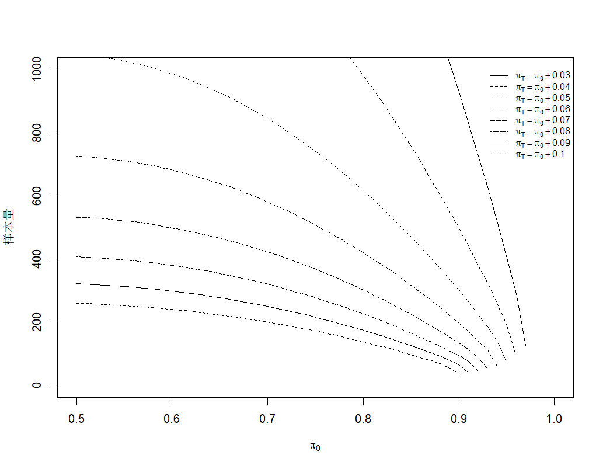
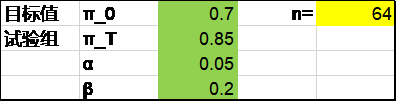
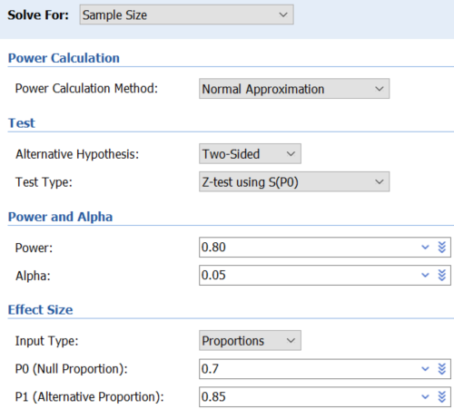
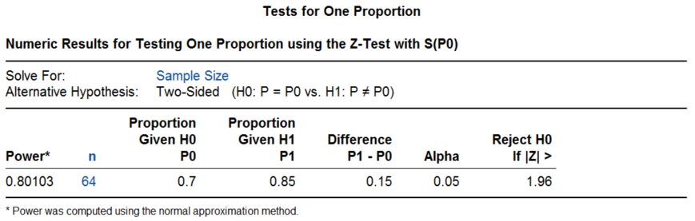
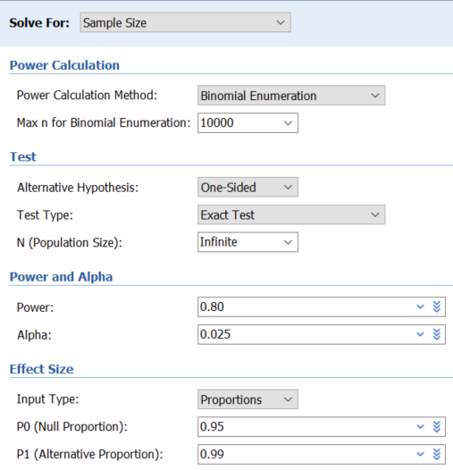
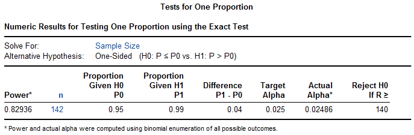
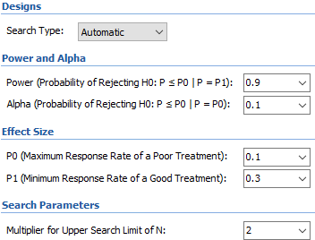
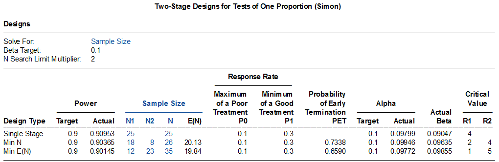

# 3. 单组率的样本量计算

计数资料的统计描述常常使用相对数，虽然中文有时统称为率，但其实包含了不同的情况，比如强度相对数（rate，率）、结构相对数（proportion，构成比，百分比）及相对比（ratio，比）等。本章的率指的是结构相对数，例如治疗成功率，死亡率等。

单组率的研究设计样本量计算，通常包括率的单组目标值法，单样本率与总体率的比较，以及Simon两阶段设计等。

单组目标值法，在临床试验的早期以及医疗器械的临床研究中较为多见，其本质是单样本率（预期值）与总体率（目标值）的比较。临床研究中常见的配对设计也适用此法，计算的结果为对子数，[参见诊断试验章节]{.mark}。

单样本率与总体率的比较的样本量计算方法较多，国内较多推荐^1-4^的公式为：

公式 2‑1 $n = \frac{\left\lbrack Z_{1 - \alpha \slash 2}\sqrt{\pi_{0}\left( 1 - \pi_{0} \right)} + Z_{1 - \beta}\sqrt{\pi_{T}\left( 1 - \pi_{T} \right)} \right\rbrack^{2}}{\left( \pi_{T} - \pi_{o} \right)^{2}}$

其中$\pi_{o}$为总体率或目标值，$\pi_{T}$为单样本率或预期值。

Chow等^5^介绍的公式为：

[]{#_Ref187509128 .anchor}公式 2‑2 $n = \frac{({Z_{1 - \alpha/2} + Z_{1 - \beta})}^{2}\pi_{T}\left( 1 - \pi_{T} \right)}{{(\pi_{T} - \pi_{0})}^{2}}$

颜艳等^6^介绍的公式为：

[]{#_Ref187509135 .anchor}公式 2‑3 $n = \frac{({Z_{1 - \alpha/2} + Z_{1 - \beta})}^{2}\pi_{0}\left( 1 - \pi_{0} \right)}{{(\pi_{T} - \pi_{0})}^{2}}$

上述样本量计算公式均基于大样本的正态近似法。当样本量较小，或者率过小及过大时，宜考虑确切概率法，该方法需迭代计算，没有显性的公式。R语言里有很多包可以实现确切概率法计算，另外免费软件G\*Power也可以计算并直观地图示^7^。需要注意的是，由于单组目标值确切概率法的检验效能与样本量并不是一个单调递增的关系，而是成"锯齿样"递增，会出现样本量增加后检验效能反而短暂降低再增加的情况^7^。如果要确保随着样本量的增加，检验效能在降短暂低时仍然能保持在预设的检验效能之上，需要更大的样本量。为了区分，我们把这更大的样本量称为确切保守法，而把首次满足α和β的较小的样本量称为确切标准法。

根据公式2-1作图（[图 2‑1](#_Ref186365797)），作表，可见单组率的预期值与目标值差异越小，所需的样本量越大。

![[]{#_Ref186365797 .anchor}图 2‑1 样本量与$\pi_{0}$及$\pi_{T}$的关系（α=0.05双侧，β=0.2）](media/S2_1Proportion/image1.png){width="5.7047244094488185in" height="4.433070866141732in"}

{width="5.75in" height="4.469748468941383in"}

+-------------+--------------------------------------------------------------------------------------------------------------------------------------+
| $$\pi_{0}$$ | $$\pi_{T}$$                                                                                                                          |
|             +----------------+----------------+----------------+----------------+----------------+----------------+----------------+---------------+
|             | $\pi_{0}$+0.03 | $\pi_{0}$+0.04 | $\pi_{0}$+0.05 | $\pi_{0}$+0.06 | $\pi_{0}$+0.07 | $\pi_{0}$+0.08 | $\pi_{0}$+0.09 | $\pi_{0}$+0.1 |
+=============+================+================+================+================+================+================+================+===============+
| 0.50        | 2178           | 1225           | 783            | 543            | 399            | 305            | 240            | 194           |
+-------------+----------------+----------------+----------------+----------------+----------------+----------------+----------------+---------------+
| 0.51        | 2176           | 1223           | 782            | 542            | 398            | 304            | 240            | 194           |
+-------------+----------------+----------------+----------------+----------------+----------------+----------------+----------------+---------------+
| 0.52        | 2172           | 1220           | 780            | 541            | 397            | 303            | 239            | 193           |
+-------------+----------------+----------------+----------------+----------------+----------------+----------------+----------------+---------------+
| 0.53        | 2166           | 1217           | 777            | 539            | 395            | 302            | 238            | 192           |
+-------------+----------------+----------------+----------------+----------------+----------------+----------------+----------------+---------------+
| 0.54        | 2158           | 1212           | 774            | 537            | 393            | 300            | 237            | 191           |
+-------------+----------------+----------------+----------------+----------------+----------------+----------------+----------------+---------------+
| 0.55        | 2149           | 1206           | 770            | 534            | 391            | 299            | 235            | 190           |
+-------------+----------------+----------------+----------------+----------------+----------------+----------------+----------------+---------------+
| 0.56        | 2138           | 1200           | 766            | 531            | 389            | 297            | 234            | 189           |
+-------------+----------------+----------------+----------------+----------------+----------------+----------------+----------------+---------------+
| 0.57        | 2125           | 1192           | 761            | 527            | 386            | 295            | 232            | 187           |
+-------------+----------------+----------------+----------------+----------------+----------------+----------------+----------------+---------------+
| 0.58        | 2110           | 1184           | 755            | 523            | 383            | 292            | 230            | 185           |
+-------------+----------------+----------------+----------------+----------------+----------------+----------------+----------------+---------------+
| 0.59        | 2094           | 1174           | 749            | 518            | 379            | 289            | 228            | 184           |
+-------------+----------------+----------------+----------------+----------------+----------------+----------------+----------------+---------------+
| 0.60        | 2075           | 1164           | 742            | 513            | 376            | 286            | 225            | 182           |
+-------------+----------------+----------------+----------------+----------------+----------------+----------------+----------------+---------------+
| 0.61        | 2055           | 1152           | 735            | 508            | 372            | 283            | 223            | 179           |
+-------------+----------------+----------------+----------------+----------------+----------------+----------------+----------------+---------------+
| 0.62        | 2034           | 1140           | 726            | 502            | 367            | 280            | 220            | 177           |
+-------------+----------------+----------------+----------------+----------------+----------------+----------------+----------------+---------------+
| 0.63        | 2010           | 1126           | 718            | 496            | 363            | 276            | 217            | 175           |
+-------------+----------------+----------------+----------------+----------------+----------------+----------------+----------------+---------------+
| 0.64        | 1985           | 1112           | 708            | 489            | 358            | 272            | 214            | 172           |
+-------------+----------------+----------------+----------------+----------------+----------------+----------------+----------------+---------------+
| 0.65        | 1958           | 1096           | 698            | 482            | 352            | 268            | 210            | 169           |
+-------------+----------------+----------------+----------------+----------------+----------------+----------------+----------------+---------------+
| 0.66        | 1930           | 1080           | 687            | 475            | 347            | 264            | 207            | 166           |
+-------------+----------------+----------------+----------------+----------------+----------------+----------------+----------------+---------------+
| 0.67        | 1899           | 1062           | 676            | 467            | 341            | 259            | 203            | 163           |
+-------------+----------------+----------------+----------------+----------------+----------------+----------------+----------------+---------------+
| 0.68        | 1867           | 1044           | 664            | 458            | 334            | 254            | 199            | 160           |
+-------------+----------------+----------------+----------------+----------------+----------------+----------------+----------------+---------------+
| 0.69        | 1833           | 1025           | 651            | 449            | 328            | 249            | 195            | 157           |
+-------------+----------------+----------------+----------------+----------------+----------------+----------------+----------------+---------------+
| 0.70        | 1798           | 1004           | 638            | 440            | 321            | 243            | 191            | 153           |
+-------------+----------------+----------------+----------------+----------------+----------------+----------------+----------------+---------------+
| 0.71        | 1760           | 983            | 624            | 430            | 313            | 238            | 186            | 149           |
+-------------+----------------+----------------+----------------+----------------+----------------+----------------+----------------+---------------+
| 0.72        | 1721           | 961            | 610            | 420            | 306            | 232            | 181            | 145           |
+-------------+----------------+----------------+----------------+----------------+----------------+----------------+----------------+---------------+
| 0.73        | 1680           | 937            | 595            | 409            | 298            | 226            | 176            | 141           |
+-------------+----------------+----------------+----------------+----------------+----------------+----------------+----------------+---------------+
| 0.74        | 1638           | 913            | 579            | 398            | 289            | 219            | 171            | 137           |
+-------------+----------------+----------------+----------------+----------------+----------------+----------------+----------------+---------------+
| 0.75        | 1593           | 888            | 563            | 387            | 281            | 213            | 166            | 133           |
+-------------+----------------+----------------+----------------+----------------+----------------+----------------+----------------+---------------+
| 0.76        | 1547           | 862            | 545            | 375            | 272            | 206            | 160            | 128           |
+-------------+----------------+----------------+----------------+----------------+----------------+----------------+----------------+---------------+
| 0.77        | 1499           | 834            | 528            | 362            | 263            | 198            | 154            | 123           |
+-------------+----------------+----------------+----------------+----------------+----------------+----------------+----------------+---------------+
| 0.78        | 1450           | 806            | 509            | 349            | 253            | 191            | 149            | 118           |
+-------------+----------------+----------------+----------------+----------------+----------------+----------------+----------------+---------------+
| 0.79        | 1398           | 777            | 491            | 336            | 243            | 183            | 142            | 113           |
+-------------+----------------+----------------+----------------+----------------+----------------+----------------+----------------+---------------+
| 0.80        | 1345           | 747            | 471            | 322            | 233            | 175            | 136            | 108           |
+-------------+----------------+----------------+----------------+----------------+----------------+----------------+----------------+---------------+
| 0.81        | 1290           | 715            | 451            | 308            | 222            | 167            | 129            | 102           |
+-------------+----------------+----------------+----------------+----------------+----------------+----------------+----------------+---------------+
| 0.82        | 1234           | 683            | 430            | 293            | 211            | 158            | 122            | 97            |
+-------------+----------------+----------------+----------------+----------------+----------------+----------------+----------------+---------------+
| 0.83        | 1175           | 650            | 408            | 278            | 200            | 150            | 115            | 91            |
+-------------+----------------+----------------+----------------+----------------+----------------+----------------+----------------+---------------+
| 0.84        | 1115           | 616            | 386            | 262            | 188            | 141            | 108            | 85            |
+-------------+----------------+----------------+----------------+----------------+----------------+----------------+----------------+---------------+
| 0.85        | 1053           | 580            | 363            | 246            | 176            | 131            | 100            | 79            |
+-------------+----------------+----------------+----------------+----------------+----------------+----------------+----------------+---------------+
| 0.86        | 989            | 544            | 340            | 230            | 164            | 121            | 93             | 72            |
+-------------+----------------+----------------+----------------+----------------+----------------+----------------+----------------+---------------+
| 0.87        | 924            | 507            | 316            | 213            | 151            | 111            | 84             | 65            |
+-------------+----------------+----------------+----------------+----------------+----------------+----------------+----------------+---------------+
| 0.88        | 857            | 468            | 291            | 195            | 138            | 101            | 76             | 57            |
+-------------+----------------+----------------+----------------+----------------+----------------+----------------+----------------+---------------+
| 0.89        | 787            | 429            | 265            | 177            | 124            | 90             | 66             | 49            |
+-------------+----------------+----------------+----------------+----------------+----------------+----------------+----------------+---------------+
| 0.90        | 716            | 388            | 239            | 158            | 110            | 78             | 56             | 35            |
+-------------+----------------+----------------+----------------+----------------+----------------+----------------+----------------+---------------+
| 0.91        | 644            | 347            | 211            | 138            | 95             | 65             | 39             | \-            |
+-------------+----------------+----------------+----------------+----------------+----------------+----------------+----------------+---------------+
| 0.92        | 569            | 304            | 183            | 118            | 78             | 45             | \-             | \-            |
+-------------+----------------+----------------+----------------+----------------+----------------+----------------+----------------+---------------+
| 0.93        | 492            | 259            | 153            | 95             | 52             | \-             | \-             | \-            |
+-------------+----------------+----------------+----------------+----------------+----------------+----------------+----------------+---------------+
| 0.94        | 413            | 213            | 121            | 61             | \-             | \-             | \-             | \-            |
+-------------+----------------+----------------+----------------+----------------+----------------+----------------+----------------+---------------+
| 0.95        | 331            | 164            | 73             | \-             | \-             | \-             | \-             | \-            |
+-------------+----------------+----------------+----------------+----------------+----------------+----------------+----------------+---------------+
| 0.96        | 244            | 93             | \-             | \-             | \-             | \-             | \-             | \-            |
+-------------+----------------+----------------+----------------+----------------+----------------+----------------+----------------+---------------+
| 0.97        | 125            | \-             | \-             | \-             | \-             | \-             | \-             | \-            |
+-------------+----------------+----------------+----------------+----------------+----------------+----------------+----------------+---------------+

: 表 2‑1 不同$\pi_{0}$和$\pi_{T}$组合下的样本量（α=0.05双侧，β=0.2）

+-------------+--------------------------------------------------------------------------------------------------------------------------------------+
| $$\pi_{0}$$ | $$\pi_{T}$$                                                                                                                          |
|             +----------------+----------------+----------------+----------------+----------------+----------------+----------------+---------------+
|             | $\pi_{0}$+0.03 | $\pi_{0}$+0.04 | $\pi_{0}$+0.05 | $\pi_{0}$+0.06 | $\pi_{0}$+0.07 | $\pi_{0}$+0.08 | $\pi_{0}$+0.09 | $\pi_{0}$+0.1 |
+=============+================+================+================+================+================+================+================+===============+
| 0.50        | 2915           | 1638           | 1047           | 726            | 532            | 407            | 321            | 259           |
+-------------+----------------+----------------+----------------+----------------+----------------+----------------+----------------+---------------+
| 0.51        | 2911           | 1635           | 1045           | 724            | 531            | 406            | 320            | 258           |
+-------------+----------------+----------------+----------------+----------------+----------------+----------------+----------------+---------------+
| 0.52        | 2905           | 1631           | 1042           | 722            | 529            | 404            | 318            | 257           |
+-------------+----------------+----------------+----------------+----------------+----------------+----------------+----------------+---------------+
| 0.53        | 2896           | 1626           | 1038           | 719            | 527            | 402            | 317            | 256           |
+-------------+----------------+----------------+----------------+----------------+----------------+----------------+----------------+---------------+
| 0.54        | 2885           | 1619           | 1034           | 716            | 524            | 400            | 315            | 254           |
+-------------+----------------+----------------+----------------+----------------+----------------+----------------+----------------+---------------+
| 0.55        | 2872           | 1611           | 1028           | 712            | 521            | 397            | 313            | 252           |
+-------------+----------------+----------------+----------------+----------------+----------------+----------------+----------------+---------------+
| 0.56        | 2856           | 1602           | 1022           | 707            | 518            | 395            | 310            | 250           |
+-------------+----------------+----------------+----------------+----------------+----------------+----------------+----------------+---------------+
| 0.57        | 2838           | 1591           | 1015           | 702            | 514            | 391            | 308            | 248           |
+-------------+----------------+----------------+----------------+----------------+----------------+----------------+----------------+---------------+
| 0.58        | 2818           | 1579           | 1007           | 696            | 509            | 388            | 305            | 245           |
+-------------+----------------+----------------+----------------+----------------+----------------+----------------+----------------+---------------+
| 0.59        | 2795           | 1566           | 998            | 690            | 504            | 384            | 302            | 243           |
+-------------+----------------+----------------+----------------+----------------+----------------+----------------+----------------+---------------+
| 0.60        | 2770           | 1552           | 988            | 683            | 499            | 380            | 298            | 240           |
+-------------+----------------+----------------+----------------+----------------+----------------+----------------+----------------+---------------+
| 0.61        | 2743           | 1536           | 978            | 675            | 493            | 375            | 295            | 237           |
+-------------+----------------+----------------+----------------+----------------+----------------+----------------+----------------+---------------+
| 0.62        | 2714           | 1518           | 966            | 667            | 487            | 370            | 291            | 234           |
+-------------+----------------+----------------+----------------+----------------+----------------+----------------+----------------+---------------+
| 0.63        | 2682           | 1500           | 954            | 658            | 480            | 365            | 286            | 230           |
+-------------+----------------+----------------+----------------+----------------+----------------+----------------+----------------+---------------+
| 0.64        | 2647           | 1480           | 941            | 649            | 473            | 360            | 282            | 226           |
+-------------+----------------+----------------+----------------+----------------+----------------+----------------+----------------+---------------+
| 0.65        | 2611           | 1459           | 927            | 639            | 466            | 354            | 277            | 222           |
+-------------+----------------+----------------+----------------+----------------+----------------+----------------+----------------+---------------+
| 0.66        | 2572           | 1436           | 913            | 629            | 458            | 348            | 272            | 218           |
+-------------+----------------+----------------+----------------+----------------+----------------+----------------+----------------+---------------+
| 0.67        | 2530           | 1413           | 897            | 618            | 450            | 341            | 267            | 214           |
+-------------+----------------+----------------+----------------+----------------+----------------+----------------+----------------+---------------+
| 0.68        | 2487           | 1387           | 880            | 606            | 441            | 334            | 261            | 209           |
+-------------+----------------+----------------+----------------+----------------+----------------+----------------+----------------+---------------+
| 0.69        | 2440           | 1361           | 863            | 594            | 432            | 327            | 256            | 205           |
+-------------+----------------+----------------+----------------+----------------+----------------+----------------+----------------+---------------+
| 0.70        | 2392           | 1333           | 845            | 581            | 422            | 320            | 249            | 200           |
+-------------+----------------+----------------+----------------+----------------+----------------+----------------+----------------+---------------+
| 0.71        | 2341           | 1304           | 826            | 567            | 412            | 312            | 243            | 194           |
+-------------+----------------+----------------+----------------+----------------+----------------+----------------+----------------+---------------+
| 0.72        | 2288           | 1274           | 806            | 553            | 402            | 304            | 237            | 189           |
+-------------+----------------+----------------+----------------+----------------+----------------+----------------+----------------+---------------+
| 0.73        | 2233           | 1242           | 786            | 539            | 391            | 295            | 230            | 183           |
+-------------+----------------+----------------+----------------+----------------+----------------+----------------+----------------+---------------+
| 0.74        | 2175           | 1209           | 764            | 524            | 379            | 286            | 223            | 177           |
+-------------+----------------+----------------+----------------+----------------+----------------+----------------+----------------+---------------+
| 0.75        | 2115           | 1175           | 742            | 508            | 368            | 277            | 215            | 171           |
+-------------+----------------+----------------+----------------+----------------+----------------+----------------+----------------+---------------+
| 0.76        | 2053           | 1139           | 719            | 491            | 355            | 267            | 207            | 165           |
+-------------+----------------+----------------+----------------+----------------+----------------+----------------+----------------+---------------+
| 0.77        | 1988           | 1102           | 694            | 474            | 343            | 257            | 199            | 158           |
+-------------+----------------+----------------+----------------+----------------+----------------+----------------+----------------+---------------+
| 0.78        | 1921           | 1064           | 670            | 457            | 329            | 247            | 191            | 151           |
+-------------+----------------+----------------+----------------+----------------+----------------+----------------+----------------+---------------+
| 0.79        | 1851           | 1024           | 644            | 439            | 316            | 237            | 183            | 144           |
+-------------+----------------+----------------+----------------+----------------+----------------+----------------+----------------+---------------+
| 0.80        | 1780           | 983            | 617            | 420            | 302            | 226            | 174            | 137           |
+-------------+----------------+----------------+----------------+----------------+----------------+----------------+----------------+---------------+
| 0.81        | 1705           | 941            | 590            | 400            | 287            | 214            | 165            | 129           |
+-------------+----------------+----------------+----------------+----------------+----------------+----------------+----------------+---------------+
| 0.82        | 1629           | 897            | 561            | 380            | 272            | 203            | 155            | 122           |
+-------------+----------------+----------------+----------------+----------------+----------------+----------------+----------------+---------------+
| 0.83        | 1550           | 852            | 532            | 360            | 257            | 191            | 146            | 114           |
+-------------+----------------+----------------+----------------+----------------+----------------+----------------+----------------+---------------+
| 0.84        | 1469           | 806            | 502            | 338            | 241            | 178            | 135            | 105           |
+-------------+----------------+----------------+----------------+----------------+----------------+----------------+----------------+---------------+
| 0.85        | 1385           | 758            | 471            | 317            | 224            | 165            | 125            | 96            |
+-------------+----------------+----------------+----------------+----------------+----------------+----------------+----------------+---------------+
| 0.86        | 1299           | 709            | 439            | 294            | 207            | 152            | 114            | 87            |
+-------------+----------------+----------------+----------------+----------------+----------------+----------------+----------------+---------------+
| 0.87        | 1211           | 658            | 406            | 271            | 190            | 138            | 103            | 78            |
+-------------+----------------+----------------+----------------+----------------+----------------+----------------+----------------+---------------+
| 0.88        | 1120           | 606            | 372            | 247            | 172            | 124            | 91             | 67            |
+-------------+----------------+----------------+----------------+----------------+----------------+----------------+----------------+---------------+
| 0.89        | 1026           | 553            | 337            | 222            | 153            | 109            | 78             | 55            |
+-------------+----------------+----------------+----------------+----------------+----------------+----------------+----------------+---------------+
| 0.90        | 931            | 498            | 301            | 196            | 133            | 93             | 64             | 35            |
+-------------+----------------+----------------+----------------+----------------+----------------+----------------+----------------+---------------+
| 0.91        | 832            | 442            | 264            | 169            | 112            | 75             | 39             | \-            |
+-------------+----------------+----------------+----------------+----------------+----------------+----------------+----------------+---------------+
| 0.92        | 731            | 384            | 226            | 141            | 89             | 45             | \-             | \-            |
+-------------+----------------+----------------+----------------+----------------+----------------+----------------+----------------+---------------+
| 0.93        | 628            | 323            | 185            | 110            | 52             | \-             | \-             | \-            |
+-------------+----------------+----------------+----------------+----------------+----------------+----------------+----------------+---------------+
| 0.94        | 520            | 260            | 141            | 61             | \-             | \-             | \-             | \-            |
+-------------+----------------+----------------+----------------+----------------+----------------+----------------+----------------+---------------+
| 0.95        | 409            | 193            | 73             | \-             | \-             | \-             | \-             | \-            |
+-------------+----------------+----------------+----------------+----------------+----------------+----------------+----------------+---------------+
| 0.96        | 291            | 93             | \-             | \-             | \-             | \-             | \-             | \-            |
+-------------+----------------+----------------+----------------+----------------+----------------+----------------+----------------+---------------+
| 0.97        | 125            | \-             | \-             | \-             | \-             | \-             | \-             | \-            |
+-------------+----------------+----------------+----------------+----------------+----------------+----------------+----------------+---------------+

: 表 2‑2 不同$\pi_{0}$和$\pi_{T}$组合下的样本量（α=0.05双侧，β=0.1）

## 单组目标值法

### 正态近似法

[]{#_Ref138312716 .anchor}例 2‑1 国家药监局2017年发布的《人工耳蜗植入系统临床试验指导原则》建议，根据临床经验，开机12个月后，产品的总体有效率需至少达到70%（目标值为70%）方可被临床接受。假设被试验产品的总体有效率可以达到85%，则在双侧显著性水平0.05、把握度80%的情况下，至少需要64例患者，考虑10%的脱落率，共需要70例患者。

Excel表按公式2-1计算的结果与之相符：

{width="3.298611111111111in" height="0.8402777777777778in"}

PASS软件正态近似法采用了公式2-1的方法，结果为64。操作时依次点击Proportions，One Proportion, Test (Inequality), Tests for One Proportion。

{width="3.1377952755905514in" height="2.8307086614173227in"}

{width="5.768055555555556in" height="1.8388888888888888in"}

R语言pwrss包采用了公式2-2，结果为45例。

library(pwrss)

pwrss.z.prop(p = 0.85, p0 = 0.7, alpha = 0.05, power = 0.8)

结果输出：

    ##  Approach: Normal Approximation 
    ##  A Proportion against a Constant (z Test) 
    ##  H0: p = p0 
    ##  HA: p != p0 
    ##  ------------------------------ 
    ##   Statistical power = 0.8 
    ##   n = 45 
    ##  ------------------------------ 
    ##  Alternative = "not equal" 
    ##  Non-centrality parameter = 2.802 
    ##  Type I error rate = 0.05 
    ##  Type II error rate = 0.2

R语言rpact包采用了公式2-1，结果为63.9，向上取整为64例。rpact包主要用于适应性设计，默认为单侧α=0.025，因此根据原文计算的要求，将下面的参数设定为"alpha=0.05，sided=2"。我们在[成组序贯设计章节]{.mark}会进一步介绍rpact包。

library(rpact)

getSampleSizeRates(groups = 1, alpha = 0.05, sided = 2, beta = 0.2,

thetaH0 = 0.7, pi1 = 0.85)

结果输出：

*Sample size calculation for a binary endpoint*

Fixed sample analysis, two-sided significance level 5%, power 80%. The results were calculated for a one-sample test for rates (normal approximation), H0: pi = 0.7, H1: pi = 0.85.

  --------------------------------------------
  Stage                               Fixed
  ----------------------------------- --------
  Stage level (two-sided)             0.0500

  Efficacy boundary (z-value scale)   1.960

  Lower efficacy boundary (t)         0.588

  Upper efficacy boundary (t)         0.812

  Number of subjects                  63.9
  --------------------------------------------

Legend:

- *(t)*: treatment effect scale

### 确切概率法

例 2‑2 药监局2019年发布的《2019 用于角膜制瓣的眼科飞秒激光治疗机临床试验指导原则》，以制瓣成功率为主要终点，根据临床实际，以制瓣成功率达到95%为目标值。采用单侧检验，检验水准为0.025，power取80%。设研究设备预期达到的制瓣成功率为99%。采用PASS2008软件进行样本估算，最后估计所需样本量142例，考虑10%脱落，试验最少需要158例。

该例预期值99%，已不适合使用正态近似法了，尽管可以按此方法计算出结果为164例。该例原文给出的142是确切标准法的结果。

PASS软件可给出确切标准法的结果142，操作时点击顺序同前，注意参数设置中Power Calculation Method选择Binomial Enumeration，Test Type选择Exact Test。

{width="3.1692913385826773in" height="3.2874015748031495in"}

{width="5.725496500437445in" height="1.8751629483814523in"}

R语言gsDesign包可给出确切标准法的结果142。我们在[成组序贯设计章节]{.mark}会进一步介绍gsDesign包。

library(gsDesign)

nBinomial1Sample(

p0 = 0.95,

p1 = 0.99,

alpha = 0.025,

beta = 0.2,

n = 1:2000,

outtype = 2

)

结果输出：

    ##     p0   p1 alpha beta   n   b    alphaR     Power
    ## 1 0.95 0.99 0.025  0.2 142 140 0.0248611 0.8293588

gsDesign包默认为α为单侧0.025，因此这里"alpha = 0.025"相当于α为双侧侧0.05。

例 2‑3 SYMPLICITY HTN-3研究^8^奠定了肾动脉消融降压治疗的地位。其主要安全性终点主要不良事件率采用单组目标值设计，目标值9.8%，预期值6%，设单侧α=0.05，则316例样本可满足80%的检验效能。

该例采用了确切标准法，PASS软件的结果为316，R语言gsDesign包的结果也是316。

library(gsDesign)

nBinomial1Sample(

p0 = 1 - 0.098,

p1 = 1 - 0.06,

alpha = 0.05,

beta = 0.2,

n = 1:2000

)

例 2‑4 皮下植入型心律转复除颤器（S-ICD）的上市后研究UNTOUCHED^9,\ 10^，主要有效性终点为18个月无不适当电击率，目标值91.6%，预期值94.6%，检验效能90%，单侧α=0.05，所需样本量为668；主要安全性终点为术后30天无并发症率，目标值93.8%，预期值96.6%，检验效能80%，单侧α=0.05，所需样本量为427。

该例采用了确切保守法，PASS软件不能直接提供确切保守法的结果。

将R语言gsDesign包确切保守法的结果分别为668例和427例，与原文一致。注意这里增加了conservative = T，为保守法，而该函数默认为标准法conservative = F.

library(gsDesign)

nBinomial1Sample(

p0 = 0.916,

p1 = 0.946,

alpha = 0.05,

beta = 0.1,

n = 1:2000,

conservative = T

)

library(gsDesign)

nBinomial1Sample(

p0 = 0.938,

p1 = 0.966,

alpha = 0.05,

beta = 0.2,

n = 1:2000,

conservative = T

)

读者可自行比较确切标准法的结果。

## 单样本率与总体率的比较

例 2‑5^4^ 在新生儿的某种病毒爆发期间，某地区的感染率为15%，治疗一段时间后卫生工作者希望知道感染率是否已降至10%，取α=0.05（单侧），β=0.1，则需样本量378例。

根据公式2-1，Excel表正态近似法计算结果为378，PASS软件正态近似法结果为378，R语言rpact包计算也为378：

library(rpact)

getSampleSizeRates(groups = 1, alpha = 0.05, beta = 0.1,

thetaH0 = 0.15, pi1 = 0.1)

## Simon两阶段设计

Simon两阶段设计多用于早期的研究，预先设定最低有效率π~0~与预期有效率π~1~，根据第一阶段的疗效（n~1~例患者中r~1~例有效），决定是否进入第二阶段（继续入组n~2~例患者），再根据总的疗效（n= n~1~+ n~2~例患者中r例有效），决策下一步行动计划。通常有最优法（Optimal）和最小最大法（Minimax），一般采用最优法。

例 2‑6^11^ 设π~0~=0.1，π~1~=0.3，α=0.1，β=0.1，则最优法设计N=35，其中n~1~=12, r~1~=1, n~2~=23, r=5；最小最大设计N=25，其中n~1~=16, r~1~=1, n~2~=9, r=4。

PASS软件操作时依次点击Proportions，One Proportion，Group-Sequential，Two-Stage Designs for Tests of One Proportion (Simon)，结果部分Min N对应的是最小最大法，与原文有出入；Min E(N)对应的是最优法，与原文一致。

{width="2.933587051618548in" height="2.233526902887139in"}

{width="5.768055555555556in" height="1.8770833333333334in"}

R语言clinfun包计算如下，pu即π~0~，pa即π~1~，与原文结果一致。

library(clinfun)

ph2simon(pu = 0.1, pa = 0.3, ep1 = 0.1, ep2 = 0.1, nmax=100)

结果输出：

    ##  Simon 2-stage Phase II design 
    ## 
    ## Unacceptable response rate:  0.1 
    ## Desirable response rate:  0.3 
    ## Error rates: alpha =  0.1 ; beta =  0.1 
    ## 
    ##            r1 n1 r  n EN(p0) PET(p0)   qLo   qHi
    ## Minimax     1 16 4 25  20.37  0.5147 0.192 1.000
    ## Admissible  2 18 4 26  20.13  0.7338 0.031 0.192
    ## Optimal     1 12 5 35  19.84  0.6590 0.000 0.031

例 2‑7 某研究^12^评价一种化疗方案治疗胰管腺瘤，主要终点为R0切除率。采用Simon最优法两阶段设计，H~0~\<=40%，H~1~\>=60%，单侧一类错误5%，检验效能80%。第一阶段16例患者中可R0切除者如\<=7例则认为化疗无效，否则进入第二阶段；第二阶段入组30例，总计46例患者中如至少24例可R0切除时则研究达成。

PASS软件结果最优法样本量46例，第一阶段18例，界值7例，与原文有出入。R语言clinfun包计算如下，最优法与原文结果一致。

library(clinfun)

ph2simon(pu = 0.4, pa = 0.6, ep1 = 0.05, ep2 = 0.2, nmax=100)

结果输出：

    ##  Simon 2-stage Phase II design 
    ## 
    ## Unacceptable response rate:  0.4 
    ## Desirable response rate:  0.6 
    ## Error rates: alpha =  0.05 ; beta =  0.2 
    ## 
    ##            r1 n1  r  n EN(p0) PET(p0)   qLo   qHi
    ## Minimax    17 34 20 39  34.44  0.9128 0.815 1.000
    ## Admissible  7 17 21 41  25.63  0.6405 0.182 0.815
    ## Optimal     7 16 23 46  24.52  0.7161 0.000 0.182

研究因入组缓慢而终止，实际入选了22例患者，18例完成了治疗，R0切除率为55.6%。

## 讨论

### 样本量计算的取整

[例 2‑1](#_Ref138312716)计算的样本量为64，考虑10%的脱落率，64/(1-10%)=71.1，向上取整应为72。原文的70例可能是采用了64X(1+10%)=70.4，然后四舍五入，这样的做法虽然不少见，但显然不是最佳。这同时也说明尽管使用了相同的计算公式，由于计算过程中的四舍五入或取整的差异，最终的样本量结果仍会有些不同，但相差不会太大。

### 检验效能的计算

[例 2‑1](#_Ref138312716)的正态近似法计算，PASS软件给出了实际的检验效能为0.80103，R语言也可以实现，实际的检验效能为0.8010：

library(rpact)

getPowerRates(groups = 1, alpha = 0.05, sided = 2, maxNumberOfSubjects = 64,

thetaH0 = 0.7, pi1 = 0.85)

结果输出：

*Power calculation for a binary endpoint*

Fixed sample analysis, two-sided significance level 5%. The results were calculated for a one-sample test for rates (normal approximation), H0: pi = 0.7, H1: pi = 0.85, number of subjects = 64.

  --------------------------------------------
  Stage                               Fixed
  ----------------------------------- --------
  Stage level (two-sided)             0.0500

  Efficacy boundary (z-value scale)   1.960

  Lower efficacy boundary (t)         0.588

  Upper efficacy boundary (t)         0.812

  Power                               0.8010

  Number of subjects                  64.0
  --------------------------------------------

Legend:

- *(t)*: treatment effect scale

### 目标值的设定

单组目标值法是临床研究设计的重要类型之一，特别是在医疗器械的临床试验领域中。美国及中国等医疗器械监管机构制定的指南性文件都论述过单组目标值法，但都未明确提出目标值具体该如何设定。

FDA 2013年发布的《医疗器械关键性临床研究的设计考虑指导原则》^13^提出客观性能标准（OPC）和性能目标（PG）两个概念，并指出OPC通常来自监管机构、专业学会或标准组织等，其证据等级高于PG。FDA的这个指导原则没有论述目标值设定的具体方法，只是提及PG有时可以是有效性/安全性终点的置信区间上限或下限。但这个提法的问题在于置信区间与样本量有关，如果既往研究的样本量较小，置信区间就较宽，这样目标值显然过于宽松；相反，如果既往研究的样本量较大，置信区间就较窄，这样的目标值可能会过严格而难以达成。临床研究实践中还有采用了置信区间上下限再加上一个界值的方法，但这同样不值得推荐。

国内《医疗器械临床试验设计指导原则》^1^沿用了FDA指导原则里OPC和PG的概念，但也未介绍目标值设定的具体方法，只是提及：目标值是专业领域内公认的某类医疗器械的有效性/安全性评价指标所应达到的最低标准......目标值的构建通常需要全面收集具有一定质量水平及相当数量病例的临床研究数据，并进行科学分析（如Meta分析）。中国临床试验生物统计学组2017年发表的《单组目标值临床试验的统计学考虑》^3^认为目标值是指专业领域内公认的某医疗器械的有效性／安全性／性能评价指标所应达到的标准（该定义的问题已在上一章讨论），并指出目标值的确定主要有三种方式：临床试验监管部门指南、行业标准或专家共识以及同类产品历史研究结果。但这个文件也没有涉及目标值建立的具体方法。

我们考察了国际上近年来采用单组目标值法设计的48个医疗器械临床试验，显示当前目标值的设定实际以参考值+界值的方法为主^14^。参考值多可通过既往研究获得（必要时进行meta分析），因而界值的大小是关键。界值太小则研究难以达成，界值太大则直接对器械的性能放松了要求，损害了患者的利益。一般来说，设定界值相对于参考值的百分比，从而获得目标值与参考值的比例，是比界值的绝对数值更为合理的指标。从我们分析的数据来看，目标值与参考值的比例与参考值的大小有关，这个比例随着参考值的增加而迅速减少。以低优指标（如并发症率）为例，当参考值\<1%，\[1%, 5%)，\[5%\~10%)，\>=10%时，目标值分别不宜超过参考值的3倍，2倍，1.75倍，1.5倍。如要超过这个范围，应当有充分的理由。目标值的设定并不是一个纯统计学的考量，一般来说，设定的界值越大，越是需要强有力的临床意义支撑，比如在显著减少严重并发症时才有理由对有效性终点作出更多的让步。

### 数据转换

此外，还有一些数据转换的方法，比如平方根反正弦转换^4^，临床研究中较少使用，这里不作讨论。R语言pwr包对率的处理通常采用arcsine转换，对[例2- 1](#_Ref138312716)计算如下：

library(pwr)

pwr.p.test(h = ES.h(0.85, 0.7), sig.level = 0.05, power = 0.8)

结果输出：

    ##      proportion power calculation for binomial distribution (arcsine transformation) 
    ## 
    ##               h = 0.3638807
    ##               n = 59.27734
    ##       sig.level = 0.05
    ##           power = 0.8
    ##     alternative = two.sided

### 何时该使用确切概率法

正态近似法的使用有一些前提条件，并且不同的正态近似法计算的结果有时差异也很大。确切概率法也有确切标准法和确切保守法，单组率研究的样本量计算究竟该如何选用？

例 2‑8 药监局2019年发布的《心肺转流系统 体外循环管道注册申报技术审查指导原则》建议：如果采用单组目标值设计，假定受试产品主要有效性评价指标"体外循环成功率"为98%，目标值为95%，统计学检验水准取α=0.025（单侧），β=0.20（把握度取80%）。计算所需样本量为331例。在此基础上考虑一定比例的脱落率，最终的入组规模确定为335例。

此例按公式2-1计算结果为331例，公式2-2计算结果为171例，公式2-3计算结果为415例，确切标准法的结果为312例，确切保守法为338例，不同方法之间的差异还是相当大的。我们之前的模拟研究提示在正态近似法的这3种计算中，公式2-1的表现优于其他两种方法^15^，在临床研究中也较为常用，可以称之为通用法，以下讨论涉及的正态近似法如无特殊说明，均为通用法。

虽然统计学教科书明确指出，当率接近0或1，或者样本量较小时，不宜使用正态近似法。但如何判断率接近0或1，如何判断样本量较小，并没有明确的界限^16^。同样来自药监局的指南性文件，在样本量计算参数相同的情况下，有的选择了正态近似法，有的选择了确切概率法，并未给出选用的具体理由（读者可自行比较2016年发布的《影像型超声诊断设备（第三类）技术审查指导原则（2015年修订版）》，2016年发布的《一次性使用膜式氧合器注册技术审查指导原则》，2017 年发布的《髋关节假体系统注册技术审查指导原则》，2020年发布的《肺炎CT影像辅助分诊与评估软件审评要点（试行）》等）。

有研究者考查了国内药监局发布的3个指导原则，认为正态近似法计算的样本量不够准确，并且都偏大^17^。另外，有作者认为在事件发生率很低时，正态近似法的一类错误高于确切概率法^18^。但也有作者认为在小规模的临床试验中，正态近似法正因为其计算的样本量偏大，所以比确切概率法更保守，试验更有把握获得成功^19^。我们认为，从实用性角度出发，临床研究中通常情况下正态近似法是足够的。尽管如此，我们仍建议尽可能地使用确切概率法，毕竟，如果想提高小规模临床试验的检验效能，直接调节β参数即可，而不是依赖于正态近似法偏高的样本量去实现。至于确切标准法和确切保守法，可首选常规的确切标准法，但要注意在入组接近尾声时，须及时停止入组，否则造成多了几例入组后检验效能反而下降的"反常"现象^7,\ 20^。我们对此做了模拟分析^15^，当高优指标π~0~逐渐从0增加至1的过程中，正态近似法计算的样本量从相对较小，从而检验效能较低逐渐变为样本量相对较大，检验效能也相对较高。这一变化过程在不同的单样本率与总体率的假设情况下尽管总体趋势表现一致，但细节上有较大的差异，因而很难找到合适的区间认为正态近似法可以放心地使用（[图 2‑2](#_Ref186372144)，[图 2‑3](#_Ref186372150)，图中正态近似法A对应[公式 2‑2](#_Ref187509128)，正态近似法B对应[公式 2‑3](#_Ref187509135)）。

![[]{#_Ref186372144 .anchor}图 2‑2 不同方法样本量的比较](media/S2_1Proportion/image10.png){alt="A graph of a graph Description automatically generated with medium confidence" width="5.768055555555556in" height="3.8847222222222224in"}

![[]{#_Ref186372150 .anchor}图 2‑3 不同方法检验效能的比较](media/S2_1Proportion/image11.png){alt="A graph of a graph Description automatically generated with medium confidence" width="5.768055555555556in" height="4.159722222222222in"}

总之，率的单组目标值法样本量计算，尽管在临床研究常见的情形下，正态近似法是足够的，但考虑到检验效能与$\pi_{0}$及$\pi_{1}$之间较为复杂的关系，我们推荐常规选用确切概率法，并且注意选用确切标准法时需考虑入组数量的控制，在较为极端的情况下可辅以模拟计算。

**References:**

1\. 国家药品监督管理局. 医疗器械临床试验设计指导原则; 2018.

2\. 李卫. 医疗器械临床试验统计方法. 2版 ed. 北京: 科学出版社; 2016.

3\. 李卫, 赵耐青. 单组目标值临床试验的统计学考虑. 中国卫生统计 2017;34:505-8.

4\. 颜虹, 徐勇勇. 医学统计学. 3版 ed. 北京: 人民卫生出版社; 2015.

5\. Chow S, Shao J, Wang H, Lokhnygina Y. Sample Size Calculations in Clinical Research. Third Edition ed: CRC Press; 2018.

6\. 颜艳, 王彤. 医学统计学. 5版 ed. 北京: 人民卫生出版社; 2020.

7\. 曾治宇, 林娜, 张明东, Peter L. 单样本率比较(单组目标值法)的样本量计算及其简便实现. 中国卫生统计 2018;35:313-4.

8\. Bhatt DL, Kandzari DE, O\'Neill WW, et al. A controlled trial of renal denervation for resistant hypertension. NEW ENGL J MED 2014;370:1393-401.

9\. Boersma LV, El-Chami MF, Bongiorni MG, et al. Understanding Outcomes with the EMBLEM S-ICD in Primary Prevention Patients with Low EF Study (UNTOUCHED): Clinical characteristics and perioperative results. HEART RHYTHM 2019;16:1636-44.

10\. Gold MR, Knops R, Burke MC, et al. The Design of the Understanding Outcomes with the S-ICD in Primary Prevention Patients with Low EF Study (UNTOUCHED). PACE 2017;40:1-8.

11\. 陈峰, 夏结来. 临床试验统计学. 北京: 人民卫生出版社; 2018.

12\. Acuna-Villaorduna A, Shankar V, Wysota M, et al. Induction Chemotherapy With FOLFIRINOX Followed by Chemoradiation With Gemcitabine in Patients With Borderline-Resectable Pancreatic Ductal Adenocarcinoma. CANCER CONTROL 2022;29:1389414837.

13\. FDA. Design Considerations for Pivotal Clinical Investigations for Medical Devices Guidance for Industry, Clinical Investigators, Institutional Review Boards and Food and Drug Administration Staff; 2013.

14\. 曾治宇, 张晓星, 彭琳, 曾理, 韩磊. 医疗器械临床试验单组目标值设定现状. 中国食品药品监管 2023:44-51.

15\. 曾治宇, 李青, 张晓星, et al. 医疗器械临床试验单组目标值法样本量计算不同方法的比较. 中国食品药品监管 2023:132-9.

16\. 曾治宇, 彭琳, 张明东, 王洪源. 二项分布的率及其数据转换的偏度系数评价研究. 中国卫生统计 2020;37:302-6.

17\. 成琪, 刘玉秀, 陈林, 刘丽霞. 单组临床试验目标值法的精确样本含量估计及统计推断. 中国临床药理学与治疗学 2011;16:517-22.

18\. 肖林海, 赵耐青. 单样本率精确概率检验的样本量估计方法及在Stata中的实现. 中国卫生统计 2014;31:711-4.

19\. 唐欣然, 黄耀华, 王杨, 李卫. 单组目标值试验样本量计算方法的比较研究. 中华疾病控制杂志 2013;17:993-6.

20\. 刘江美, 陈平雁. 单样本率确切概率检验的样本量与检验效能非单调变化关系的研究. 中国卫生统计 2012;29:164-7.
