# 4. 两组均数的比较

定量数据在临床研究中广泛存在，比如年龄、身高、体重、血压、血糖等，常见的统计量如均数、标准差等也广为熟知。两组均数的比较常见于临床的早期阶段，或者用作替代终点以及使用量表的情况。

两组均数比较的样本量计算公式^1-6^如下：

$n_{C} = n_{T} = \frac{{2\left( Z_{1 - \alpha/2} + Z_{1 - \beta} \right)}^{2}}{{(\frac{\delta}{\sigma})}^{2}}$（3-1）

公式中C代表对照组，T代表试验组，δ为两组均数之差μ~T~-μ~C~，σ为标准差。这是基于正态分布且总体标准差已知时的Z检验法的样本量计算公式。当总体标准差未知或样本量较小时应当使用t检验法，此时样本量计算需迭代，没有显性公式。T检验法的样本量计算可使用软件，或者校正公式^2^：

$n_{C} = n_{T} = \frac{{2\left( Z_{1 - \alpha/2} + Z_{1 - \beta} \right)}^{2}}{{(\frac{\delta}{\sigma})}^{2}} + \frac{1}{4}Z_{1 - \alpha/2}^{2}$（3-2）

从校正公式即可看出基于t检验法的样本量计算比基于Z检验法的样本量计算的结果相差并不大，因此也可以在基于Z检验法的样本量计算结果上总例数增加2\~3例^7^。可以将Z检验法视为t检验法的特例。

如果两组方差不等，样本量计算公式的形式同公式3-1与3-2，只是需要带入合并方差：

$\sigma^{2} = {(\sigma}_{C}^{2} + \sigma_{T}^{2})/2$（3-3）

也有建议取较大的方差带入计算^7^。

两组例数不等时，假设试验组与对照组按r:1分配，则样本量计算公式为^1,\ 6^：

$n_{C} = \frac{\left( z_{1 - \alpha/2} + z_{1 - \beta} \right)^{2}(1 + 1 \slash r)}{{(\delta/\sigma)}^{2}}$（3-4）

$$n_{T} = n_{C}r$$

当两组方差及例数都不相等时同公式3-4，其中：

$\sigma^{2} = \frac{\sigma_{C}^{2} + \sigma_{T}^{2}/r}{1 + 1/r}$（3-5）

或者^6^：

$n = \frac{\left( z_{1 - \alpha/2} + z_{1 - \beta} \right)^{2}\left( {(\sigma}_{C}^{2} + \sigma_{T}^{2} \slash r \right)}{\delta^{2}}$ （3-6）

如果需要校正^8^：

$n_{C} = \frac{\left( z_{1 - \alpha/2} + z_{1 - \beta} \right)^{2}(1 + 1 \slash r)}{{(\delta/\sigma)}^{2}} + \frac{Z_{1 - \alpha/2}^{2}}{2(1 + r)}$（3-7）

由以上公式可以看出，样本量与两组均数的差值及标准差有关，准确地说是样本量与δ/σ的平方成反比，而与每组均数的具体值并不直接相关。临床常见参数组合下的t检验法样本量见[图 3‑1](#_Ref186376310)，[表 3‑1](#_Ref186376317)。

![[]{#_Ref186376310 .anchor}图 3‑1 两组均数比较的样本量与δ/σ的关系（α=0.05双侧）](media/S3_2Means/image1.png){width="5.768055555555556in" height="4.770833333333333in"}

+---------------------------+---------------------------+---------------------------+
| $$\frac{\delta}{\sigma}$$ | α=0.05双侧                | α=0.05单侧                |
|                           +-------------+-------------+-------------+-------------+
|                           | β=0.2       | β=0.1       | β=0.2       | β=0.1       |
+==========================:+============:+============:+============:+============:+
| 0.20                      | 787         | 1053        | 620         | 858         |
+---------------------------+-------------+-------------+-------------+-------------+
| 0.25                      | 505         | 675         | 398         | 550         |
+---------------------------+-------------+-------------+-------------+-------------+
| 0.30                      | 351         | 469         | 277         | 382         |
+---------------------------+-------------+-------------+-------------+-------------+
| 0.35                      | 259         | 346         | 204         | 281         |
+---------------------------+-------------+-------------+-------------+-------------+
| 0.40                      | 199         | 265         | 156         | 216         |
+---------------------------+-------------+-------------+-------------+-------------+
| 0.45                      | 157         | 210         | 124         | 171         |
+---------------------------+-------------+-------------+-------------+-------------+
| 0.50                      | 128         | 171         | 101         | 139         |
+---------------------------+-------------+-------------+-------------+-------------+
| 0.55                      | 106         | 141         | 84          | 115         |
+---------------------------+-------------+-------------+-------------+-------------+
| 0.60                      | 90          | 119         | 71          | 97          |
+---------------------------+-------------+-------------+-------------+-------------+
| 0.65                      | 77          | 102         | 60          | 83          |
+---------------------------+-------------+-------------+-------------+-------------+
| 0.70                      | 67          | 88          | 52          | 72          |
+---------------------------+-------------+-------------+-------------+-------------+
| 0.75                      | 58          | 77          | 46          | 63          |
+---------------------------+-------------+-------------+-------------+-------------+
| 0.80                      | 52          | 68          | 41          | 55          |
+---------------------------+-------------+-------------+-------------+-------------+
| 0.85                      | 46          | 61          | 36          | 49          |
+---------------------------+-------------+-------------+-------------+-------------+
| 0.90                      | 41          | 54          | 32          | 44          |
+---------------------------+-------------+-------------+-------------+-------------+
| 0.95                      | 37          | 49          | 29          | 40          |
+---------------------------+-------------+-------------+-------------+-------------+
| 1.00                      | 34          | 45          | 27          | 36          |
+---------------------------+-------------+-------------+-------------+-------------+

: []{#_Ref186376317 .anchor}表 3‑1 两组均数比较不同$\frac{\delta}{\sigma}$、α及β组合下的样本量

## t检验法

[]{#_Ref138326543 .anchor}例 3‑1 LBBP-RESYNC是来自于我国的研究^9^，在接受心脏再同步治疗（CRT）的患者中比较了左束支起搏（LBBP）与传统的双室起搏（BiVP）治疗心衰的疗效，主要终点为6个月时左室射血分数（LVEF）的改善。据既往数据，预期LBBP-CRT组可提高LVEF 18%，BiVP-CRT组提高13%，标准差5%，设定显著性水平0.05，则34例患者可确保80%的检验效能。假设脱落率15%，共需40例患者。

注意此例研究终点的百分率是定量数据而不是定性数据。Excel表Z检验法计算结果为32例，校正后为34例，考虑脱落为34/(1-15%)=40。前文已述，两组均数比较的样本量计算，关键变量是两组均数差值与标准差的比值$\delta/\sigma$，因此如果用对照组13，试验组18及标准差5带入Excel表，计算结果完全一致。

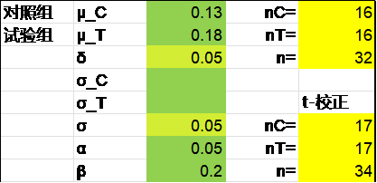{width="3.4652777777777777in" height="1.6736111111111112in"}

R语言pwrss包Z检验法结果为32例：

library(pwrss)

pwrss.z.2means(mu1 = 0.18, mu2 = 0.13, sd1 = 0.05,

alpha = 0.05, power = 0.8)

结果输出：

Difference between Two Means (Independent Samples z Test)

H0: mu1 = mu2

HA: mu1 != mu2

\-\-\-\-\-\-\-\-\-\-\-\-\-\-\-\-\-\-\-\-\-\-\-\-\-\-\-\-\--

Statistical power = 0.8

n1 = 16

n2 = 16

\-\-\-\-\-\-\-\-\-\-\-\-\-\-\-\-\-\-\-\-\-\-\-\-\-\-\-\-\--

Alternative = "not equal"

Non-centrality parameter = 2.802

Type I error rate = 0.05

Type II error rate = 0.2

R语言pwrss包t检验法结果为34例：

library(pwrss)

pwrss.t.2means(mu1 = 0.18, mu2 = 0.13, sd1 = 0.05,

alpha = 0.05, power = 0.8)

结果输出：

Difference between Two means

(Independent Samples t Test)

H0: mu1 = mu2

HA: mu1 != mu2

\-\-\-\-\-\-\-\-\-\-\-\-\-\-\-\-\-\-\-\-\-\-\-\-\-\-\-\-\--

Statistical power = 0.8

n1 = 17

n2 = 17

\-\-\-\-\-\-\-\-\-\-\-\-\-\-\-\-\-\-\-\-\-\-\-\-\-\-\-\-\--

Alternative = "not equal"

Degrees of freedom = 32

Non-centrality parameter = 2.915

Type I error rate = 0.05

Type II error rate = 0.2

PASS软件Z检验法的结果为32，操作时依次点击Means, Two Independent Means, Z-Test (Inequality), Two-Sample Z-Tests Assuming Equal Variance。

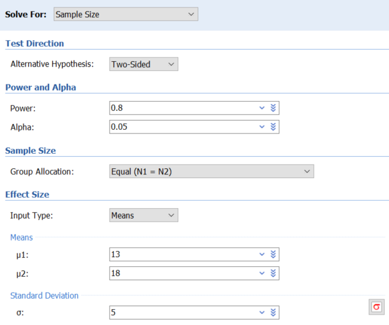{width="4.307086614173229in" height="3.6023622047244093in"}

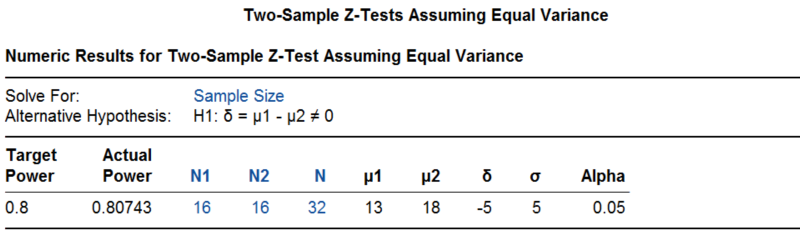{width="5.768055555555556in" height="1.6875in"}

PASS软件t检验法的结果为34，操作时依次点击Means, Two Independent Means, T-Test (Inequality), Two-Sample T-Tests Assuming Equal Variance，其参数设置界面与Z检验法完全一致，此处不再重复。

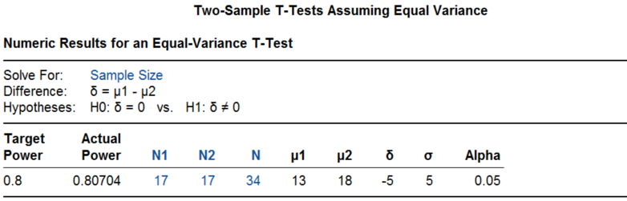{width="5.768055555555556in" height="1.851388888888889in"}

该研究实际入组了40例患者，试验组LVEF的改善明显优于对照组（试验组变化21.08± 1.91%，对照组变化15.62 ±1.94%），平均差值5.6%（95%置信区间0.3%-10.9%，P=0.039），研究达成。

[]{#_Ref138326616 .anchor}例 3‑2 Clarity AD研究^10^评价乐卡尼单抗（Lecanemab）在早期阿尔茨海默病中的疗效。患者随机接受乐卡尼单抗或安慰剂治疗，主要终点为18个月时临床痴呆评分（CDR-SB，0\~18分，分值越高表面病情越重）。假设乐卡尼单抗可延缓病情的进展，18个月时CDR-SB的增加比对照组低0.373分（相当于低25%，文章未给出对照组的具体数值，但这不影响样本量的计算），标准差两组均为2.031，检验效能90%，脱落率20%，则总样本量需1566，每组783例。

Excel表Z检验法的计算结果为每组624例，校正后为625例，考虑落后为625/（1-0.2）=781.3，向上取整为每组782例。

R语言pwrss包Z检验法的结果为每组624例，t检验法的结果为每组625例。

library(pwrss)

pwrss.z.2means(mu1 = 0.373, mu2 = 0, sd1 = 2.031,

alpha = 0.05, power = 0.9)

pwrss.t.2means(mu1 = 0.373, mu2 = 0, sd1 = 2.031,

alpha = 0.05, power = 0.9)

R语言pwr包t检验的结果为每组624.0196例。

library(pwr)

pwr.t.test(d = 0.373/2.031, sig.level = 0.05, power = 0.9)

PASS软件Z检验法结果为每组624例，t检验法结果也是每组624例。可见样本量较大时，Z检验法的结果与t检验法的结果基本一致。

研究实际入组了1795例患者，两组基线CDR-SB约为3.2，18个月时调整后的CDR-SB变化在对照组增加了1.66，治疗组增加了1.21（差值-0.45，95%CI -0.67\~-0.23，P\<0.001）。该研究使乐卡尼单抗于2023年1月获美国FDA加速审批的方式批准。

接下来看几个两组样本量不等的实例。

例 3‑3 PLATINUM China^11^研究是某外企在我国开展的一个冠脉支架上市前随机对照试验。新型支架与传统支架按3:1随机分配，主要终点为9个月时支架内管腔丢失。假设传统支架丢失0.35mm，新型支架为0.14mm，标准差都是0.54mm，双侧α=0.05，脱落率20%，则500例患者可提供91%的检验效能。

Excel表按Z检验法结果为388，t检验校正结果为392，其实这种较大的样本量通常已无需校正。

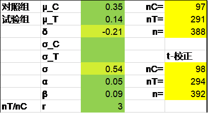{width="3.4652777777777777in" height="1.8819444444444444in"}

R语言pwrss包Z检验法结果为n1+n2=97+289=386，可以看出对照组为97例，如果试验组按对照组的3倍计算为291，总计为388例。。

library(pwrss)

pwrss.z.2means(mu1 = 0.14, mu2 = 0.35, sd1 = 0.54, kappa = 3,

alpha = 0.05, power = 0.91)

R语言pwrss包t检验法结果为97+290=387，可以看出对照组为97例，如果试验组按对照组的3倍计算为291，总计为388例。

library(pwrss)

pwrss.t.2means(mu1 = 0.14, mu2 = 0.35, sd1 = 0.54, kappa = 3,

alpha = 0.05, power = 0.91)

PASS软件Z检验法结果为385例（对照组96例），t检验法结果为387例（对照组97例）。两种方法的参数界面完全一致，此处仅给出t检验法的计算过程。

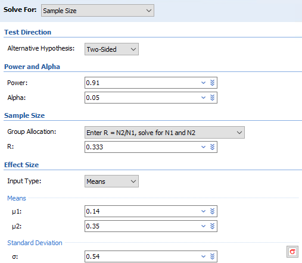{width="4.225366360454943in" height="3.683652668416448in"}

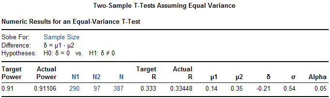{width="5.675492125984252in" height="1.6834787839020122in"}

注意PASS软件在计算两样本均数比较的样本量时对第1组与第2组具体所指并无具体要求，两组可互换，但实际结果仍有细微差异，如第1组代表对照组时的最终结果为388例。

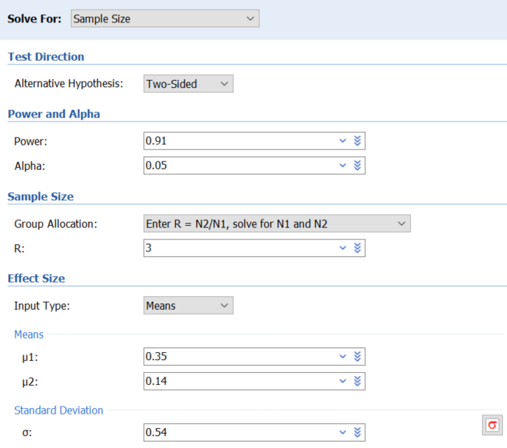{width="4.311023622047244in" height="3.8149606299212597in"}

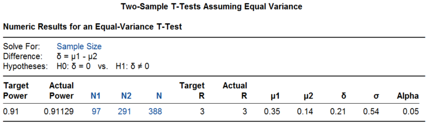{width="5.768055555555556in" height="1.679861111111111in"}

本例是考虑20%的脱落后得到样本量500例的，我们还原一下脱落前样本量400例时可提供的检验效能为91.9%：

pwrss.t.2means(mu1 = 0.14, mu2 = 0.35, sd1 = 0.54, kappa = 3,

alpha = 0.05, n2 = 100)

结果输出：

Difference between Two means

(Independent Samples t Test)

H0: mu1 = mu2

HA: mu1 != mu2

\-\-\-\-\-\-\-\-\-\-\-\-\-\-\-\-\-\-\-\-\-\-\-\-\-\-\-\-\--

Statistical power = 0.919

n1 = 300

n2 = 100

\-\-\-\-\-\-\-\-\-\-\-\-\-\-\-\-\-\-\-\-\-\-\-\-\-\-\-\-\--

Alternative = "not equal"

Degrees of freedom = 398

Non-centrality parameter = -3.368

Type I error rate = 0.05

Type II error rate = 0.081

该研究最终入组了500例患者，结果为传统支架组0.40±0.45mm，新型支架组0.11±0.36 mm，P\<0.001。同时研究也计算了管腔丢失的相对结果，传统支架组为22.20±16.00%，新型支架组为11.06±13.86%，P\<0.001。

例 3‑4 PEDAP研究^12^评价了某闭环胰岛素泵控制2\~6岁儿童I型糖尿病的效果。主要终点为治疗后血糖处于70\~180mg/dl的百分比，闭环胰岛素泵与标准治疗比较，2:1分组，假设治疗13周后试验组较对照组可提高主要终点绝对值7.5%，标准差为10%，双侧检验I类错误5%，则90例患者可提供90%的检验效能，考虑到脱落，总样本量增加至102例。

Excel表Z检验法及校正后都是87例，R语言pwrss包t检验法及PASS软件t检验法结果也都是87例。

library(pwrss)

pwrss.t.2means(mu1 = 7.5, mu2 = 0, sd1 = 10, kappa = 2,

alpha = 0.05, power = 0.9)

研究入选了102例患者，治疗后血糖控制率试验组从基线56.7±18.0%提高至69.3±11.1%， 对照组从基线54.9±14.7% 提高至55.9±12.6%（调整后两组变化的差值为12.4%，相当于每天3小时左右。95%置信区间9.5\~15.3%，P\<0.001）。注意此例研究终点的百分率是定量数据而不是定性数据。

## Wilcoxon检验法

Machin^13^

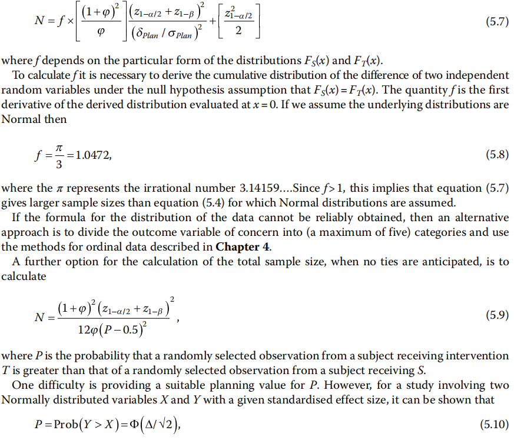{width="5.768055555555556in" height="5.021527777777778in"}

如果研究数据不符合正态分布，需要使用非参数方法Wilcoxon检验法。

[]{#_Ref186379791 .anchor}例 3‑5 STELLAR III期临床试验^14^评价某药物治疗肺动脉高压的疗效。主要终点为治疗24周后6分钟步行距离的变化。双侧检验I类错误0.05，假设组间差异为25米，标准差为50米，则基于Wilcoxon秩和检验，每组121例患者（该数值是基于次要终点的计算结果）可提供约96%的检验效能。假设脱落率15%，总样本量为284。样本量计算使用了nQuery软件。

我们先看一下每组121例的样本量能够提供的检验效能，R语言pwrss包计算的结果为96.6%。

library(pwrss)

pwrss.np.2groups(mu1 = 25, mu2 = 0, sd1 = 50,

alpha = 0.05, n2 = 121)

结果输出：

Non-parametric Difference between Two Groups (Independent samples)

Mann-Whitney U or Wilcoxon Rank-sum Test

(a.k.a Wilcoxon-Mann-Whitney Test)

Method: GUENTHER

\-\-\-\-\-\-\-\-\-\-\-\-\-\-\-\-\-\-\-\-\-\-\-\-\-\-\-\-\--

Statistical power = 0.966

n1 = 121

n2 = 121

\-\-\-\-\-\-\-\-\-\-\-\-\-\-\-\-\-\-\-\-\-\-\-\-\-\-\-\-\--

Alternative = "not equal"

Non-centrality parameter = 3.8

Degrees of freedom = 229.09

Type I error rate = 0.05

Type II error rate = 0.034

如果将96%的检验效能带入，计算所得的样本量为每组117例。

library(pwrss)

pwrss.np.2groups(mu1 = 25, mu2 = 0, sd1 = 50,

alpha = 0.05, power = 0.96)

PASS软件以96%的检验效能计算的结果为每组118例，操作时依次点击Means, Two Independent Means, Nonparametric, Mann-Whitney U or Wilcoxon Rank-Sum Tests(Guenther)。

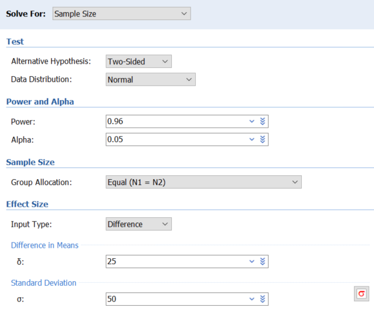{width="4.255905511811024in" height="3.543307086614173in"}

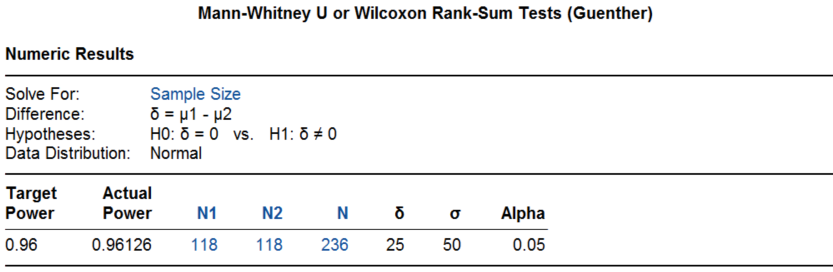{width="5.768055555555556in" height="1.8833333333333333in"}

研究实际入选了323例患者，6分钟步行距离治疗组增加了34.4米，对照组增加了1米，Hodges--Lehmann估计的组间差异为40.8米（95%置信区间27.5\~54.1米，P\<0.001）。

## 讨论

1.  
2.  
3.  1.  
    2.  
    3.  

### 绝对差值和相对差值

均数的差异性比较，可以有绝对差值和相对差值，临床研究中选择绝对差值的似多见一些。比如在起搏治疗心力衰竭的心脏再同步化治疗（CRT）领域，判断CRT治疗有效的指标有很多，对LVEF的要求是绝对值增加5%以上，而对左室收缩期末容量（LVESV）的要求则通常是相对值减少15%以上，偶尔有定义绝对值减少15mL的。[例 3‑1](#_Ref138326543)左束支起搏的研究，选择了左室射血分数（LVEF）变化的绝对差值。[例 3‑2](#_Ref138326616)药物治疗阿尔茨海默病，研究比较的也是变化的绝对差值。对于该研究，有读者来信质疑研究终点的临床意义，认为主要终点CDR-SB评分的范围为0\~18分，临床有意义的变化为1\~2分，因此18个月时对照组增加了1.66分，治疗组增加了1.21分，都是有临床意义的恶化，而两组的绝对差值为-0.45，即治疗组的延缓进展可能没有临床意义。在这种情况下，如果绝对差值转换为相对差值可能会更直观些。

### 样本量计算与统计分析的一致性

选择样本量计算的方法时有一个基本原则，即研究结束时使用哪个方法进行统计分析，就应该在研究设计时使用那个方法进行样本量计算。比如，统计分析时打算用Wilcoxon秩和检验，在样本量计算就应该使用Wilcoxon秩和检验法；或者在统计分析阶段需要进行数据转换时，在样本量计算时也应当使用数据转换等等。

但临床研究实际中往往有不同的做法。某研究^15^的主要终点为房间隔穿刺时间，尽管方案里提到如果数据呈正态分布，则统计分析时采用t检验；如果表现为偏态，则使用Wilcoxon秩和检验；但这不是一个值得推荐的做法，应当可以预见到或者根据既往研究事先估计到穿刺时间的非正态分布。[例 3‑5](#_Ref186379791)药物治疗肺动脉高压研究，样本量计算时用的Wilcoxon秩和检验法，统计分析阶段使用Hodges-Lehmann方法估计了组间差异，尽管这是基于Wilcoxon的推广。

样本量计算与统计分析不一致的情况在临床研究实际中并不少见，尽管有些问题并不大，但这种现象仍值得重视，并且应当尽可能避免。我们在[生存数据的章节]{.mark}还会讨论到样本量计算用简单率的比较而统计分析用Kaplan-Meier率进行log-rank分析的情况。

### 基线和协变量

[例 3‑2](#_Ref138326616)药物治疗阿尔茨海默病，样本量计算时为t检验法，统计分析时使用了基线调整后的t检验。一般来说，基线调整可缩窄95%置信区间，提高统计效率。我们在[两组均数比较的非劣效设计一章]{.mark}中将要介绍的SIMPLICIY HTN-3研究^16^，评价肾动脉消融治疗高血压的效果，主要分析两组t检验结果是阴性的，在作敏感性分析时进行了基线调整及将基线值作为协变量分析，尽管95%置信区间缩窄了，但结果仍然是阴性的。

如果在样本量计算阶段就考虑协变量效应，有望减少样本量。假设某协变量与终点变量的相关系数为r，则样本量可以调整为^6^：

$n' = n(1 - r^{2})$ （3-8）

FDA2023年发布的《药物和生物制品随机临床试验中协变量的调整指导原则》^17^指出，在对主要有效性终点分析时不进行协变量的调整是可以接受的。申办方在随机临床试验有效性终点分析时可以进行基线协变量的调整。这样做通常可减少治疗效应估计的变异，从而缩窄置信区间，提高假设检验的效能。

### 脱落和交叉

因各种原因没有观察到患者的研究终点，都可称为脱落（attrition或drop out），包括患者退出、失访、死亡（如果死亡不是终点事件）等。

假设脱落率是r，通常样本量会调整至：

$n' = n/(1 - r)$（3-9）

交叉包括患者从对照组进入试验组或从试验组进入对照组的情况，从进一步细分的话，可以将患者由试验组转入对照组叫做落出（drop out，注意这和上文的drop out含义并不相同，假设发生率为r~o~），由对照组转入试验组叫落进（drop in，假设发生率为r~i~），根据ITT分析原则，这会稀释治疗效果，因此样本量应调整至：

$n' = n/{(1 - r_{o} - r_{i})}^{2}$（3-10）

此时样本量将有明显的增加，比如假设落出和落入的比例都是10%，则样本量需增加至原来的1.56倍。因此加强临床研究的质量，提高患者的依从性非常重要。

**References:**

1\. 李康, 贺佳. 医学统计学. 6版 ed. 北京: 人民卫生出版社; 2013.

2\. 颜艳, 王彤. 医学统计学. 5版 ed. 北京: 人民卫生出版社; 2020.

3\. 李卫. 医疗器械临床试验统计方法. 2版 ed. 北京: 科学出版社; 2016.

4\. 贺佳, 邓伟, 王素珍. 临床试验设计与统计分析. 2版 ed. 北京: 人民卫生出版社; 2022.

5\. 陈峰, 夏结来. 临床试验统计学. 北京: 人民卫生出版社; 2018.

6\. Chow S, Shao J, Wang H, Lokhnygina Y. Sample Size Calculations in Clinical Research. Third Edition ed: CRC Press; 2018.

7\. 颜虹, 徐勇勇. 医学统计学. 3版 ed. 北京: 人民卫生出版社; 2015.

8\. Kieser M. Methods and Applications of Sample Size Calculation and Recalculation in Clinical Trials: Springer; 2020.

9\. Wang Y, Zhu H, Hou X, et al. Randomized Trial of Left Bundle Branch vs Biventricular Pacing for Cardiac Resynchronization Therapy. J AM COLL CARDIOL 2022;80:1205-16.

10\. van Dyck CH, Swanson CJ, Aisen P, et al. Lecanemab in Early Alzheimer\'s Disease. NEW ENGL J MED 2023;388:9-21.

11\. Gao R, Han Y, Yang Y, et al. PLATINUM China: a prospective, randomized investigation of the platinum chromium everolimus-eluting stent in de novo coronary artery lesions. CATHETER CARDIO INTE 2015;85 Suppl 1:716-23.

12\. Wadwa RP, Reed ZW, Buckingham BA, et al. Trial of Hybrid Closed-Loop Control in Young Children with Type 1 Diabetes. NEW ENGL J MED 2023;388:991-1001.

13\. Machin D, Campbell MJ, Tan SB, Tan SH. Sample Sizes for Clinical, Laboratory and Epidemiology Studies. Fourth Edition ed. Pondicherry: Wiley Blackwell; 2018.

14\. Hoeper MM, Badesch DB, Ghofrani HA, et al. Phase 3 Trial of Sotatercept for Treatment of Pulmonary Arterial Hypertension. NEW ENGL J MED 2023;388:1478-90.

15\. Dewland TA, Gerstenfeld EP, Moss JD, et al. Randomized Comparison of a Radiofrequency Wire Versus a Radiofrequency Needle System for Transseptal Puncture. JACC-CLIN ELECTROPHY 2023;9:611-9.

16\. Bhatt DL, Kandzari DE, O\'Neill WW, et al. A controlled trial of renal denervation for resistant hypertension. NEW ENGL J MED 2014;370:1393-401.

17\. FDA. Adjusting for Covariates in Randomized Clinical Trials for Drugs and Biological Products Guidance for Industry; 2023.
