# 两组率的比较

两组率（proportion，构成比）的比较在临床研究中十分普遍，因为临床研究所关注的患者结局（outcome）通常都是临床事件，比如心肌梗死、卒中、死亡等，两组之间的比较自然就是率的比较。两组率的比较的样本量计算常见的方法有独立方差法（unpooled variance）与合并方差法（pooled variance）。

独立方差法的样本量计算公式如下，C和T分别代表对照组和试验组^1-5^：

$n_{C} = n_{T} = \frac{\left( Z_{\frac{1 - \alpha}{2}} + Z_{1 - \beta} \right)^{2}\lbrack\pi_{C}\left( 1 - \pi_{C} \right) + \pi_{T}\left( 1 - \pi_{T} \right)\rbrack}{{(\pi_{T} - \pi_{C})}^{2}}$（4-1）

如果两组例数不等，试验组数量是对照组的r倍，则^2-4^：

$n_{C} = \frac{\left( Z_{\frac{1 - \alpha}{2}} + Z_{1 - \beta} \right)^{2}\lbrack\pi_{C}\left( 1 - \pi_{C} \right) + \pi_{T}\left( 1 - \pi_{T} \right)/r\rbrack}{{(\pi_{T} - \pi_{C})}^{2}}$（4-2）

$$n_{T} = n_{C}r$$

合并方差法的样本量计算公式如下^6,\ 7^：

$n_{C} = n_{T} = \frac{\left\lbrack Z_{1 - \alpha/2}\sqrt{2\pi(1 - \pi)} + Z_{1 - \beta}\sqrt{\pi_{C}\left( 1 - \pi_{C} \right) + \pi_{T}\left( 1 - \pi_{T} \right)} \right\rbrack^{2}}{\left( \pi_{T} - \pi_{C} \right)^{2}}$（4-3）

其中

$\pi = {(\pi}_{C} + \pi_{T})/2$ (4-4)

如果两组例数不等，试验组数量是对照组的r倍，则^6^：

$n_{C} = \frac{\left\lbrack Z_{1 - \alpha/2}\sqrt{\pi(1 - \pi)\left( 1 + \frac{1}{r} \right)} + Z_{1 - \beta}\sqrt{\pi_{C}\left( 1 - \pi_{C} \right) + \pi_{T}\left( 1 - \pi_{T} \right)/r} \right\rbrack^{2}}{\left( \pi_{T} - \pi_{C} \right)^{2}}$（4-5）

其中

$\pi = \frac{\pi_{C} + r\pi_{T}}{1 + r}$（4-6）

如果统计分析使用Fisher确切概率法或连续性校正卡方检验，样本量需适当修正^7,\ 8^：

$n_{C}' = \frac{n_{C}}{4}{(1 + \sqrt{1 + \frac{2(1 + r)}{rn_{C}|\pi_{T} - \pi_{C}|}})}^{2}$（4-7）

配对设计的样本量计算公式^7^：

$n = \frac{\left\lbrack Z_{1 - \alpha/2}\sqrt{2\overline{\pi}} + Z_{1 - \beta}\sqrt{2\left( \pi_{C} - \pi \right)\left( \pi_{T} - \pi \right)/\overline{\pi}} \right\rbrack^{2}}{\left( \pi_{T} - \pi_{C} \right)^{2}}$（4-8）

其中π为两种处理的阳性一致率，$\overline{\pi} = (\pi_{C} + \pi_{T} - 2\pi)$。

或者^4^：

$n = \frac{\left\lbrack Z_{1 - \alpha/2}\sqrt{\pi_{01} + \pi_{10}} + Z_{1 - \beta}\sqrt{\pi_{01} + \pi_{10} - {(\pi_{01} - \pi_{10})}^{2}} \right\rbrack^{2}}{\left( \pi_{01} - \pi_{10} \right)^{2}}$（4-9）

公式中各参数的含义在本章案例中有进一步的解释。

数据转换本章不作介绍^7^。

（样本量图）

## 独立方差法

[]{#_Ref138344393 .anchor}例 4‑1 VPS II随机对照双盲试验^9^评价了起搏器在血管迷走性晕厥中的疗效，所有患者均植入带有频率骤降反应功能的双腔起搏器，对照组程控为仅感知，不进行起搏。假设起搏器治疗可以将6个月晕厥事件由60%降为30%，检验效能80%，则共需80例患者。

该例文献原文未给出α水平，此处按常规双侧0.05计算。Excel表独立方差法结果为80，合并方差法为84。

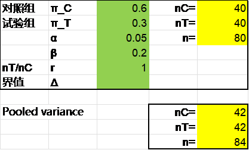{width="3.4652777777777777in" height="2.0902777777777777in"}

R语言pwrss包独立方差法计算结果也是80：

library(pwrss)

pwrss.z.2props(p1 = 0.3, p2 = 0.6, alpha = 0.05, power = 0.8)

结果输出：

Approach: Normal Approximation

Difference between Two Proportions

(Independent Samples z Test)

H0: p1 = p2

HA: p1 != p2

\-\-\-\-\-\-\-\-\-\-\-\-\-\-\-\-\-\-\-\-\-\-\-\-\-\-\-\-\--

Statistical power = 0.8

n1 = 40

n2 = 40

\-\-\-\-\-\-\-\-\-\-\-\-\-\-\-\-\-\-\-\-\-\-\-\-\-\-\-\-\--

Alternative = "not equal"

Non-centrality parameter = -2.802

Type I error rate = 0.05

Type II error rate = 0.2

PASS软件独立方差法同样得到80，操作时依次点击Proportions, Two Independent Proportions, Test (Inequality), Tests for Two Proportions。注意PASS软件在两组率的比较时默认第1组为试验组，参数界面Test Type默认为Z-Test（Unpooled）。

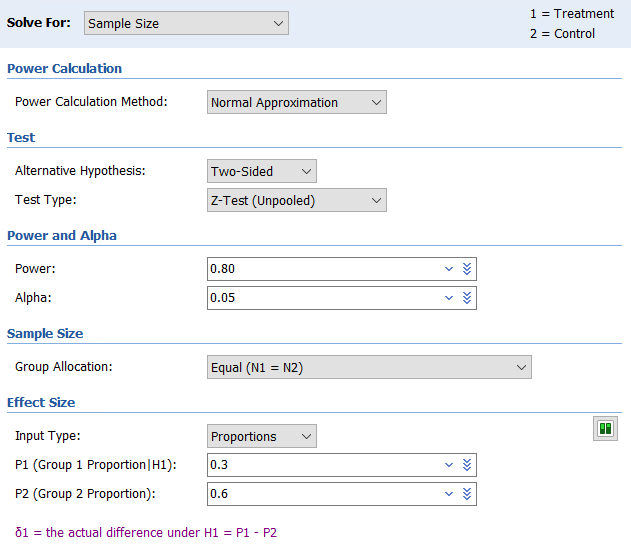{width="5.25878937007874in" height="4.5587281277340335in"}

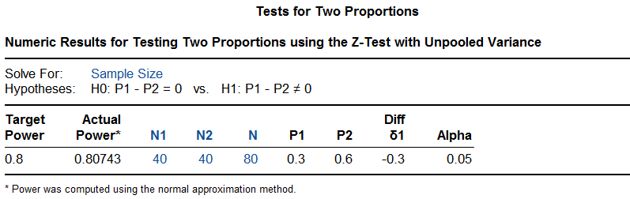{width="5.768055555555556in" height="1.823611111111111in"}

研究在入组60例患者后发现实际的总事件率低于预期，样本量增加至100例。结果6个月累积晕厥率在对照组为40%，试验组为31%，降低了30%（95%置信区间-33%\~63%，log-rank P=0.14），研究未达成。

可以看到，PASS软件提供了实际的检验效能为0.807，R语言pwrss包也可以做到：

library(pwrss)

pwrss.z.2props(p1 = 0.3, p2 = 0.6, alpha = 0.05, n2 = 40)

结果输出：

    ##  Approach: Normal Approximation 
    ##  Difference between Two Proportions 
    ##  (Independent Samples z Test) 
    ##  H0: p1 = p2 
    ##  HA: p1 != p2 
    ##  ------------------------------ 
    ##   Statistical power = 0.807 
    ##   n1 = 40 
    ##   n2 = 40 
    ##  ------------------------------ 
    ##  Alternative = "not equal" 
    ##  Non-centrality parameter = -2.828 
    ##  Type I error rate = 0.05 
    ##  Type II error rate = 0.193

## 合并方差法

例 4‑2 EMINENT研究^9^比较了ELUVIA药物支架和常规金属裸支架在股腘动脉病变中的应用。患者按2:1随机接受试验组和对照组的治疗，主要终点为12个月血管通畅率。假设试验组通畅率85%，对照组75%，单侧α=0.025，检验效能85%，则需630例患者。假设脱落率16%，样本量增加至750。

Excel表独立方差法和合并方差法的结果分别是678与630例。

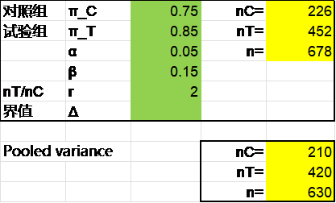{width="3.4652777777777777in" height="2.0902777777777777in"}

R语言结果与之相同，pwrss包的独立方差法的结果为678例，gsDesign包的合并方差法的结果为630例。

library(gsDesign)

nBinomial(p1 = 0.75, p2 = 0.85, ratio = 2, alpha = 0.025, beta = 0.15,

outtype = 2)

结果输出：

n1 n2

1 209.7694 419.5389

PASS软件独立方差法与合并方差法的结果分别是677例和629例。看上比前述算法去各少了1例，其实PASS软件独立方差法计算对照组226，试验组如果按对照组的2倍计算为452例，与Excel表及R语言结果完全一致，但PASS软件试验组取了451例。同样，PASS软件合并方差法计算对照组210，试验组如果按对照组的2倍计算为420例，与Excel表及R语言结果完全一致，但PASS软件试验组取了419例。PASS软件合并方差法操作时在参数界面的Test Type项选择Z-Test (Pooled)。注意PASS软件在两组率的比较时默认第1组为试验组，两组例数之比R为对照组/试验组，因此本例参数界面的R取0.5。

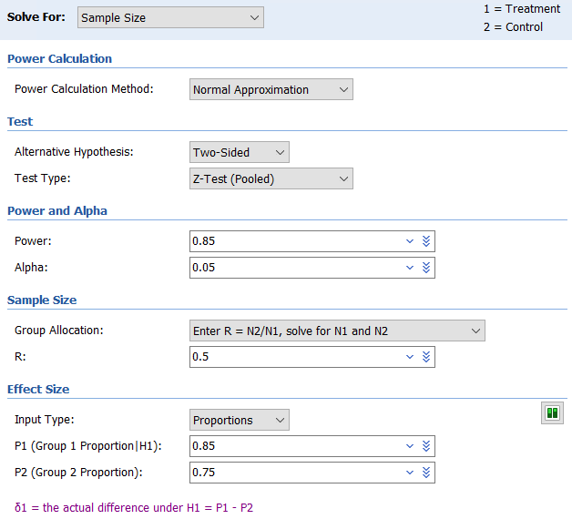{width="5.233787182852144in" height="4.750411198600175in"}

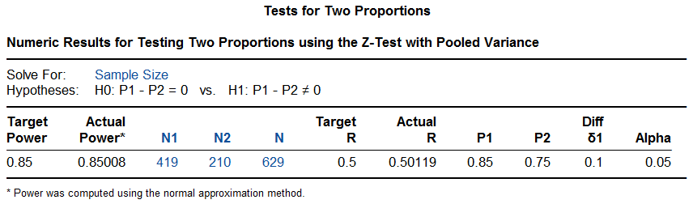{width="5.768055555555556in" height="1.6979166666666667in"}

研究实际随机了775例患者，结果试验组通畅率显著高于对照组（83.2%与74.3%，P\<0.01）。

CAPLA研究^11^

## 3 Fisher确切概率法

例 4‑3 BAG-RECALL研究^12^探索一种新的监测方案能否降低非预期的术中清醒的发生率。假设对照组终点事件率为0.5%，试验组0.1%，Fisher检验，单侧α=0.05，则每组3000例患者可以提供87%的检验效能。

R语言exact2X2包计算的样本量为每组2983例：

library(exact2x2)

ss2x2(p0 = 0.005, p1 = 0.001, power = 0.87, sig.level = 0.1)

结果输出：

Power for Fisher\'s Exact Test

power = 0.8701174

n0 = 2983

n1 = 2983

p0 = 0.005

p1 = 0.001

sig.level = 0.1

alternative = two.sided

nullOddsRatio = 1

NOTE: errbound= 1e-06

如果将参数approx设定为T（默认为F），结果如下：

ss2x2(p0 = 0.005, p1 = 0.001, power = 0.87, sig.level = 0.1,

approx = T)

结果输出：

Approximate Power for Fisher\'s Exact Test

power = 0.87

p0 = 0.005

p1 = 0.001

n0 = 3351.072

n1 = 3351.072

sig.level = 0.1

alternative = two.sided

strict = FALSE

tsmethod = NULL

nullOddsRatio = 1

NOTE: errbound= 1e-06

也可以计算一下每组3000例时的检验效能，为0.872：

power2x2(p0 = 0.005, p1 = 0.001, n0 = 3000, n1 = 3000, sig.level = 0.1)

结果输出：

Power for Fisher\'s Exact Test

power = 0.8721597

n0 = 3000

n1 = 3000

p0 = 0.005

p1 = 0.001

sig.level = 0.1

alternative = two.sided

nullOddsRatio = 1

NOTE: errbound= 1e-06

PASS软件操作时依次点击Proportions, Two Independent Proportions, Test (Inequality), Fisher's Exact Test for Two Proportions，在Power Calculation Method中先选择Normal Approximation，结果为每组3352例。

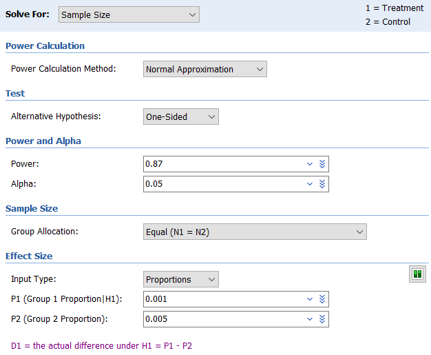{width="5.21711832895888in" height="4.292038495188102in"}

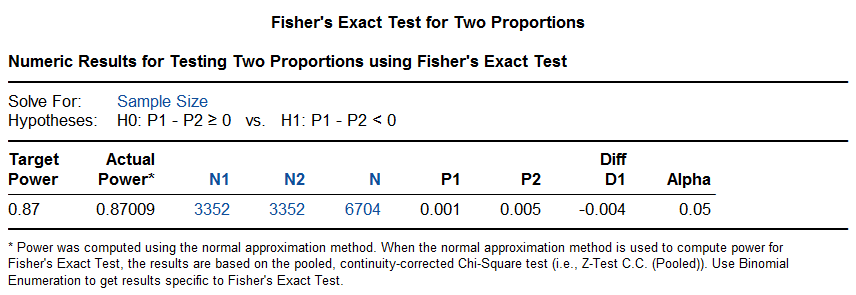{width="5.739583333333333in" height="1.9777777777777779in"}

如果在Power Calculation Method中选择Binomial Enumeration，注意适当扩大Maximum N1 or N2 for Binomial Enumeration的取值范围。但此法对于样本量1000以上的计算将非常耗时，本例的结果为2983例。

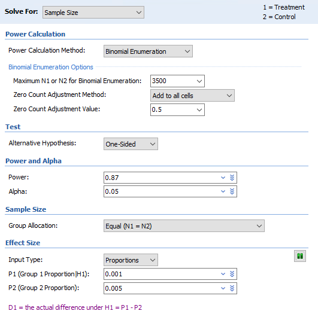{width="4.4253838582677165in" height="4.375379483814523in"}

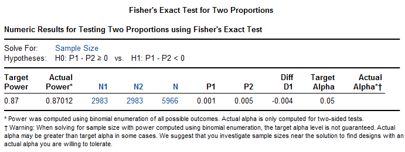{width="5.739583333333333in" height="2.1597222222222223in"}

该研究实际随机了6041例患者，其中5413例有终点判断完整的数据。对照组0.07%（2/2852），试验组0.24%（7/2861）发生了终点事件，差值为0.17%（95%置信区间-0.03%\~0.38%，P=0.98），研究未达成。

## 配对设计

例 4‑4^7^ 欲比较甲、乙两药治疗过敏性鼻炎的疗效，采用配对设计，预实验中甲药有效率65%，乙药50%，甲、乙两药阳性一致率为40%，取α=0.05，β=0.1，则根据公式（4-8）计算需151例（对）患者。

根据以上参数可以构建下面的四格表：

+------+--------------------------+
| 甲药 | 乙药                     |
|      +------------+-------------+
|      | 有效       | 无效        |
+======+============+=============+
| 有效 | 0.4（1,1） | 0.25（1,0） |
+------+------------+-------------+
| 无效 | 0.1（0,1） | 0.25（0,0） |
+------+------------+-------------+

此例π=0.4， $\overline{\pi} = (\pi_{C} + \pi_{T} - 2\pi)$ = (0.5 + 0.65 -- 2x0.4) = 0.35, 因此

$$n = \frac{\left\lbrack Z_{1 - \frac{\alpha}{2}}\sqrt{2\overline{\pi}} + Z_{1 - \beta}\sqrt{\frac{2\left( \pi_{C} - \pi \right)\left( \pi_{T} - \pi \right)}{\overline{\pi}}} \right\rbrack^{2}}{\left( \pi_{T} - \pi_{C} \right)^{2}} = \frac{({1.960*\sqrt{2*0.35} + 1.282*\sqrt{2*(0.5 - 0.4)*(0.65 - 0.5)/0.35})}^{2}}{{(0.65 - 0.5)}^{2}} = 200.5$$

([原文误将]{.mark}$\overline{\pi}$[计算成0.175，最终结果为151。]{.mark})

R语言TrialSize包根据公式（4-9）计算，结果样本量为160：

library(TrialSize)

n \<- McNemar.Test(alpha = 0.05, beta = 0.1, psai = 0.1/0.25, paid = 0.1+0.25)

n

结果输出：

\[1\] 159.2529

PASS软件计算结果也是160。操作时依次点击Proportions, Two Correlated (Paired) Proportions, Test (Inequality), Tests for Two Correlated Proportions (McNemar Test)。参数设置界面较为灵活，注意适当选择。

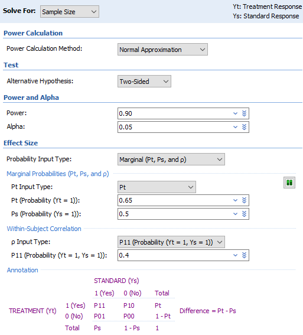{width="4.275370734908137in" height="4.7254090113735785in"}

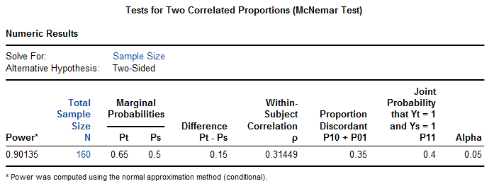{width="5.739583333333333in" height="2.1659722222222224in"}

## 讨论

本章的实例中仍然出现了样本量计算方法与最终统计方法不完全一致的情况，比如[例 4‑1](#_Ref138344393) VPS II研究，样本量计算时为两组率的比较，统计分析使用了log-rank检验。CAPLA研究。

### 独立方差法与合并方差法的选用

两组率的比较的样本量计算，独立方差法与合并方差法在临床研究实践中都有应用，究竟应该选用哪一种？Chow等^4^把这两种方法称为非条件法和条件法，并认为该选用哪种是个麻烦问题，因为不存在哪种方法一直更为有效。

实际上在两组例数相等时，这两种方法计算的结果相差并不大，合并方差法计算出的样本量略高一些（[图 4‑1](#_Ref186395621)，[图 4‑2](#_Ref186395623)），而两组例数不等时，差异会略大一些（[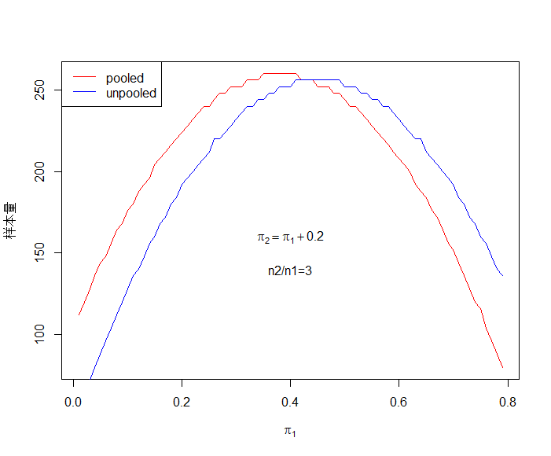{width="5.768055555555556in" height="4.772222222222222in"}图 4‑3](#_Ref186395642)）。我们认为，简单的推荐是选用样本量较大的那种以保证检验效能，必要时可进行模拟评价。

![[]{#_Ref186395621 .anchor}图 4‑1 独立方差法与合并方差法样本量计算比较1（α=0.05双侧，β=0.2）](media/S4_2Proportions/image14.png){width="5.768055555555556in" height="4.772222222222222in"}

![[]{#_Ref186395623 .anchor}图 4‑2 独立方差法与合并方差法样本量计算比较2（α=0.05双侧，β=0.2）](media/S4_2Proportions/image15.png){width="5.768055555555556in" height="4.772222222222222in"}

[]{#_Ref186395642 .anchor}{width="5.768055555555556in" height="4.772222222222222in"}图 4‑3 独立方差法与合并方差法样本量计算比较3（双侧α=0.05，β=0.2）

Lydersen et al. recommended in their tutorial that "*The traditional Fisher's exact test*

*should practically never be used*" (Lydersen et al. 2009, p. 1174).^13^

### 定量数据转换为定性数据

对于临床研究的终点，将定量数据转换为定性数据是一个值得探讨的话题。某超声消融治疗帕金森病的研究^14^，中途将两组均数比较更改为两组率的比较；而RESCUE BT2研究^15^的主要终点为90天时改良Rankin量表评分结果良好，这是基于定量的改良Rankin评分（范围0\~6分）转换而来，将评分0\~1定义为结果良好，而3\~6分为非良好。一般来说，从统计学角度看，定量数据转换为定性数据时会有信息的损失从而降低了检验效能，此时需要有充分的临床意义来支持这一转换。

### 率差还是率比

本章介绍的两个率比较的样本量计算，从公式上看都是比较两个率的差值，但有时候临床上两个率的比值会更为关注，提请读者注意。在[两个率的非劣效比较一章]{.mark}中我们继续谈妥这一话题。

**References:**

1\. 李卫. 医疗器械临床试验统计方法. 2版 ed. 北京: 科学出版社; 2016.

2\. 陈峰, 夏结来. 临床试验统计学. 北京: 人民卫生出版社; 2018.

3\. 贺佳, 邓伟, 王素珍. 临床试验设计与统计分析. 2版 ed. 北京: 人民卫生出版社; 2022.

4\. Chow S, Shao J, Wang H, Lokhnygina Y. Sample Size Calculations in Clinical Research. Third Edition ed: CRC Press; 2018.

5\. 国家药品监督管理局. 医疗器械临床试验设计指导原则; 2018.

6\. 李康, 贺佳. 医学统计学. 6版 ed. 北京: 人民卫生出版社; 2013.

7\. 颜虹, 徐勇勇. 医学统计学. 3版 ed. 北京: 人民卫生出版社; 2015.

8\. Machin D, Campbell MJ, Tan SB, Tan SH. Sample Sizes for Clinical, Laboratory and Epidemiology Studies. Fourth Edition ed. Pondicherry: Wiley Blackwell; 2018.

9\. Connolly SJ, Sheldon R, Thorpe KE, et al. Pacemaker therapy for prevention of syncope in patients with recurrent severe vasovagal syncope: Second Vasovagal Pacemaker Study (VPS II): a randomized trial. JAMA-J AM MED ASSOC 2003;289:2224-9.

10\. Goueffic Y, Torsello G, Zeller T, et al. Efficacy of a Drug-Eluting Stent Versus Bare Metal Stents for Symptomatic Femoropopliteal Peripheral Artery Disease: Primary Results of the EMINENT Randomized Trial. CIRCULATION 2022;146:1564-76.

11\. Kistler PM, Chieng D, Sugumar H, et al. Effect of Catheter Ablation Using Pulmonary Vein Isolation With vs Without Posterior Left Atrial Wall Isolation on Atrial Arrhythmia Recurrence in Patients With Persistent Atrial Fibrillation: The CAPLA Randomized Clinical Trial. JAMA-J AM MED ASSOC 2023;329:127-35.

12\. Avidan MS, Jacobsohn E, Glick D, et al. Prevention of intraoperative awareness in a high-risk surgical population. NEW ENGL J MED 2011;365:591-600.

13\. Lydersen S, Fagerland MW, Laake P. Recommended tests for association in 2 x 2 tables. STAT MED 2009;28:1159-75.

14\. Krishna V, Fishman PS, Eisenberg HM, et al. Trial of Globus Pallidus Focused Ultrasound Ablation in Parkinson\'s Disease. NEW ENGL J MED 2023;388:683-93.

15\. Zi W, Song J, Kong W, et al. Tirofiban for Stroke without Large or Medium-Sized Vessel Occlusion. NEW ENGL J MED 2023;388:2025-36.
