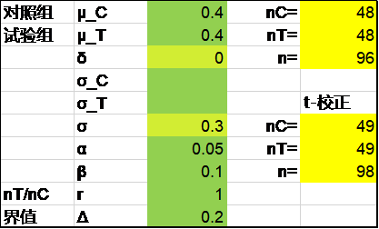
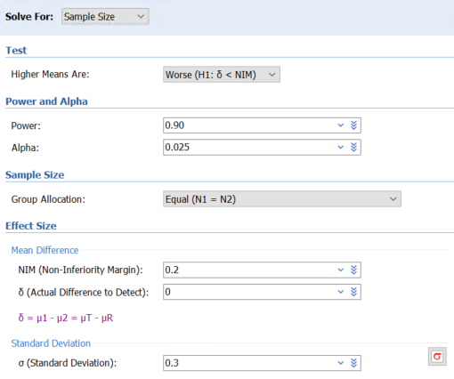
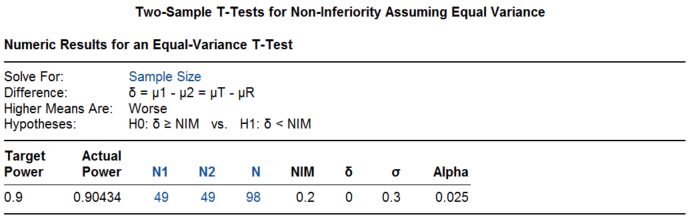
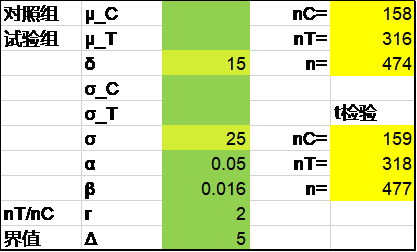
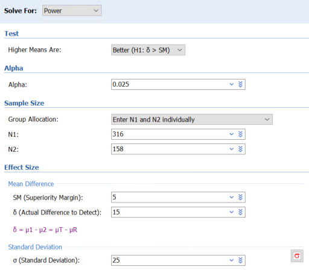
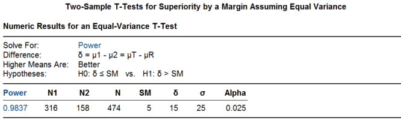
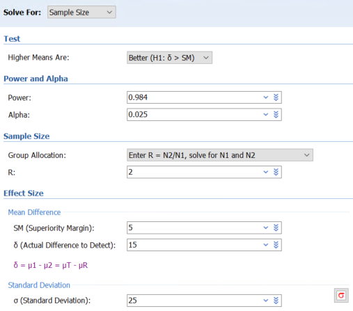
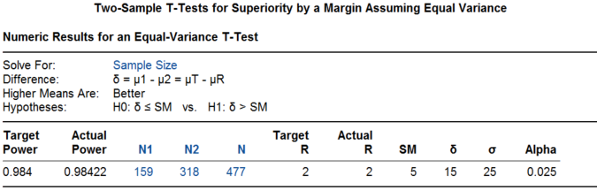

# 6. 两组均数比较的非劣效设计

非劣效设计是临床研究中常见的一种方法，两组均数非劣效比较的样本量计算公式如下^1-3^，C和T分别代表对照组和试验组，δ为两组之间的差异μ~T~-μ~C~，Δ为非劣效界值。

$n_{C} = n_{T} = \frac{{2\left( z_{1 - \alpha/2} + z_{1 - \beta} \right)}^{2}\sigma^{2}}{{(\delta - \mathrm{\Delta})}^{2}}$（6-1）

t检验法校正后为^4^：

$n_{C} = n_{T} = \frac{{2\left( z_{1 - \alpha/2} + z_{1 - \beta} \right)}^{2}\sigma^{2}}{{(\delta - \mathrm{\Delta})}^{2}} + \frac{1}{4}Z_{1 - \alpha/2}^{2}$（6-2）

如果两组例数不等，试验组与对照组按r:1分配，则^2,\ 3^：

$n_{C} = \frac{\left( z_{1 - \alpha/2} + z_{1 - \beta} \right)^{2}\sigma^{2}(1 + 1 \slash r)}{{(\delta - \mathrm{\Delta})}^{2}}$（6-3）

$$n_{T} = n_{C}r$$

t检验法校正后为^4^：

$n_{C} = \frac{\left( z_{1 - \alpha/2} + z_{1 - \beta} \right)^{2}\sigma^{2}\left( 1 + \frac{1}{r} \right)}{(\delta - \mathrm{\Delta})^{2}} + \frac{Z_{1 - \alpha/2}^{2}}{2(1 + r)}$（6-4）

如果两组方差不等，公式同上，只是

$\sigma^{2} = \frac{\sigma_{C}^{2} + \sigma_{T}^{2}/r}{1 + 1/r}$（6-5）

如果将以上样本量计算公式中的σ放到分母上，分母变为${\lbrack(\delta - \mathrm{\Delta})/\sigma\rbrack}^{2}$，则这些公式与[之前章节]{.mark}介绍的样本量计算公式在形式上更为一致。

注意Δ值的正负比较容易出错。如果$\delta$=0，即两组预期的终点值相等，Δ取正或取负并不影响计算结果；如果$\delta$≠0，即组预期的终点值不等，则需要特别注意。对于高优指标（数值越大越好，比如肺活量、六分钟步行距离、成功率等），Δ通常取负值；对于低优指标（数值越小越好，比如冠脉介入治疗后的管腔丢失，并发症率等），Δ通常取正值。注意无论是高邮指标还是低优指标，当预期试验组的疗效略差于对照组时，差值$\delta$显然在数值上不能大于非劣效界值$\mathrm{\Delta}$，否则就没有实际意义了。不同的统计学书刊的样本量计算公式对于$\delta$和$\mathrm{\Delta}$的规定可能存在一些形式上的差别，提请读者仔细甄别，确保Δ值正负的正确取用。

## 非劣效设计

例 5‑1 Agent ISR研究^5^比较了药物球囊与普通球囊在支架内再狭窄病变中的应用，主要终点为6个月时的晚期管腔丢失。假设晚期管腔丢失在两个组都是0.4mm，标准差0.3mm，非劣效界值0.2mm，检验效能90%，主要终点差值的95%置信区间上限需小于非劣效界值，则需要122例患者（已考虑20%的脱落率）。

Excel表Z检验法校正后为98例，考虑脱落后为98/(1-20%)=122.5。

{width="3.4652777777777777in" height="2.0902777777777777in"}

R语言pwrss包的计算结果同Excel表，也是98例。注意pwrss包的使用，建议第1组设为试验组，第2组为对照组，尽管此案例两组假设值相等，表面上看不出差异。

library(pwrss)

pwrss.t.2means(mu1 = 0.4, mu2 = 0.4, sd1 = 0.3, margin = 0.2,

alpha = 0.025, power = 0.9, alternative = \"non-inferior\")

结果输出：

Difference between Two means

(Independent Samples t Test)

H0: mu1 - mu2 \<= margin

HA: mu1 - mu2 \> margin

\-\-\-\-\-\-\-\-\-\-\-\-\-\-\-\-\-\-\-\-\-\-\-\-\-\-\-\-\--

Statistical power = 0.9

n1 = 49

n2 = 49

\-\-\-\-\-\-\-\-\-\-\-\-\-\-\-\-\-\-\-\-\-\-\-\-\-\-\-\-\--

Alternative = "non-inferior"

Degrees of freedom = 96

Non-centrality parameter = -3.3

Type I error rate = 0.025

Type II error rate = 0.1

PASS软件计算的结果也是98例。操作时依次点击Non-Inferiority, Means, Two Independent Means, Two-Sample T-Tests for Non-Inferiority Assuming Equal Variance。注意在参数设置界面第1组为试验组，Higher Means Are的选项此例为Worse，即低优指标。

{width="4.25036854768154in" height="3.550307305336833in"}

{width="5.733829833770779in" height="1.8334919072615923in"}

研究实际入组了例125例患者，试验组的终点为0.397±0.43 mm，对照组为0.393±0.536 mm，差值为0.004mm，95%置信区间（-0.189\~0.196）的上限小于非劣效界值0.2，非劣效P=0.046，研究达成。注意此例尽管假设了主要终点指标在两个组都是0.4mm，但这并不是必需的，只需给出预期的两组的差值为零，即$\delta$=0即可。

##  优效设计

[]{#_Ref138404094 .anchor}例 5‑2 SYMPLICITY HTN-3^6^评价了肾动脉消融治疗高血压的疗效，在本书[第2章单组率的研究设计]{.mark}我们已经根据安全性终点计算出试验组与对照组的样本量分别为316和158例，假设两组血压下降的差值为15mmHg，标准差为25mmHg，如要求在在单侧α=0.025的基础上证实两组差值\>5mmHg，则316例试验组和158例对照组可提供\>95%的检验效能。

在Excel表中试用不同的β值，当β=0.016时可重现该例的样本量，此时的检验效能为1-β=98.4%。

{width="3.4652777777777777in" height="2.0902777777777777in"}

R语言pwrss包可以直接计出算该例的检验效能为98.4%：

library(pwrss)

pwrss.z.2means(mu1 = 15, mu2 = 0, sd1 = 25, margin = 5, kappa = 2,

alpha = 0.025, n2 = 158, alternative = \"superior\")

结果输出：

Difference between Two Means (Independent Samples z Test)

H0: mu1 - mu2 \<= margin

HA: mu1 - mu2 \> margin

\-\-\-\-\-\-\-\-\-\-\-\-\-\-\-\-\-\-\-\-\-\-\-\-\-\-\-\-\--

Statistical power = 0.984

n1 = 316

n2 = 158

\-\-\-\-\-\-\-\-\-\-\-\-\-\-\-\-\-\-\-\-\-\-\-\-\-\-\-\-\--

Alternative = "superior"

Non-centrality parameter = 4.104

Type I error rate = 0.025

Type II error rate = 0.016

以检验效能98.4%带入计算，试验组和对照组分别为316例和158例。

library(pwrss)

pwrss.z.2means(mu1 = 15, mu2 = 0, sd1 = 25, margin = 5, kappa = 2,

alpha = 0.025, power = 0.984, alternative = \"superior\")

结果输出：

Difference between Two Means (Independent Samples z Test)

H0: mu1 - mu2 \<= margin

HA: mu1 - mu2 \> margin

\-\-\-\-\-\-\-\-\-\-\-\-\-\-\-\-\-\-\-\-\-\-\-\-\-\-\-\-\--

Statistical power = 0.984

n1 = 316

n2 = 158

\-\-\-\-\-\-\-\-\-\-\-\-\-\-\-\-\-\-\-\-\-\-\-\-\-\-\-\-\--

Alternative = "superior"

Non-centrality parameter = 4.104

Type I error rate = 0.025

Type II error rate = 0.016

再次强调一下在pwrss包里建议将第1组作为试验组，否则试验组与对照组的例数之比参数kappa在本例中需调整为1/2。

PASS软件也可以先计算检验效能，同样是98.4%。操作时以此点击Superiority by a Margin, Two Independent Means, Two-Sample T-Tests for Superiority by a Margin Assuming Equal Variance。注意参数界面Solve for选择Power，而不是默认的Sample Size。另外，此例的Higher Means Are中选择Better，即高优指标。

{width="4.267361111111111in" height="3.7333333333333334in"}

{width="5.5504811898512685in" height="1.6834787839020122in"}

以98.4%的检验效能带入PASS软件，所得样本量为试验组318例，对照组159例，注意此时实际的检验效能略高于98.4%。

{width="4.225366360454943in" height="3.7253226159230097in"}

{width="5.625487751531058in" height="1.8001563867016623in"}

该研究随机了535例患者，6个月血压下降在对照组和治疗组分别为-11.74±25.94 mmHg和-14.13±23.93 mmHg，差值-2.39 mmHg（95%置信区间-6.89\~2.12mmHg），与优效性界值5mmHg比较的优效性P=0.26，故研究未达成。

## 讨论

### 何为优效设计？

优效设计的含义在临床研究中尚未统一，国内药物临床试验通常把本书之前章节的差异性检验叫做优效性试验，进一步细分的话把Δ不为零的情况叫做临床优效性，并把Δ为零时的情况称作统计优效性^9,\ 10^。

药监局2018年发布的《医疗器械临床试验设计指导原则》指出：优效性检验的目的是确证试验器械的疗效/安全性优于对照器械/标准治疗方法/安慰对照，且其差异大于预先设定的优效界值，即差异有临床实际意义。由于试验器械特征、对照和主要评价指标等因素的不同，部分优效性检验没有考虑优效性界值，申请人需论述不考虑优效性界值的理由。这里优效性检验是广义的概念，包括了优效性界值为零（即差异性检验）的情况。

本书的优效设计特指优效界值Δ不为零的情况，这与非劣效设计在名称上有更好的对应关系；而把之前章节介绍的两组的比较称为差异性检验（inequality test）^11^，这与PASS软件是一致的，尽管也有称之为均等检验（equality）的^3^。真正的优效设计在临床研究中并不多见，因为当申办方可以通过差异性检验确定产品的优势时，通常没有动力去做优效设计证明新产品比对照要好一定的程度（此时研究达成的把握下降，且所需的样本量显然更大）。当前一些器械治疗高血压的研究（比如本章[例 5‑2](#_Ref138404094)）采用了优效设计，这里其实有更多的临床考虑。

### 非劣效设计的意义

为什么要有非劣效设计？尽管与安慰剂对照的随机试验通常是最为理想的研究设计，但在临床上已经存在有效治疗的情况下，再与安慰剂对照就会引入明显的伦理难题。而新的药物或器械与既有的产品或治疗方式（阳性对照）相比，在疗效方面不一定能胜出，甚至会略微差一点，但是这差异局限在一定范围内，在临床上是可以接受的，那么这个可接受的一定的范围，就是非劣效界值。药监局2018年发布的《医疗器械临床试验设计指导原则》^7^认为：非劣效界值是指试验器械与对照器械之间的差异不具有临床实际意义的最大值。药监局2020年发布的《药物临床试验非劣效设计指导原则》^8^也指出：非劣效界值是指试验药与阳性对照药相比在临床上可接受的最大疗效损失。

既然允许有一些差异，那么，这个新药或新的器械潜在地需要有其他的一些可取之处，比如更安全，使用更方便，或者价格更便宜等等，尽管对于价格更便宜的看法还有些争议。临床上有一种常见情形是企业为"me too"类产品申办的上市前临床试验，这些新产品与临床既有的产品相似程度很高，在安全性和优效性方面理论上都不会有太大的差异（很难胜出，同时也不易输掉），通常就首选非劣效设计了。有支持者认为这种竞争是有益的，可以降低产品的价格从而增加产品的可及性，也有批评认为这通常会为后来的并不更加优秀甚至较差的产品"放水"。

药监局2020年发布的《药物临床试验非劣效设计指导原则》^8^认为："非劣效设计允许试验药疗效相对于阳性对照药有一定的损失，相应地也要考虑试验药在其他方面是否有潜在获益，以对其疗效损失进行必要补偿。例如，与阳性对照药相比，其他方面的潜在获益可能包括疗程更短、使用更方便、不良反应更少、依从性更好等。对潜在获益的评估应综合考虑非劣效试验目的和关注的临床问题。"因此，当前的临床研究设计在关注非劣效界值的同时，应当阐明潜在的获益。

我们将在下一章讨论非劣效界值具体该如何设定。

**References:**

1\. 李卫. 医疗器械临床试验统计方法. 2版 ed. 北京: 科学出版社; 2016.

2\. 陈峰, 夏结来. 临床试验统计学. 北京: 人民卫生出版社; 2018.

3\. Chow S, Shao J, Wang H, Lokhnygina Y. Sample Size Calculations in Clinical Research. Third Edition ed: CRC Press; 2018.

4\. Kieser M. Methods and Applications of Sample Size Calculation and Recalculation in Clinical Trials: Springer; 2020.

5\. Hamm CW, Dorr O, Woehrle J, et al. A multicentre, randomised controlled clinical study of drug-coated balloons for the treatment of coronary in-stent restenosis. EUROINTERVENTION 2020;16:e328-34.

6\. Bhatt DL, Kandzari DE, O\'Neill WW, et al. A controlled trial of renal denervation for resistant hypertension. NEW ENGL J MED 2014;370:1393-401.

7\. 国家药品监督管理局. 医疗器械临床试验设计指导原则; 2018.

8\. 国家药品监督管理局. 药物临床试验非劣效设计指导原则; 2020.

9\. 贺佳, 邓伟, 王素珍. 临床试验设计与统计分析. 2版 ed. 北京: 人民卫生出版社; 2022.

10\. 李康, 贺佳. 医学统计学. 6版 ed. 北京: 人民卫生出版社; 2013.

11\. 尹国圣, 石昊伦. 临床试验设计的统计方法. 北京: 高等教育出版社; 2018.
