# 两组率比较的非劣效设计

与[第4章]{.mark}两组率的差异性比较一样，两组率的非劣效比较也有独立方差法与合并方差法。独立方差法且两组样本量相等时^1-4^：

$n_{C} = n_{T} = \frac{\left( Z_{\frac{1 - \alpha}{2}} + Z_{1 - \beta} \right)^{2}\lbrack\pi_{C}\left( 1 - \pi_{C} \right) + \pi_{T}\left( 1 - \pi_{T} \right)\rbrack}{{(\pi_{T} - \pi_{C} - \mathrm{\Delta})}^{2}}$（7-1）

其中C、T分别代表对照组和试验组，Δ为非劣效界值。

如果两组样本量不等，假设试验组与对照组按r:1分配^3,\ 5^：

$n_{C} = \frac{\left( Z_{\frac{1 - \alpha}{2}} + Z_{1 - \beta} \right)^{2}\lbrack\pi_{C}\left( 1 - \pi_{C} \right) + \pi_{T}\left( 1 - \pi_{T} \right)/r\rbrack}{{(\pi_{T} - \pi_{C} - \mathrm{\Delta})}^{2}}$（7-2）

$$n_{T} = n_{C}r$$

合并方差法且两组样本量相等^6^：

$n_{C} = n_{T} = \frac{\left\lbrack Z_{1 - \alpha/2}\sqrt{2\pi(1 - \pi)} + Z_{1 - \beta}\sqrt{\pi_{C}\left( 1 - \pi_{C} \right) + \pi_{T}\left( 1 - \pi_{T} \right)} \right\rbrack^{2}}{\left( \pi_{T} - \pi_{C} - \mathrm{\Delta} \right)^{2}}$（7-3）

其中：

$\pi = \frac{\pi_{C} + r\pi_{T}}{1 + r}$（7-4）

如果两组样本量不等，假设试验组与对照组按r:1分配^6^：

$n_{C} = \frac{\left\lbrack Z_{1 - \alpha/2}\sqrt{\pi(1 - \pi)\left( 1 + \frac{1}{r} \right)} + Z_{1 - \beta}\sqrt{\pi_{C}\left( 1 - \pi_{C} \right) + \pi_{T}\left( 1 - \pi_{T} \right)/r} \right\rbrack^{2}}{\left( \pi_{T} - \pi_{C} - \mathrm{\Delta} \right)^{2}}$（7-5）

近年来Farrington-Manning法使用似有增多趋势，该方法没有显性的计算公式，我们在具体案例中作介绍。

优效设计的概念参见[上一章]{.mark}，注意尽管样本量计算公式与非劣效设计相同，优效界值Δ正负号的取用与非劣效设计正好相反。

## 独立方差法

例 6‑1 药监局2014年发布的《心脏射频消融导管产品注册技术审查指导原则》建议：针对阵发性室上速导管消融：依据当前国内外医学文献的报道，即刻成功率应≥98%，考虑到室上速导管消融技术的成熟情况，因此，以即刻成功率作为样本量计算的依据。在非劣效界值5%、显著性水平取0.05（双侧检验），把握度为80%，考虑10%的脱落率的情况下，每组样本量140例。

Excel表独立方差法与合并方差法的结果均为每组124例，考虑脱落后为每组124/(1-10%)=137.8。

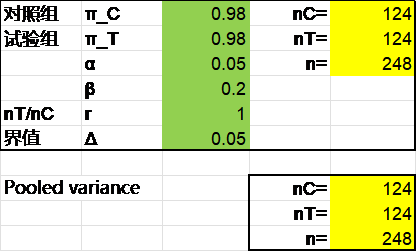{width="3.4652777777777777in" height="2.0902777777777777in"}

R语言pwrss包的独立方差法结果是每组124例。

library(pwrss)

pwrss.z.2props(p1 = 0.98, p2 = 0.98, alpha = 0.025, power = 0.8,

margin = 0.05, alternative = \"non-inferior\")

结果输出：

Approach: Normal Approximation

Difference between Two Proportions

(Independent Samples z Test)

H0: p1 - p2 \<= margin

HA: p1 - p2 \> margin

\-\-\-\-\-\-\-\-\-\-\-\-\-\-\-\-\-\-\-\-\-\-\-\-\-\-\-\-\--

Statistical power = 0.8

n1 = 124

n2 = 124

\-\-\-\-\-\-\-\-\-\-\-\-\-\-\-\-\-\-\-\-\-\-\-\-\-\-\-\-\--

Alternative = "non-inferior"

Non-centrality parameter = -2.802

Type I error rate = 0.025

Type II error rate = 0.2

SPSS软件独立方差法与合并方差法的结果均为每组124例，操作时依次点击Non-Inferiority, Proportions, Two Independent Proportions, Non-Inferiority Tests for the Difference Between Two Proportions。独立方差法在Test Type中选择Z-Test (Unpooled)。此例为高优指标，参数界面设置时非劣效界值δ0取负号。

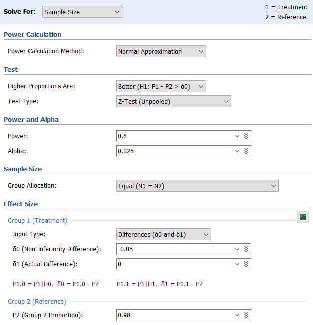{width="5.225452755905512in" height="5.433804680664917in"}

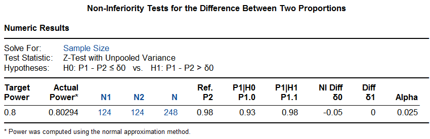{width="5.768055555555556in" height="1.8659722222222221in"}

PASS软件使用合并方差法时，在参数设置界面中Test Type选择Z-Test (Pooled)，计算结果与独立方差法相同。

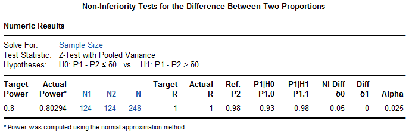{width="5.725496500437445in" height="1.858494094488189in"}

## 合并方差法

例 6‑2某研究^7^对循环死亡或脑死亡的心脏移植供体的使用进行了比较。患者按3:1随机分为循环死亡供体组（试验组，可接受循环死亡供体或脑死亡供体的心脏，先到先得）和脑死亡供体组（标准治疗对照组，只能接受脑死亡供体心脏）。假设试验组6个月生存率为85%，对照组为93%，非劣效界值20%，单侧α=0.05。研究将按照实际治疗进行分析，考虑到试验组的患者非常少，即使试验组与对照组按3:1随机，预计实际治疗的比例为1:3，则试验组53例，对照组159例患者可以提供80%的检验效能。

Excel表显示此例采用了合并方差法，如果试验组取整为53例，乘以3得159为对照组例数，与原文完全相同。

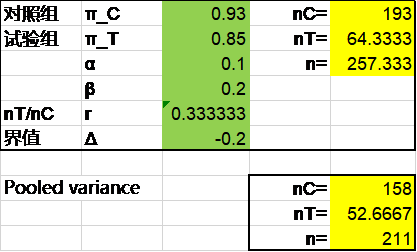{width="3.4652777777777777in" height="2.0902777777777777in"}

研究进行过程中发现试验组没有预期的那么少，两组实际治疗的比例接近1:1，重新计算样本量为168例。

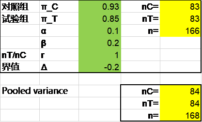{width="3.4652777777777777in" height="2.0902777777777777in"}

暂未找到合适的R语言包提供两组率的合并方差法的非劣效比较样本量计算，自编程序并计算如下：

ni.pooled \<- function(pi.c, pi.t, delta, r = 1, alpha = 0.05, beta = 0.1){

pi \<- (pi.c+pi.t\*r)/(1+r)

n.c \<- (qnorm(alpha/2)\*sqrt(pi\*(1-pi)\*(1+1/r))+

qnorm(beta)\*sqrt(pi.c\*(1-pi.c)+pi.t\*(1-pi.t)/r))\^2/

(pi.t-pi.c-delta)\^2

n.t \<- n.c\*r

ni.n \<- c(n.c, n.t)

names(ni.n) \<- c(\"n.c\",\"n.t\")

return(ni.n)

}

ni.pooled(pi.c = 0.93, pi.t = 0.85, delta = -0.2, r = 1/3, alpha = 0.1, beta = 0.2)

结果输出：

n.c n.t

157.19379 52.39793

ni.pooled(pi.c = 0.93, pi.t = 0.85, delta = -0.2, alpha = 0.1, beta = 0.2)

结果输出：

n.c n.t

83.5993 83.5993

PASS软件计算两次的结果分别为212例和168例。操作时依次点击Non-Inferiority, Proportions, Two Independent Proportions, Non-Inferiority Tests for the Difference Between Two Proportions。参数界面Test Type选择Z-Test (Pooled)。

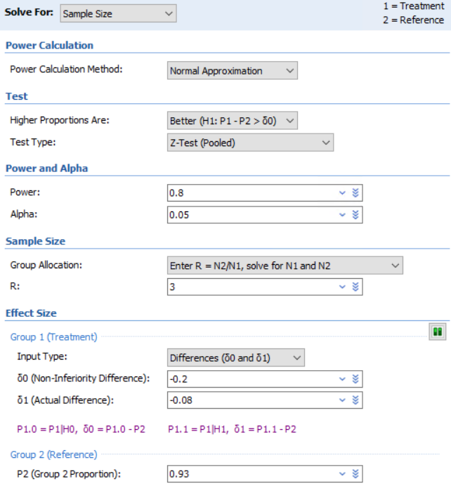{width="5.350463692038495in" height="5.767166447944007in"}

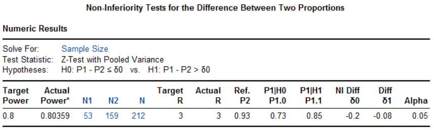{width="5.768055555555556in" height="1.729861111111111in"}

该研究最终有180例患者接受了心脏移植，其中164例（80例接受了循环死亡供体的心脏，86例接受了脑死亡供体的心脏）纳入了实际治疗分析。风险调整后的6个月生存率在循环死亡供体组为94%，脑死亡供体组为90%（最小平方均数差-3，90%置信区间-10\~3），非劣效P\<0.001，研究达成。

## Farrington-Manning法

[]{#_Ref140753587 .anchor}例 6‑3 EVOLVE II研究^8^比较了新型冠脉支架SYNERGY和临床正在使用的冠脉支架PE Plus。主要终点为12个月靶病变失败率，假设两组的预期值均为8%，非劣效界值4.4%（两组差值的单侧97.5%置信区间上限需小于该界值），脱落率5%，则1684例患者可提供0.89检验功效。使用Farrington-Manning检验，要求ITT和PP分析均满足才能宣称非劣效。

Excel表独立方差法和合并方差法计算结果均为1546例，Farrington-Manning法的结果是1594例，考虑脱落后为1594/(1-5%)=1677.9。

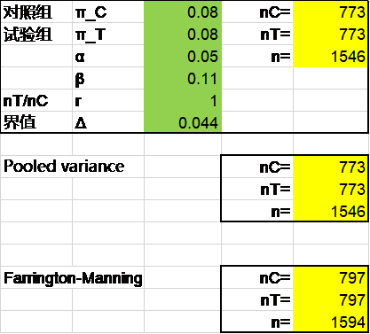{width="3.4652777777777777in" height="3.1319444444444446in"}

R语言gsDesign包Farrington-Manning法计算结果在脱落前也是1594例。

library(gsDesign)

nBinomial(p1 = 0.08, p2 = 0.08, delta0 = 0.044,

alpha = 0.025, beta = 1-0.89)

结果输出：

\[1\] 1593.403

PASS软件Farrington-Manning法计算结果在脱落前也是1594例，操作同前，在参数界面Test Type选择Likelihood Score (Farr. & Mann.):

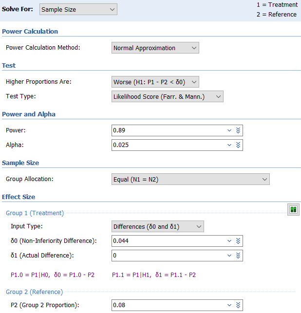{width="5.150446194225721in" height="5.358798118985127in"}

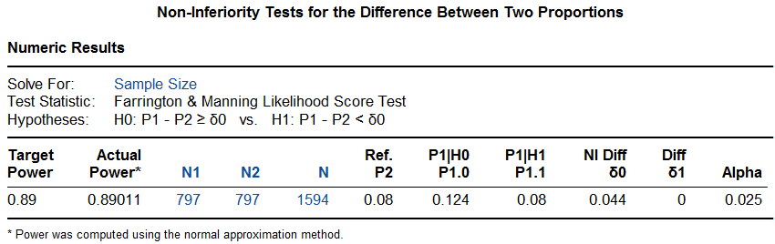{width="5.768055555555556in" height="1.81875in"}

研究实际入组了1684例患者，主要终点ITT集分析在对照组和试验组分别为6.5%和6.7%（K-M率分别为6.2%和6.7%），非劣效P=0.0005；PP集分析两组均为6.4%，非劣效P=0.0003，研究达成。

## 优效设计

[例 6‑4]{.mark} 某研究^9^探索一种新的内镜成像方法能否提高早期胃癌的检出率。假设对照组检出率为0.75%，试验组3.75%，优效界值1%，单侧检验错误0.025，检验效能0.9，脱落率5%，则需要每组1378例患者，为便于研究中心入选，总样本量扩充至2800。

Excel表计算脱落前样本量，独立方差法、合并方差法及Farrington-Manning法分别为2288，2302及2150例，R语言及PASS软件计算与之完全一致，均未能准确重复该例的样本量计算。R语言独立方差法结果示例：

library(pwrss)

pwrss.z.2props(p1 = 0.0375, p2 = 0.0075, alpha = 0.025, power = 0.9,

margin = 0.01, alternative=\"superior\")

PASS软件独立方差法示例：

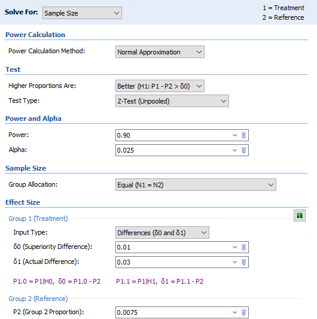{width="4.417049431321085in" height="4.442051618547682in"}

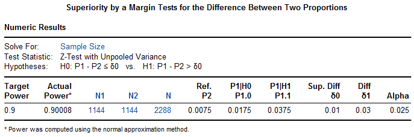{width="5.725496500437445in" height="1.900165135608049in"}

研究实际入组了2383例患者，对照组检出率4.31%，试验组8.01%，差值3.70%，P\<0.001，研究达成。

## 讨论

对常规的随机对照临床试验的分析，意向治疗（ITT）分析通常是比较保守的分析，但在非劣效研究中一般不是这种情况，符合方案（PP）分析通常更为保守。研究设计时需预先指定哪一种分析为主分析，严格的做法是要求ITT和PP分析均满足才能宣称非劣效，比如本章的[例 6‑3](#_Ref140753587)。

### 非劣效界值的设定

美国FDA 2010年发布了《非劣效临床试验评价有效性的指导原则（草案）》，并于2016年发布了最终版本^10^，提出了非劣效界值设定的固定法与合成法。随后我国药监局器审中心和药审中心也分别发布了相应的指导原则。2018年药监局器审中心发布的《医疗器械临床试验设计指导原则》^1^指出：界值的制定主要考虑临床实际意义，需要被临床认可或接受。理论上，非劣效界值的确定可采用两步法，一是通过Meta分析估计对照器械减去安慰效应后的绝对效应或对照器械的相对效应M1，二是结合临床具体情况，在考虑保留对照器械效应的适当比例1-f后，确定非劣效界值M2（M2=f×M1）。f越小，试验器械的效应越接近对照器械，一般情况下，f的取值在0～0.5之间。2020年药监局药审中心发布的《药物临床试验非劣效设计指导原则》^11^也有类似表述：非劣效界值不应大于阳性对照药相对于安慰剂的临床获益，以确保试验药的疗效至少能够优于安慰剂......非劣效界值的确定通常应根据统计分析和临床判断综合考虑，并在试验方案中说明非劣效界值确定的依据......(对于高优指标)M1 为既往阳性对照药与安慰剂的优效试验中C－P 的 95% CI 下限。如果对既往证据的变异性和恒定假设存在顾虑，可采用"折扣"策略确定 M1，即将 M1通过一定幅度的"折扣"（如减半）转换为更加保守的 M1。

但实际上按以上指导原则操作的案例并不多。笔者对过去20年发表在NEJM、Lancet和JAMA三大医学期刊上的医疗器械非劣效临床试验界值的设定作过分析^12^，在83个研究中，仅2篇文献明确采用了监管机构指导原则建议的固定法，没有研究采用合成法。

非劣效研究中界值的设定是一个非常重要也通常较为棘手的问题。固定法的问题在于根据95%可信区间下限定M1时，这个M1受既往研究的样本量影响。如果既往研究的样本量较小，则95%可信区间较宽，那这个M1就会比较小，造成M2的空间受限，尽管这是对既往研究样本量小的惩罚，最终会导致样本量急剧增加而不可接受。

有研究者提出经验性设定非劣效界值，对于定量指标，可取阳性对照组均数的1/10\~1/5；对于定性指标，可以取疗效的5%\~10%，或直接取10%^13^。

我们建议可以采用较为简单实用的基于阳性对照预期值百分比的方法设定非劣效界值^12^。FDA的指导原则认为M2的选择是一个临床判断，其实，不仅M2，整个界值的设定都是一个临床判断。药监局《医疗器械临床试验设计指导原则》也认为界值的制定主要考虑临床实际意义，需要被临床认可或接受。因此，界值的确定主要由临床医学专家确定，而不是依赖于统计学专家^23^。从我们的数据分析来看，在临床研究实践中界值百分比与对照组预期值存在一定的反比关系（[图 6‑1](#_Ref112080412)），总的来说，以低优指标为例，界值不宜超过阳性对照组的50%，否则需提供充分的理由，特别适当对照组预期值大于10%时。

![[]{#_Ref112080412 .anchor}图 6‑1 界值百分比与对照组预期值的反比关系](media/S6_noninferiorProportions/image14.png){width="5.768055555555556in" height="3.4944444444444445in"}

注：横坐标为对照组预期值，纵坐标为界值百分比。红色表示该终点包含死亡事件。

### 何时使用Farrington-Manning法

两组率的比较的非劣效设计，同之前介绍的两组率的差异性检验一样有独立方差法和合并方差法，这两种方法的异同可以参考之前章节的分析。两组率的比较的非劣效设计，还有Farrington-Manning法，通常这是相对更保守的样本量计算方法^3^。有时这三种方法计算的样本量差异会较大，特别是不对称设计时，比如本章的，独立方差法、合并方差法及Farrington-Manning法计算的样本量分别为248、248及374。三种方法的具体选用目前并没有明确的推荐，建议可选择样本量较大的方法，可确保检验效能，或者做一些样本量的模拟分析。

### 非劣效转差异性检验或优效检验

一般来说，非劣效设计研究在满足了非劣效检验后可以进一步作差异性检验并宣称优于对照组，这种转换无需进行α校正，但需要预先在研究方案中作出规定^13^。例如BeNeDuctus研究^15^，结果已显示试验组优于对照组。而优效设计或差异性比较的研究，在不满足优效或差异性检验后，通常不能直接转为非劣效比较，除非事先定义了非劣效界值并考虑了多重性校正。

### 率差vs率比

本章所介绍的两组率比较的非劣效设计都是基于率的差值。FDA的《非劣效临床试验评价有效性的指导原则》认为当研究终点为定性数据时，因事件发生率在不同的研究中可能会有较大的变异，界值采用HR或RR等相对数通常比绝对差值更稳健。我们对实际临床研究的数据分析^12^显示在83个两组率的非劣效研究中，83.1%的界值采用了绝对差值。Macaya等^16^考察了9个冠脉支架的非劣效研究，非劣效界值全部采用了绝对差值，结果也都达成了非劣效，但如果采用相对数界值，仅4个仍能保持非劣效的结论。这点也易于理解，以低优指标并发症为例，当两组率的预期值都较高为10%，因而设定了一个较高的非劣效界值5%，这时候的RR是1.5；而当实际两组发生的并发症都明显较低，试验组和对照组分别为6%和4%，这时候的RR已经为1.5了，RR的假设检验肯定通不过了，而率差的假设检验仍然能够通过。

**References:**

1\. 国家药品监督管理局. 医疗器械临床试验设计指导原则; 2018.

2\. 李卫. 医疗器械临床试验统计方法. 2版 ed. 北京: 科学出版社; 2016.

3\. Chow S, Shao J, Wang H, Lokhnygina Y. Sample Size Calculations in Clinical Research. Third Edition ed: CRC Press; 2018.

4\. Kieser M. Methods and Applications of Sample Size Calculation and Recalculation in Clinical Trials: Springer; 2020.

5\. CCTS工作小组, 夏结来. 非劣效临床试验的统计学考虑. 中国卫生统计 2012;29:270-4.

6\. 尹国圣, 石昊伦. 临床试验设计的统计方法. 北京: 高等教育出版社; 2018.

7\. Schroder JN, Patel CB, DeVore AD, et al. Transplantation Outcomes with Donor Hearts after Circulatory Death. NEW ENGL J MED 2023;388:2121-31.

8\. Kereiakes DJ, Meredith IT, Windecker S, et al. Efficacy and safety of a novel bioabsorbable polymer-coated, everolimus-eluting coronary stent: the EVOLVE II Randomized Trial. CIRC-CARDIOVASC INTE 2015;8.

9\. Gao J, Zhang X, Meng Q, et al. Linked Color Imaging Can Improve Detection Rate of Early Gastric Cancer in a High-Risk Population: A Multi-Center Randomized Controlled Clinical Trial. DIGEST DIS SCI 2021;66:1212-9.

10\. FDA. Non-Inferiority Clinical Trials to Establish Effectiveness Guidance for Industry; 2016.

11\. 国家药品监督管理局. 药物临床试验非劣效设计指导原则; 2020.

12\. 曾治宇, 李青, 张晓星, et al. 医疗器械非劣效设计临床试验界值设定的现状与分析. 中国食品药品监管 2024:30-8.

13\. 陈峰. 医学统计学. 4版 ed. 北京: 人民卫生出版社; 2024.

14\. 陈峰, 夏结来. 临床试验统计学. 北京: 人民卫生出版社; 2018.

15\. Hundscheid T, Onland W, Kooi E, et al. Expectant Management or Early Ibuprofen for Patent Ductus Arteriosus. NEW ENGL J MED 2023;388:980-90.

16\. Macaya F, Ryan N, Salinas P, Pocock SJ. Challenges in the Design and Interpretation of Noninferiority Trials: Insights From Recent Stent Trials. J AM COLL CARDIOL 2017;70:894-903.
