# 8. 生存分析的研究设计

有一种数据类型与时间有关，比如肿瘤治疗后的复发、死亡等事件；PCI术后死亡、心肌梗死或血运重建等事件，即时间-事件（time-to-event）数据，尽管不能治愈这些疾病或者完全预防不良事件的发生，但如果延长这些事件的发生时间也是有临床意义的，通常会考虑生存分析的研究设计。

生存分析有一些基本的假设和公式，比如最简单的指数模型为：

[]{#_Ref186450241 .anchor}公式 7‑1 $S = e^{- \lambda t}$

S为生存率，λ是风险率（hazard），代表瞬时的风险，在指数模型里λ是恒定的。

在指数模型中，当S=0.5，即有一半患者生存时，可推出中位生存时间，

公式 7‑2 $T_{m} = \frac{\ln(2)}{\lambda}$

但临床上多见的情况是$T_{m}$已知，根据上式可以由$T_{m}$求出λ：

公式 7‑3 $\lambda = \frac{ln(2)}{T_{m}}$

也可以根据[公式 7‑1](#_Ref186450241)由生存率S，或事件率P（P=1-S）求出λ：

[]{#_Ref186451116 .anchor}公式 7‑4 $\lambda = - \ln(S)/t = - \ln(1 - P)/t$

临床医生较为熟悉的风险比HR（hazard ratio），即试验组与对照组风险率之比，可由多种方法得出：

公式 7‑5 $HR = \frac{\lambda_{T}}{\lambda_{C}} = \frac{T_{mC}}{T_{mT}} = \ln\left( S_{T} \right)/ln(S_{C}) = \ln\left( {1 - P}_{T} \right)/ln(1 - P_{C})$

这样就可以根据风险率λ、中位生存时间$T_{m}$或事件率P去计算HR或样本量了。

生存分析一般是事件驱动的，所以通常首先计算出所需的事件数，Schoenfeld法公式如下（该方法并不要求数据符合指数模型）^1^：

[]{#_Ref186451694 .anchor}公式 7‑6 $\mathbb{e} = \frac{4\left( Z_{1 - \alpha/2} + Z_{1 - \beta} \right)^{2}}{\left\lbrack \ln(HR) \right\rbrack^{2}}$

如果两组例数不等，假设试验组与对照组按r:1分配，则^1^：

公式 7‑7 $e_{C} = \frac{\left( Z_{1 - \alpha/2} + Z_{1 - \beta} \right)^{2}(1 + 1 \slash r)}{\left\lbrack \ln(HR) \right\rbrack^{2}}$

如果是非劣效设计，则^2^：

公式 7‑8 $\mathbb{e} = \frac{\left( Z_{1 - \alpha/2} + Z_{1 - \beta} \right)^{2}}{\left\lbrack \ln{(HR) - ln(\mathrm{\Delta})} \right\rbrack^{2}}\frac{{(1 + r)}^{2}}{r}$

Freedman法计算事件数的公式如下^1^：

公式 7‑9 $e = \frac{\left( Z_{1 - \alpha/2} + Z_{1 - \beta} \right)^{2}{(HR + 1)}^{2}}{{(HR - 1)}^{2}}$

如果两组例数不等，假设试验组与对照组按r:1分配，则^1^：

公式 7‑10 $e = \frac{\left( Z_{1 - \alpha/2} + Z_{1 - \beta} \right)^{2}{(HR \cdot r + 1)}^{2}}{{(HR - 1)}^{2} \cdot r}$

如果是非劣效设计，则：

公式 7‑11 $e = \frac{\left( z_{\alpha/2} + z_{\beta} \right)^{2}{(1 + r(HR + \mathrm{\Delta}))}^{2}}{{r\left( 1 - (HR - \mathrm{\Delta}) \right)}^{2}}$

指数模型下的事件率为：

公式 7‑12 $\varphi(\lambda) = 1 - \left( e^{- \lambda t_{f}} - \mathbb{e}^{- \lambda\left( t_{a} + t_{f} \right)} \right) \slash \left( \lambda t_{a} \right)$

其中$t_{a}$代表入组，$t_{f}$代表随访，接着即可求得所需样本例数：

公式 7‑13 $n = \mathbb{e} \slash (\varphi\left( \lambda_{C} \right) + \varphi\left( \lambda_{T} \right))$

或者已知生存率$\pi_{C}$与$\pi_{T}$时，总生存率为：

公式 7‑14 $\pi = \frac{\left( 1 - \pi_{C} \right) + r(1 - \pi_{T})}{1 + r}$

公式 7‑15 $n = e/\pi$

生存分析的样本量计算，重要的是确定事件数，而样本量则会根据入组的速度和时间，以及随访方式和时间等不同的假设而有所不同。

很多临床医生对风险率λ不太熟悉，下面举一简单例子进一步说明。假设某种肿瘤的年死亡率为10%，则由[公式 7‑4](#_Ref186451116)可得年λ=-ln(1-0.1)/1=0.1054，注意死亡率和λ这两个数值并不相等，通常λ或略高一些。根据[公式 7‑4](#_Ref186451116)进一步可以计算月λ=-ln(1-0.1)/12=0.1054/12=0.00878，而月死亡率不是简单的10%/12，而是继续由[公式 7‑4](#_Ref186451116)得到P=1-exp(-λt)=1-exp(-0.00878x1)=0.00874（[图 7‑1](#_Ref186451665)）。

![[]{#_Ref186451665 .anchor}图 7‑1 指数模型生存曲线示意图](media/S7_SurvivalAnalysis/image1.png){width="6.0in" height="4.450694444444444in"}

根据[公式 7‑6](#_Ref186451694) Schoenfeld法计算的事件数见[图 7‑2](#_Ref186451753)，[表 7‑1](#_Ref186451775)。

![[]{#_Ref186451753 .anchor}图 7‑2 事件数随着HR的增加而迅速增加（α=0.05双侧）](media/S7_SurvivalAnalysis/image2.png){width="6.0in" height="4.517361111111111in"}

+---------+-----------------------+-----------------------+
| HR      | α=0.05双侧            | α=0.1双侧             |
|         +-----------+-----------+-----------+-----------+
|         | β=0.1     | β=0.2     | β=0.1     | β=0.2     |
+=========+==========:+==========:+==========:+==========:+
| 0.20    | 17        | 13        | 14        | 10        |
+---------+-----------+-----------+-----------+-----------+
| 0.25    | 22        | 17        | 18        | 13        |
+---------+-----------+-----------+-----------+-----------+
| 0.30    | 29        | 22        | 24        | 18        |
+---------+-----------+-----------+-----------+-----------+
| 0.35    | 39        | 29        | 32        | 23        |
+---------+-----------+-----------+-----------+-----------+
| 0.40    | 51        | 38        | 41        | 30        |
+---------+-----------+-----------+-----------+-----------+
| 0.45    | 66        | 50        | 54        | 39        |
+---------+-----------+-----------+-----------+-----------+
| 0.50    | 88        | 66        | 72        | 52        |
+---------+-----------+-----------+-----------+-----------+
| 0.55    | 118       | 88        | 96        | 70        |
+---------+-----------+-----------+-----------+-----------+
| 0.60    | 162       | 121       | 132       | 95        |
+---------+-----------+-----------+-----------+-----------+
| 0.65    | 227       | 170       | 185       | 134       |
+---------+-----------+-----------+-----------+-----------+
| 0.70    | 331       | 247       | 270       | 195       |
+---------+-----------+-----------+-----------+-----------+
| 0.75    | 508       | 380       | 414       | 299       |
+---------+-----------+-----------+-----------+-----------+
| 0.80    | 845       | 631       | 688       | 497       |
+---------+-----------+-----------+-----------+-----------+

: []{#_Ref186451775 .anchor}表 7‑1 不同HR及α、β组合下所需的事件数

统计学教材^3^

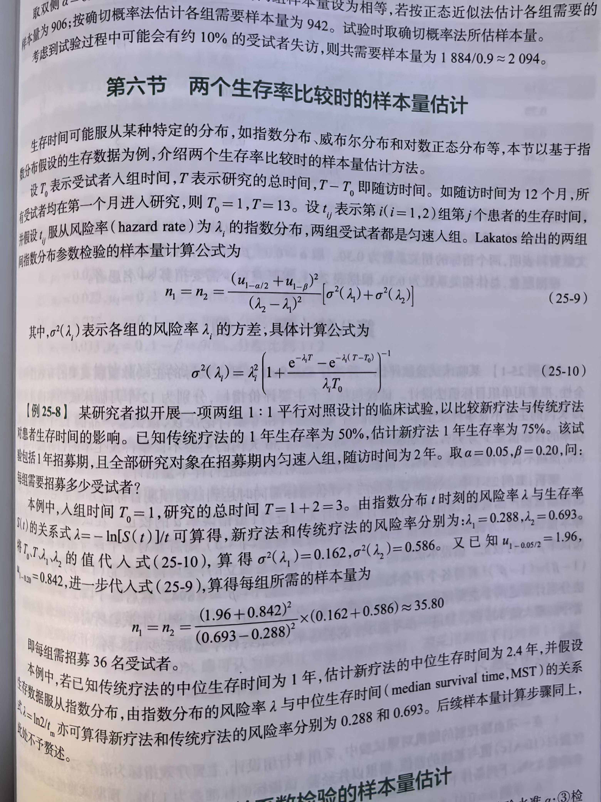{width="6.0in" height="8.0in"}

特殊类型，rate^4^，

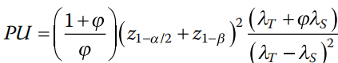{width="2.1725251531058616in" height="0.4108803587051619in"}

Single arm, at least one event^4^

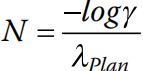{width="0.6846839457567804in" height="0.33994860017497813in"}

## 单组生存数据的研究设计

例 7‑1 某研究方案^5^欲评价一种疗法对晚期结直肠癌的效果。主要终点为无进展生存（PFS，progression free survival），无效假设为PFS 2个月，预期PFS为4个月。设定单侧α=0.05，检验效能90%，假设入组时间12个月，随访12个月，需24例患者。考虑到10%的脱落率，样本量定为27。样本量计算使用了PASS软件。

R语言未找到相应的包，自编程序如下，计算结果为23.3，向上取整得24：

logrank1s \<- function(median0, median1,

ta, tf,

alpha=0.05, beta=0.1) {

alpha = alpha

beta = beta

median0 \<- median0

median1 \<- median1

lam0 \<- log(2)/median0

lam1 \<- log(2)/median1

ta \<- ta

tf \<- tf

Gt=function(t){

ifelse(t \<= tf, 1, ifelse(t \<= ta + tf, (ta+tf-t)/ta, 0))}

S0t=function(t){exp(-lam0\*t)}

S1t=function(t){exp(-lam1\*t)}

p0f = function(t){

ifelse(t \<= tf, 1, ifelse(t \<= ta + tf, (ta+tf-t)/ta, 0))\*

exp(-lam1\*t)\*lam0}

p0=integrate(p0f, 0, Inf)\$value

p1f = function(t){

ifelse(t \<= tf, 1, ifelse(t \<= ta + tf, (ta+tf-t)/ta, 0))\*

exp(-lam1\*t)\*lam1}

p1=integrate(p1f,0,Inf)\$value

p00f = function(t){

ifelse(t \<= tf, 1, ifelse(t \<= ta + tf, (ta+tf-t)/ta, 0))\*

exp(-lam1\*t)\*

lam0\*t\*lam0}

p00=integrate(p00f,0,Inf)\$value

p01f = function(t){

ifelse(t \<= tf, 1, ifelse(t \<= ta + tf, (ta+tf-t)/ta, 0))\*

exp(-lam1\*t)\*

lam0\*t\*lam1}

p01=integrate(p01f,0,Inf)\$value

sigma0 \<- sqrt(p0)

sigma1 \<- sqrt(p1)

w \<- sigma1\^2 - sigma0\^2

sigma \<- sqrt(p1 - p1\^2 + 2\*p00 - p0\^2 - 2\*p01 + 2\*p0\*p1)

n=(sigma0\*qnorm(1-alpha/2)+sigma\*qnorm(1-beta))\^2/w\^2

return (n)

}

计算：

logrank1s (2, 4, 12, 12, alpha = 0.1)

结果输出：

\[1\] 23.32901

PASS软件操作时依次点击Survival, One Survival Curve, One-Sample Longrank Tests。

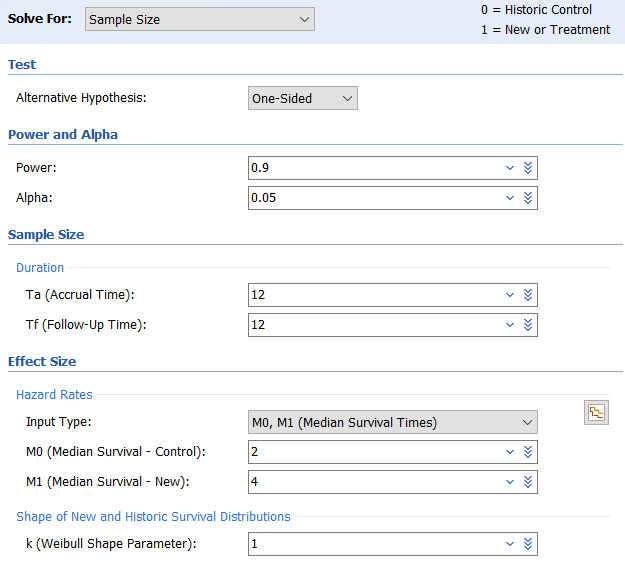{width="5.208784995625547in" height="4.683739063867017in"}

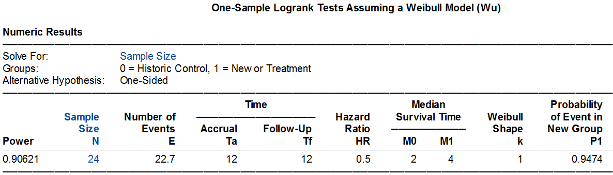{width="6.0in" height="1.7201388888888889in"}

## 两组生存数据的比较

### 风险率λ已知

这种情形在临床研究中并不多见。

[]{#_Ref186452524 .anchor}例 7‑2 颜艳等主编的医学研究生教材《医学统计学（第5版）》^6^介绍了一个生存分析样本量计算的例子。首先根据HR=0.5，双侧α=0.05，检验效能90%，计算出需要的事件数为88。然后假设对照组的事件率为0.1/人年（incidence rate，即λ），需样本量1216例。

该例没有给出入组时间和随访时间，我们简单假定为患者同时入组（入组时间给了一个极小值0.001），随访1年。Excel表计算如下，可见此例的事件数计算符合Schoenfeld法，病例数1216例与原文相同。

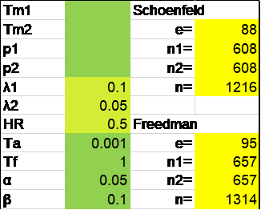{width="2.7083333333333335in" height="2.173611111111111in"}

R语言rpact包计算如下：

library(rpact)

getSampleSizeSurvival(

alpha = 0.025,

beta = 0.1,

lambda1 = 0.05,

lambda2 = 0.1,

accrualTime = 0.001,

followUpTime = 1

)

结果输出：

Design plan parameters and output for survival data:

Design parameters:

Critical values : 1.96

Significance level : 0.0250

Type II error rate : 0.1000

Test : one-sided

User defined parameters:

lambda(1) : 0.050

lambda(2) : 0.100

Accrual time : 0.001

Follow up time : 1.00

Default parameters:

Theta H0 : 1

Type of computation : Schoenfeld

Planned allocation ratio : 1

kappa : 1

Piecewise survival times : 0.00

Drop-out rate (1) : 0.000

Drop-out rate (2) : 0.000

Drop-out time : 12

Sample size and output:

Direction upper : FALSE

median(1) : 13.9

median(2) : 6.9

Hazard ratio : 0.500

Number of events : 87.5

Accrual intensity : 1214971.9

Number of events fixed : 87.5

Number of subjects fixed : 1215

Number of subjects fixed (1) : 607.5

Number of subjects fixed (2) : 607.5

Analysis times : 1.00

Study duration : 1.00

Critical values (treatment effect scale) : 0.658

Legend:

(i): values of treatment arm i

事件数87.5，向上取整为88。尽管样本量总数为1215，但每组607.5，如果先进行每组向上取整至608，总样本量仍然为1216，与教材案例一致。

R语言gsDesign包的nEvents函数可以简洁地得到事件数：

library(gsDesign)

nEvents(hr = 0.5, alpha = 0.025, beta = 0.1)

输出结果：

\[1\] 87.4793

进一步计算样本量：

nSurvival(

lambda1 = 0.1,

lambda2 = 0.05,

Ts = 0.001+1,

Tr = 0.001,

alpha = 0.025,

beta = 0.1

)

结果输出：

Fixed design, two-arm trial with time-to-event

outcome (Lachin and Foulkes, 1986).

Study duration (fixed): Ts=1.001

Accrual duration (fixed): Tr=0.001

Uniform accrual: entry=\"unif\"

Control median: log(2)/lambda1=6.9

Experimental median: log(2)/lambda2=13.9

Censoring only at study end (eta=0)

Control failure rate: lambda1=0.1

Experimental failure rate: lambda2=0.05

Censoring rate: eta=0

Power: 100\*(1-beta)=90%

Type I error (1-sided): 100\*alpha=2.5%

Equal randomization: ratio=1

Sample size based on hazard ratio=0.5 (type=\"rr\")

Sample size (computed): n=1268

Events required (computed): nEvents=92

这与原来的计算略有差异，事件数为92，样本量为1268，主要是因为gsDesign包的nSurvival函数采用了Lachin和Foulkes的方法，这里不展开讨论。注意R语言gsDesign包默认第1组为对照组，而rpact包默认第1组为试验组，不过两个包的α默认设定都是单侧0.025。

Excel表Lachin和Foulkes法与R语言gsDesign包结果相同，事件数92，样本量1268：

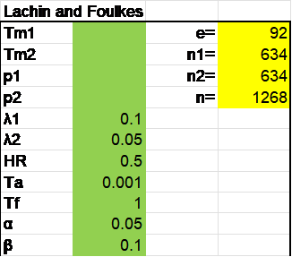{width="2.7083333333333335in" height="2.3819444444444446in"}

PASS软件默认的计算为Lakatos法，需要90个事件，1250例样本。操作时依次点击Survival, Two Survival Curves, Test(Inequality), Logrank Tests。

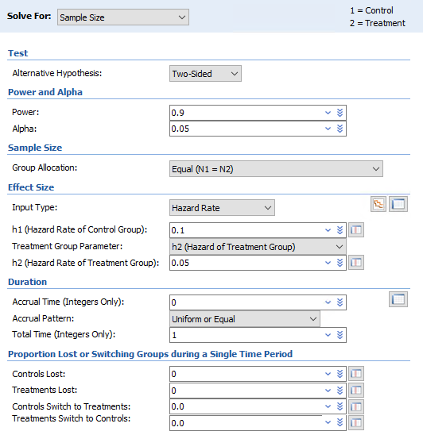{width="4.43371719160105in" height="4.567062554680665in"}

Input type可根据需要灵活选用。如果有现成的参数可直接填入，也可通过本章开头的公式计算，或者利用PASS软件自带的参数转换功能，点击右侧生存曲线小图标后进行转换。

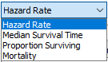{width="1.0831244531933508in" height="0.6500568678915135in"}

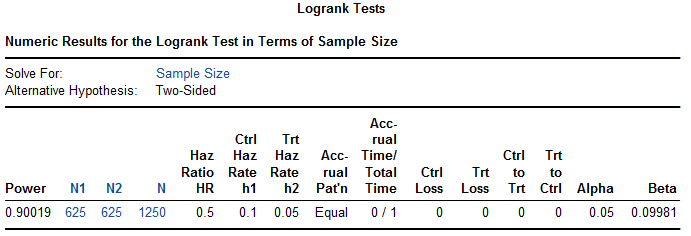{width="5.758832020997375in" height="1.9668372703412074in"}

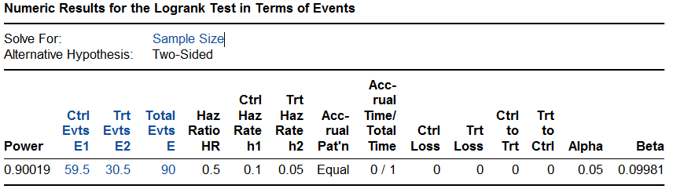{width="6.0in" height="1.6895833333333334in"}

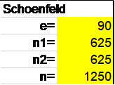{width="1.3611111111111112in" height="1.0in"}

在Excel表中，如果将90作为事件数，计算得需患者数1250例，同PASS，可见这两种方法在计算事件率时是一致的，因而根据事件数推算样本量的结果是一致的。

PASS软件Freedman法需事件数95，样本量1316，与Excel表基本一致。操作时依次点击Survival, Two Survival Curves, Test(Inequality), Logrank Tests (Freedman)。

PASS软件Lachin和Foulkes法计算样本量为1311例，与Excel表及R语言gsDesign包的结果均稍有差异，PASS也未给出所需事件数。操作时依次点击Survival, Two Survival Curves, Test(Inequality), Logrank test (Lachin and Foulkes)。

PASS软件Cox比例风险模型给出的结果为事件数88，样本量1216，从而推测是采用了Schoenfeld法。PASS软件指数模型给出的结果为事件数95，样本量1314，与Freedman法一致。

例 7‑3 STABLE-SR-III研究^7^在老年阵发性房颤患者中比较肺静脉隔离加低电压区消融与单纯肺静脉隔离的效果。主要终点为无房性心律失常发生率，预期在试验组和对照组中分别为每年85%和75%。设入组2年，随访1年，log-rank检验，双侧α=0.05，检验效能90%，需369例患者。假定脱落率为15%，则需434例患者。样本量计算使用了PASS 13软件。

Excel表Schoenfeld法计算结果为368，PASS 2024软件log-rank模块计算结果为369，R语言rpact包计算结果为366.1。

{width="2.7083333333333335in" height="2.183333333333333in"}

library(rpact)

getSampleSizeSurvival(

alpha = 0.025,

beta = 0.1,

pi1 = 0.15,

pi2 = 0.25,

eventTime = 1,

accrualTime = 2,

followUpTime = 1

)

研究实际入组438例患者，中位随访时间为23个月，试验组房性心律失常发生率明显低于对照组（15% vs 24%，P=0.03），研究达成。

（与PROMPT-AF比较）

### 中位生存时间已知

已知中位生存时间计算样本量，多见于肿瘤的临床研究。

例 7‑4 SYNCHRONOUS研究^8^欲比较结肠癌的两种治疗方案，假设对照组中位生存时间20个月，试验组26个月，入组24个月，随访36个月，显著性水平5%，检验效能85%，则需522个事件，694例患者。

由Excel表计算可知该例采用了Freedman方法，样本量694例。

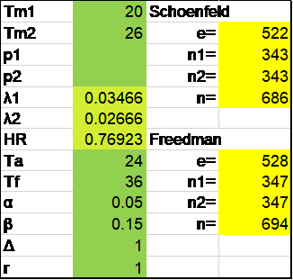{width="2.7083333333333335in" height="2.5833333333333335in"}

R语言rpact包计算如下，需528个事件，694例患者：

library(rpact)

getSampleSizeSurvival(

typeOfComputation = \"Freedman\",

alpha = 0.025,

beta = 0.15,

median1 = 26,

median2 = 20,

accrualTime = 24,

followUpTime = 36

)

PASS软件Freedman法需事件数528，样本量688；而选择指数模型给出的结果为事件数532，样本量698。

### 事件率已知

已知事件率，计算样本量，心血管病领域的研究多用此法。

例 7‑5 PARTNER Cohort B研究^9^是TAVR领域第一个里程碑式的随机对照试验，将严重主动脉瓣狭窄且不适合外科手术的患者随机分为经导管主动脉瓣植入（TAVI）或标准治疗组，主要终点为全因死亡率。假设对照组1年死亡率37.5%，试验组25%，脱落率每年10%，预计350例患者可提供84%的检验效能。附件方案里提供了进一步的信息：α=0.05，研究所需事件数为148，按150计算。计划匀速入组18个月，随访1年。

Excel表计算Schoenfeld法需事件数145，需样本量308，脱落率每年10%，可粗略对应18个月为15%，则样本量扩充为308/(1-15%)=362.4。

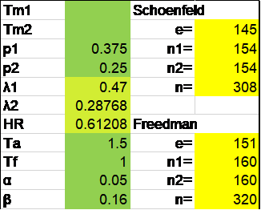{width="2.7083333333333335in" height="2.173611111111111in"}

PASS软件Lakatos法需事件数146，样本量336；指数模型的结果为事件数152，样本量322。

研究实际随机了358例患者，对照组1年死亡率50.7%，试验组为30.7%，HR=0.55（95%置信区间0.40\~0.74），P\<0.001，研究达成。

## 两组生存数据比较的非劣效设计

例 7‑6 Aspirin LAAO研究^10^欲探索植入左心耳封堵器后的患者，是否可以停用阿司匹林长期抗凝治疗。主要终点为复合事件包括卒中、全身栓塞，心血管/原因不明死亡，大出血，急性冠脉综合征及冠脉或外周动脉血运重建。假设主要终点事件率在两组均为7/百患者年，非劣效界值1.5，检验效能0.8，单侧α=0.025，则需要191个事件，考虑10%的脱落率，需要1120例患者。

Excel表Schoenfeld法计算需要191个事件，1012例患者，考虑脱落后为1012/(1-10%)=1124.4例。

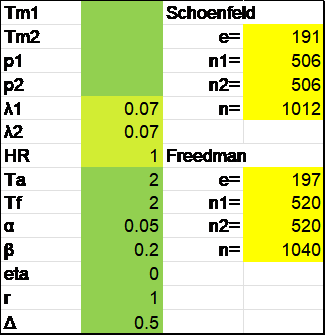{width="2.7083333333333335in" height="2.7916666666666665in"}

R语言rpact包计算，事件数和病例数分别为191和1012，与Excel表相同。

getSampleSizeSurvival(

thetaH0 = 1.5,

alpha = 0.025,

beta = 0.2,

lambda1 = 0.07,

lambda2 = 0.07,

accrualTime = 2,

followUpTime = 2,

eventTime = 1

)

SPSS软件Lakatos法计算需191个事件，在考虑脱落前需1011例患者。

## 讨论

### Kaplan-Meier率与简单率

本书之前章节讨论的率比较简单，分子是事件数，分母是总人数，可称之为简单率。本章介绍的生存数据同时包含了计数资料和计量资料的信息，虽然仍可以计算简单率，但由于1）出现失访或删失情况时，该失访或删失者是否或者如何放入分母会比较麻烦，2）简单率没有充分利用时间的信息（比如推迟肿瘤的复发时间也是有临床意义的），因而在生存分析里通常使用利用乘积限法计算的Kaplan-Meier率（K-M率）。在没有删失的情况下，K-M与简单率相等，有删失时，K-M率配合log-rank检验显得更为合理。

值得指出的是，样本量计算的方法应当与随后的统计分析方法保持一致。样本量计算时采用的是简单率的比较，而统计分析时采用了log-rank分析，这种情况在临床研究中并不少见（[举例]{.mark}）。考虑简单率的比较与log-rank检验（本质上是对时间进行了加权）的差异，这并不是一个好的做法。

### 两种随访结束的方式

本章之前介绍的研究设计，每位患者的随访时间通常是相同的，比如都是随访1年或者2年，到了1年或2年后，该患者即完成了研究而按方案退出。但在生存分析研究里，更多的情况是所有患者随访至一个统一的时间点（积累了预期的事件数后），这样第一个入组的患者随访时间最长，最后一个入组的患者随访时间最短。两种方法各有优缺点，逐个结束法（或固定随访时间法）简便易行，事件率较低的心血管病研究多见；统一结束法可追踪更多的信息从而减少样本量，但增加了结束时的管理工作，事件率较高的肿瘤研究多见。

应注意这两种随访结束方式对样本量计算的影响。常见的生存分析样本量计算时假定的都是统一结束法，如果需要采用逐个结束法，可将入组时间设定为零或给一个极小值如0.001，视软件或具体的计算方法而定，可参考本章[例 7‑1](#_Ref186452524)。

### 不同样本量计算方法的比较

生存分析的样本量计算有不同的方法，如Schoenfeld， Freedman，Lachin and Flulkes及Lakatos等。一般来说，对称性设计（两组样本量相等）且HR\>0.5时，Schoenfeld法给出的事件数比较准确，而Freedman法计算的事件数略高于Schoenfeld法；HR≤0.25时，Schoenfeld易低估事件数而Freedman高估事件数。在不对称设计且HR远离1时，Schoenfeld法在试验组人数多时高估事件术，而对照组人数多时低估事件数；Freedman法表现整体欠佳^11^。必要时可进行模拟分析。

**References:**

1\. 陈峰, 夏结来. 临床试验统计学. 北京: 人民卫生出版社; 2018.

2\. 贺佳, 邓伟, 王素珍. 临床试验设计与统计分析. 2版 ed. 北京: 人民卫生出版社; 2022.

3\. 陈峰. 医学统计学. 4版 ed. 北京: 人民卫生出版社; 2024.

4\. Machin D, Campbell MJ, Tan SB, Tan SH. Sample Sizes for Clinical, Laboratory and Epidemiology Studies. Fourth Edition ed. Pondicherry: Wiley Blackwell; 2018.

5\. Zhang P, Li X, Wang X, Yang Y, Wang J, Cao D. SHR-8068 combined with adebrelimab and bevacizumab in the treatment of refractory advanced colorectal cancer: study protocol for a single-arm, phase Ib/II study. FRONT IMMUNOL 2024;15:1450533.

6\. 颜艳, 王彤. 医学统计学. 5版 ed. 北京: 人民卫生出版社; 2020.

7\. Chen H, Li C, Han B, et al. Circumferential Pulmonary Vein Isolation With vs Without Additional Low-Voltage-Area Ablation in Older Patients With Paroxysmal Atrial Fibrillation: A Randomized Clinical Trial. JAMA CARDIOL 2023;8:765-72.

8\. Rahbari NN, Lordick F, Fink C, et al. Resection of the primary tumour versus no resection prior to systemic therapy in patients with colon cancer and synchronous unresectable metastases (UICC stage IV): SYNCHRONOUS\--a randomised controlled multicentre trial (ISRCTN30964555). BMC CANCER 2012;12:142.

9\. Leon MB, Smith CR, Mack M, et al. Transcatheter aortic-valve implantation for aortic stenosis in patients who cannot undergo surgery. NEW ENGL J MED 2010;363:1597-607.

10\. Chen M, Wang Q, Sun J, et al. Double-blind, placebo-controlled randomised clinical trial to evaluate the effect of ASPIRIN discontinuation after left atrial appendage occlusion in atrial fibrillation: protocol of the ASPIRIN LAAO trial. BMJ OPEN 2021;11:e44695.

11\. Wu J. Statistical methods for survival trial design : with applications to cancer clinical trials using R. Boca Raton London New York: CRC Press; 2018.
