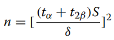
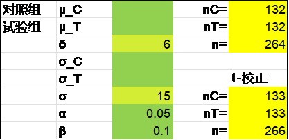
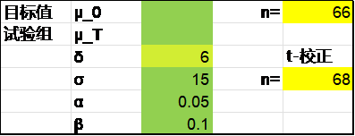
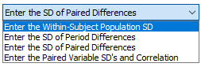
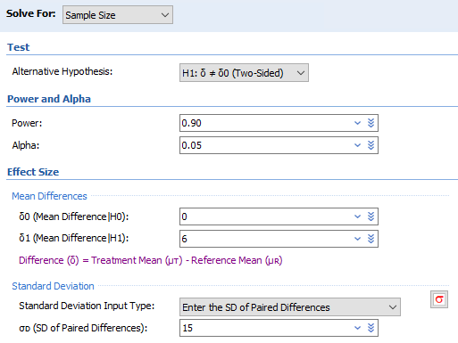
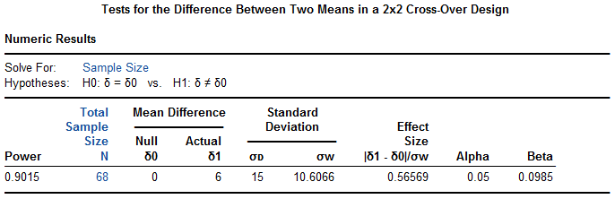
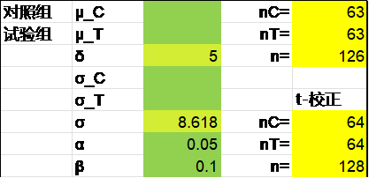
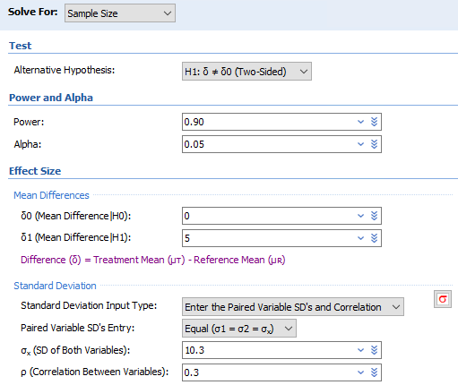
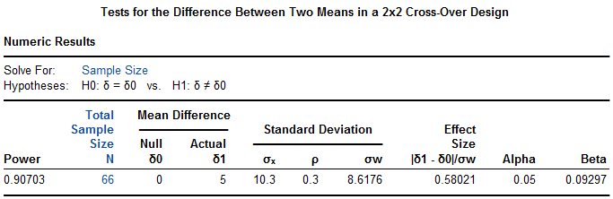

# 9. 交叉设计

以计量资料2x2交叉设计为例，有统计学教材认为2x2交叉设计，每个对象接受了两种处理，故样本量可以简单地取平行设计的样本量的一半 ^1^：

[]{#_Ref186473083 .anchor}公式 8‑1 $n = \frac{2\left( Z_{1 - \alpha/2} + Z_{1 - \beta} \right)^{2}}{{(\frac{\delta}{\sigma})}^{2}}$

有些更是简单地采用了配对设计的样本量计算公式，样本量再减一半^2^。但要注意，[公式 8‑1](#_Ref186473083)虽然形式上与之前介绍的平行设计相似，其σ可能是不一样的。一般来说，交叉设计中，影响终点的因素主要有处理和时期（次序），以及个体间及个体内的变异。通常个体内的变异小于个体间的变异，样本量计算公式宜表达为^3^：

公式 8‑2 $n = \frac{2\left( Z_{1 - \alpha/2} + Z_{1 - \beta} \right)^{2}}{{(\frac{\delta}{\sigma_{w}})}^{2}}$

其中：

公式 8‑3 $\sigma_{w}^{2} = \sigma^{2}(1 - \rho)$（10-3）

这里$\sigma_{w}$为个体内标准差，ρ为同一个体的研究终点在两个时期间的相关系数。可以看出，即使同一个体的研究终点在两个时期间的结果不相关，即ρ=0，交叉设计也可以节约一半的样本量；而ρ=0.5时，样本量为平行设计的1/4，这与配对设计的结果一致。

在生物等效性研究中常用的为2x2m设计，可以参考Chow等专著^4^，本书不作讨论。

## 交叉设计样本量计算实例

例 8‑1 QUADUAL研究^5^拟评价四联半量降压方案是否优于标准两联的方案，主要终点为24h平均收缩压降幅，2X2交叉设计，预期两组差异为6 ± 15 mmHg，考虑20%的脱落率及区组随机因素，则90例患者可提供90%的检验效能（双侧α=0.05）。该研究的统计分析计划论文^1^提供了进一步的信息，样本量计算公式为：

{width="1.3599671916010498in" height="0.484669728783902in"}

计算结果为66。同时使用PASS软件计算的结果为68，取较大值68，考虑脱落后为85，再考虑区组随机因素，最终样本量定为90，每组45。

Excel表平行设计两组均数比较的样本量为266（减半为133），而配对设计样本量为68（实质为再减半），与原文PASS软件计算结果一致。R语言结果与Excel表相同。

{width="2.3208333333333333in" height="1.1284722222222223in"}

{width="2.2118055555555554in" height="0.8458333333333333in"}

library(pwrss)

pwrss.t.2means(mu1 = 0, mu2 = 6, sd1 = 15,

alpha = 0.05, power = 0.9)

pwrss.t.mean(mu = 6, sd = 15, alpha = 0.05, power = 0.9)

PASS软件操作时依次点击Means, Cross-Over(2X2) Design, Test (Inequality), Tests for the Difference Between Two Means in a 2X2 Cross-Over Design。

{width="2.1085159667541555in" height="0.7083945756780402in"}

上面4个选项，样本量分别为134，266，68，68（ρ=0.5），再次验证ρ=0.5时的结果与配对设计是一致的。

{width="4.275370734908137in" height="3.2086111111111113in"}

{width="5.7171620734908135in" height="1.8501607611548556in"}

例 8‑2 KidsAP研究^8^在1\~7岁I型糖尿病儿童患者中比较了闭环胰岛素泵和常规胰岛素泵的疗效。患者先接受一种治疗16周，再换另一种治疗16周，治疗顺序是随机的。主要终点为血糖处于目标范围（70\~180mg/dl）的时间百分比。假设试验组比对照组的终点指标高5个百分点，标准差为10.3，两个治疗时期之间的相关系数为0.3，则65例患者可提供90%的检验效能。预计10%的脱落率，样本量增加至72。原文未提供α水平，此处以双侧0.05计算。

此例考虑脱落的正确方式因该是65/(1-10%)=72.2。

先计算此时的$\sigma_{w} = \sqrt{\sigma^{2}(1 - \rho)} = \sqrt{{10.3}^{2}(1 - 0.3)} = 8.618$，以此带入计算，Excel表两组均数比较t-校正法结果为64，注意需按常规两样本均数比较的结果减半。

{width="2.3208333333333333in" height="1.1284722222222223in"}

R语言pwrss包的结果为66。

library(pwrss)

pwrss.t.2means(mu1 = 0, mu2 = 5, sd1 = 10.3\*sqrt(1-0.3),

alpha = 0.05, power = 0.9)

PASS软件结果为66。

{width="4.258701881014873in" height="3.5836439195100613in"}

{width="5.692159886264217in" height="1.8501607611548556in"}

研究实际随机了74例患者，主要终点在试验组比对照组高8.7个百分点（95%置信区间7,.4\~9.9，P\<0.001），研究达成。

## 讨论

交叉设计的样本量计算在适合的领域可提高研究效率。尽管可根据相关系数ρ减少样本量，遗憾的是ρ通常不易获得。交叉设计的样本量直接取平行对照样本量的一半是较为保守的策略。

**References:**

1\. 颜虹, 徐勇勇. 医学统计学. 3版 ed. 北京: 人民卫生出版社; 2015.

2\. 李卫. 医疗器械临床试验统计方法. 2版 ed. 北京: 科学出版社; 2016.

3\. Juliouis SA. Sample Sizes for Clinical Trials: CRC Press; 2010.

4\. Chow S, Shao J, Wang H, Lokhnygina Y. Sample Size Calculations in Clinical Research. Third Edition ed: CRC Press; 2018.

5\. Zhao X, Chen Y, Yang G, et al. Initial treatment with a single capsule containing half-dose quadruple therapy versus standard-dose dual therapy in hypertensive patients (QUADUAL): Study protocol for a randomized, blinded, crossover trial. AM HEART J 2023.

6\. Zhao X, Li X, Liu T, et al. Initial treatment with a single capsule containing half-dose quadruple therapy versus standard-dose dual therapy in hypertensive patients (QUADUAL): statistical analysis plan for a randomized, blinded, crossover trial. TRIALS 2024;25:45.

7\. Ullrich H, Olschewski M, Munzel T, Gori T. Randomized, crossover, controlled trial on the modulation of cardiac coronary sinus hemodynamics to develop a new treatment for microvascular disease: Protocol of the MACCUS trial. FRONT CARDIOVASC MED 2023;10:1133014.

8\. Ware J, Allen JM, Boughton CK, et al. Randomized Trial of Closed-Loop Control in Very Young Children with Type 1 Diabetes. NEW ENGL J MED 2022;386:209-19.

9\. Roediger J, Dembek TA, Achtzehn J, et al. Automated deep brain stimulation programming based on electrode location: a randomised, crossover trial using a data-driven algorithm. LANCET DIGIT HEALTH 2023;5:e59-70.
