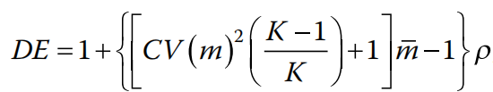
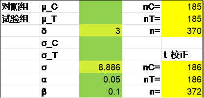
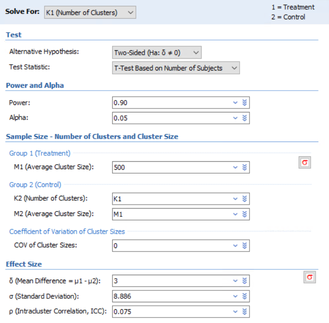
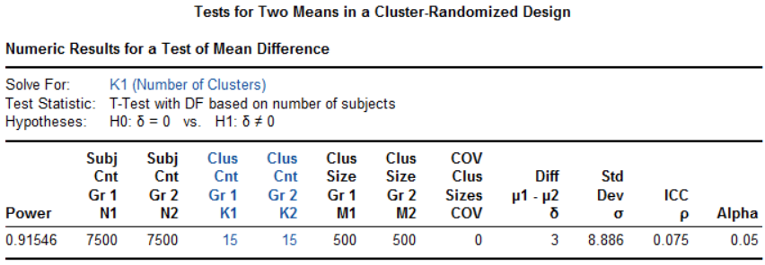
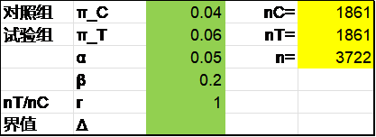
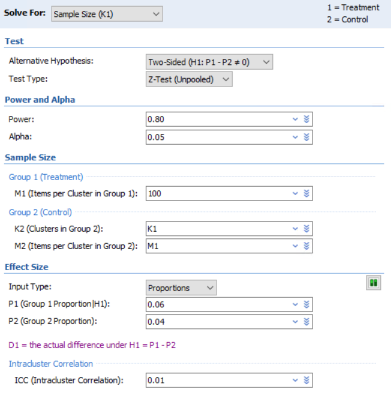
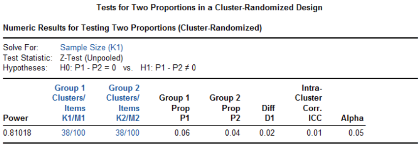

# 10. 整群随机研究

整群随机研究常见于流行病学（现场）干预研究。一些在学校、社区、乡村等地点开展的行为干预的研究，例如社区防治，如果以群（cluster，一个学校、一个小区、一个自然村等）为随机单位接受一种干预，在研究执行上更可行，也便于设盲，避免不同的处理方案在同一个群内的沾染，因而在人群干预研究中颇受欢迎。同一个群里的个体通常更为相似，其离散程度可用群内标准差σ~w~描述；而群与群之间的差异会相对较大，可用群间标准差σ~b~描述；总的方差σ^2^=σ~w~^2^+σ~b~^2^。整群设计时，群内的相似性降低了个体对研究的贡献，因此样本量也需适当扩增，这个扩增的倍数即方差膨胀因子（variance inflation factor, VIF），亦称设计效应（design effect, DE）。

群内相关系数（intra-cluster correlation coefficient，ICC），或简作ρ，可以描述群内个体的相似程度，计算公式为^1^：

公式 9‑1 $\rho = \sigma_{b}^{2}/(\sigma_{b}^{2} + \sigma_{w}^{2})$

考虑一种简单的情形，有k个群，每个群都有m个个体（每个群的个体数不等时可取平均数，或有时用m~max~代替），则设计效应DE的计算公式为：

公式 9‑2 $DE = 1 + (m - 1)\rho$

整群设计的总样本量N与不考虑群的影响时的样本量n的关系为：

公式 9‑3 $N = n \cdot DE$

2018 Machin

{width="2.598363954505687in" height="0.4866032370953631in"}

## 两组均数比较的整群随机设计

[]{#_Ref186481072 .anchor}例 9‑1 某社区干预试验^1^考察限盐预防高血压的效果，主要终点为舒张压的下降幅度。既往数据显示人群中舒张压的标准差为8.886mmHg，社区内相关系数为0.075。每个村按500人计算，预计干预1年后试验组较对照组舒张压至少降低3mmHg，设双侧α=0.05，β=0.1，则每组所需的观察例数为7086，每组所需自然村个数为7086/500=14.17，取整为15，总共需30个自然村。

可先计算常规设计所需的样本量，Excel表t-校正法，R语言pwrss包及PASS软件t检验法的结果均为每组186例。然后计算设计效应DE=1+(500-1)X0.075=38.425，最终每组样本量为186X38.425=7147.05，每组所需自然村数为7147.05/500=14.29，取整为15，总共需30个自然村。

{width="2.3194444444444446in" height="1.125in"}

library(pwrss)

pwrss.t.2means(mu1 = 3, mu2 = 0, sd1 = 8.886, alpha = 0.05, power = 0.9)

R语言clusterPower包计算如下，每组需15.2个自然村：

library(clusterPower)

cpa.normal(

alpha = 0.05,

power = 0.9,

nclusters = NA,

nsubjects = 500,

d = 3,

ICC = 0.075,

vart = 8.886\^2

)

结果输出：

nclusters

15.19699

PASS软件整群设计计算每组需15个自然村。操作时依次点击Cluster-Randomized, Two Means, Test (Inequality), Tests for Two Means in a Cluster-Randomized Design。

{width="5.5504811898512685in" height="5.458806867891513in"}

{width="5.768055555555556in" height="2.004166666666667in"}

## 两组率比较的整群随机设计

例 9‑2 在以学校为单位进行的学生吸烟率的干预试验中，每个学校随机抽取100名学生，从既往数据估计校内相关系数为0.01。预期试验组与对照组吸烟率分别下降0.06和0.04，则在双侧α=0.05，β=0.2的条件下，每组所需的个体数为3698例，即3698/100=36.98所学校，取38所。

先计算常规设计所需样本量，Excel表独立方差法、R语言pwrss包及PASS软件的结果均为每组1861例。设计效应DE=1+(100-1)X0.01=1.99，因此整群设计时的每组样本量为1861X1.99=3703.39，因此需要3703.39/100=37.03所学校。

{width="2.3194444444444446in" height="0.8472222222222222in"}

library(pwrss)

pwrss.z.2props(p1 = 0.04, p2 = 0.06, alpha = 0.05, power = 0.8)

R语言clusterPower包计算如下：

library(clusterPower)

cpa.binary(

alpha = 0.05,

power = 0.8,

nclusters = NA,

nsubjects = 100,

CV = 0,

p1 = 0.06,

p2 = 0.04,

ICC = 0.01

)

结果输出：

nclusters

38.00233

PASS软件整群设计计算每组需38所学校。操作时以此点击Cluster-Randomized, Two Proportions, Test (Inequality), Tests for Two Proportions in a Cluster-Randomized Design。

{width="5.433804680664917in" height="5.458806867891513in"}

{width="5.768055555555556in" height="2.0104166666666665in"}

例 9‑3 有研究^3^在湖南某农村地区评价健康宣教预防寄生虫感染的效果。将学校随机分为健康宣教组和对照组，假设对照组一年感染率为6%，干预措施可降低感染50%。根据既往数据，设计效应为1.1，则1639例样本可提供80%的检验效能。（原文未给出α水平，暂按双侧0.05计算。）

先计算不考虑群影响时的样本量n，Excel表独立方差法、R语言pwrsss包及PASS软件的结果皆为1492，考虑设计效应后为1492x1.1=1641.2。

{width="2.3194444444444446in" height="0.8472222222222222in"}

library(pwrss)

pwrss.z.2props(p1 = 0.03, p2 = 0.06, alpha = 0.05, power = 0.8)

研究实际入组了1934例儿童，其中1718例（38个学校，每个学校入组数量中位数为42）纳入最终分析，试验组的感染率明显低于对照组（4.1%与8.4%，P\<0.001）。

## 讨论

[例 9‑1](#_Ref186481072)的设计效应接近40，显得有些得不偿失。如果每个村入组100人，则设计效应为8.425，每组需要15.7个自然村，读者可自行比较一下。设计策略上可以考虑总的样本量最小（传统的非整群设计），或者总的的自然村数最小，或者根据实际情况取得平衡。

**References:**

1\. 颜艳, 王彤. 医学统计学. 5版 ed. 北京: 人民卫生出版社; 2020.

2\. Katzmarzyk PT, Martin CK, Newton RJ, et al. Weight Loss in Underserved Patients - A Cluster-Randomized Trial. NEW ENGL J MED 2020;383:909-18.

3\. Bieri FA, Gray DJ, Williams GM, et al. Health-education package to prevent worm infections in Chinese schoolchildren. NEW ENGL J MED 2013;368:1603-12.
